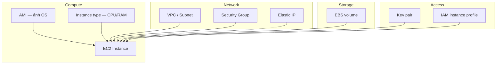

# EC2 — Các khái niệm cốt lõi

> Giải thích **từng khái niệm** khi tạo và vận hành EC2. Hướng dẫn thao tác từng bước: [`how-to-create.md`](./how-to-create.md).

**EC2** (Elastic Compute Cloud) = máy ảo (VM) trên AWS. Bạn thuê CPU/RAM/disk theo giờ, cài OS (thường Linux), SSH vào và chạy app — ví dụ Docker Compose (Postgres, Redis, backend, frontend, nginx).

---

## 1. EC2 Instance

Máy ảo đang chạy (hoặc đã dừng) — đơn vị tính phí chính cho CPU/RAM.

| Thuộc tính | Ý nghĩa |
|------------|---------|
| **Instance ID** | Định danh (ví dụ `i-0abc…`) — dùng trong CLI, IAM, monitoring |
| **Instance state** | `pending` → `running` → `stopping`/`stopped` → `terminated` |
| **Status checks** | `2/2` = hệ thống + instance healthy — sẵn sàng nhận SSH |
| **Public DNS / Public IP** | Địa chỉ truy cập từ internet (nếu subnet public + auto-assign) |

**Stop vs Terminate:**

| Hành động | CPU/RAM | EBS (root) | IP public mặc định |
|-----------|---------|------------|-------------------|
| **Stop** | Không tính phí | Vẫn tính phí | **Đổi** khi start lại |
| **Terminate** | Xóa VM | Xóa nếu *Delete on termination* = Yes | Mất hẳn |

---

## 2. Region & Availability Zone (AZ)

| Khái niệm | Dùng để làm gì |
|-----------|----------------|
| **Region** | Vùng địa lý (ví dụ `ap-southeast-1` Singapore). Instance, EBS, Elastic IP **gắn cứng** một region — chọn nhầm phải tạo lại |
| **Availability Zone** | Data center vật lý trong region (`ap-southeast-1a`, `1b`…). Subnet nằm trong một AZ |

Chọn region gần user hoặc **cùng region** với ECR/RDS để giảm latency và phí cross-region.

---

## 3. AMI (Amazon Machine Image)

Ảnh đĩa gốc: OS + (tùy chọn) package/agent có sẵn. Launch instance = clone AMI thành volume root.

| Lựa chọn phổ biến | Đặc điểm |
|--------------------|----------|
| **Amazon Linux 2023** | Chuẩn AWS, tích hợp SSM, `dnf` |
| **Ubuntu Server LTS** | Quen thuộc, nhiều tutorial Docker |
| **Amazon Linux 2** | Legacy — chỉ khi policy bắt buộc |

| Thuộc tính | Ý nghĩa |
|------------|---------|
| **Architecture x86_64** | Chạy hầu hết image Docker public |
| **Architecture arm64 (Graviton)** | Rẻ hơn — cần image build cho ARM |
| **User mặc định SSH** | Ubuntu → `ubuntu`; Amazon Linux → `ec2-user` |

---

## 4. Instance type

Quyết định **vCPU, RAM, mạng** và **chi phí theo giờ**.

| Family | Ý tưởng |
|--------|---------|
| **t3.*** (burstable) | CPU có “credit” — spike ngắn OK; full load lâu có thể bị throttle. Phổ biến cho dev |
| **m6i.*** (general purpose) | CPU ổn định hơn — phù hợp workload đều |

Gợi ý kích thước: Docker stack (Postgres + Redis + BE + FE + nginx) thường cần **≥ 4 GiB RAM** (ví dụ `t3.medium`).

---

## 5. Key pair

Cặp khóa SSH: AWS gắn **public key** vào instance; bạn giữ **private key** (`.pem`).

| Khái niệm | Ý nghĩa |
|-----------|---------|
| **Key pair name** | Nhãn trên AWS — gắn khi launch |
| **`.pem` (RSA / OpenSSH)** | File private — `ssh -i file.pem user@host` |
| **Chỉ tải một lần** | Mất file = không SSH được (trừ SSM Session Manager) |

Không commit `.pem` lên git. CI (GitHub Actions) thường lấy key từ secret/SSM.

---

## 6. VPC, Subnet, Internet Gateway

| Khái niệm | Dùng để làm gì |
|-----------|----------------|
| **VPC** | Mạng ảo riêng — isolation; RDS private thường cùng VPC với EC2 |
| **Subnet** | Phân đoạn IP trong một AZ. **Public subnet** = có route tới Internet Gateway |
| **Internet Gateway (IGW)** | Cổng VPC ↔ internet |
| **Auto-assign public IP** | Gán IP public tạm khi launch — **đổi** khi stop/start |

Dev/staging cần SSH từ internet hoặc GitHub Actions → thường đặt instance ở **public subnet** + public IP (hoặc Elastic IP).

---

## 7. Security Group (SG)

Firewall **stateful** gắn vào instance (hoặc ENI): quyết định traffic **inbound/outbound** theo port + source/destination.

| Hướng | Ý nghĩa |
|-------|---------|
| **Inbound** | Ai được kết nối vào (SSH 22, HTTP 80, HTTPS 443, app 8080…) |
| **Outbound** | Instance gọi ra đâu — mặc định thường *All traffic* (pull ECR, apt, API AWS) |

SG là lớp bảo vệ đầu tiên trước khi traffic tới OS. Nên hạn chế SSH theo IP (`x.x.x.x/32`), không mở `0.0.0.0/0` trừ khi chấp nhận rủi ro.

---

## 8. Elastic IP (EIP)

Địa chỉ IPv4 **cố định** trong region, gắn (associate) vào instance.

| So sánh | Public IP mặc định | Elastic IP |
|---------|--------------------|------------|
| Sau stop/start | **Đổi** | **Giữ nguyên** |
| DNS / CI whitelist | Dễ gãy | Ổn định |
| Phí khi idle | — | IP **không gắn** instance vẫn mất phí nhỏ |

Nên dùng EIP cho dev host có DNS hoặc CI SSH theo IP cố định. Nhớ **Release** khi không dùng.

---

## 9. EBS (Elastic Block Store)

Ổ đĩa mạng gắn vào instance — thường là **root volume** chứa OS.

| Thuộc tính | Ý nghĩa |
|------------|---------|
| **Volume type (gp3)** | SSD cân bằng giá/hiệu năng — mặc định tốt cho hầu hết workload |
| **Size (GiB)** | OS + Docker images + logs — pull ECR nhiều lần dễ full disk |
| **Delete on termination** | Terminate instance → xóa luôn volume (tránh orphan volume tốn phí) |
| **Encrypted** | Mã hóa at-rest (KMS) |

EBS **độc lập** với lifecycle CPU: stop instance vẫn tính phí storage.

---

## 10. IAM Instance Profile / Role

Vai trò IAM gắn vào instance → process trên máy gọi AWS API **không cần** access key cứng trên disk.

Quyền hay dùng cho host deploy Docker:

- `AmazonSSMManagedInstanceCore` — SSH qua SSM Session Manager (không mở port 22)
- `ecr:GetAuthorizationToken`, `ecr:BatchGetImage` — `docker pull` từ ECR

---

## 11. User data

Script (thường bash) chạy **một lần** khi instance boot lần đầu — tự động hóa setup (cài Docker, agent, cấu hình ban đầu).

Khác với SSH tay sau launch: user data = “bootstrap” lúc tạo máy.

---

## 12. Tags

Metadata key-value gắn resource (`Environment=dev`, `Project=…`, `Owner=…`).

- Không đổi chức năng kỹ thuật
- Dùng cho Cost Allocation, automation, tránh terminate nhầm production

---

## 13. Metadata service (IMDS)

Endpoint nội bộ trên instance để lấy thông tin (region, IP, temporary credentials của instance role).

**IMDSv2** (token-based) = chuẩn bảo mật mới — hạn chế SSRF đánh cắp credential.

---

## 14. Khái niệm liên quan (ngoài Launch wizard)

| Khái niệm | Dùng để làm gì |
|-----------|----------------|
| **ENI (Elastic Network Interface)** | Card mạng ảo — gắn IP, SG |
| **Placement group** | Xếp instance gần nhau (latency thấp) — thường bỏ qua khi học |
| **Termination protection** | Chặn terminate nhầm trên Console |
| **CloudWatch monitoring** | Metric CPU/network; detailed = 1 phút (tốn hơn) |
| **Auto Scaling Group** | Scale số instance theo metric — không launch hàng loạt tay |
| **Bastion / jump host** | EC2 public để nhảy SSH vào instance private trong VPC |

---

## 15. EC2 so với lựa chọn khác

| Nhu cầu | Thường chọn |
|---------|-------------|
| Host dài hạn, SSH, Docker Compose, cron | **EC2** |
| API serverless, event-driven | Lambda + API Gateway |
| Container orchestration production | ECS / EKS |
| Static site | S3 + CloudFront |

---

## 16. Bản đồ khái niệm ↔ bước tạo instance

| Khi Launch… | Khái niệm chính |
|-------------|-----------------|
| Name and tags | Tags |
| Application and OS Images | AMI |
| Instance type | Instance type (CPU/RAM) |
| Key pair | Key pair / `.pem` |
| Network settings | VPC, Subnet, Public IP, Security Group |
| Configure storage | EBS |
| Advanced details | IAM profile, User data, IMDSv2, termination protection |
| Sau launch | Elastic IP, DNS, SSH / SSM |

Chi tiết thao tác: [`how-to-create.md`](./how-to-create.md).
