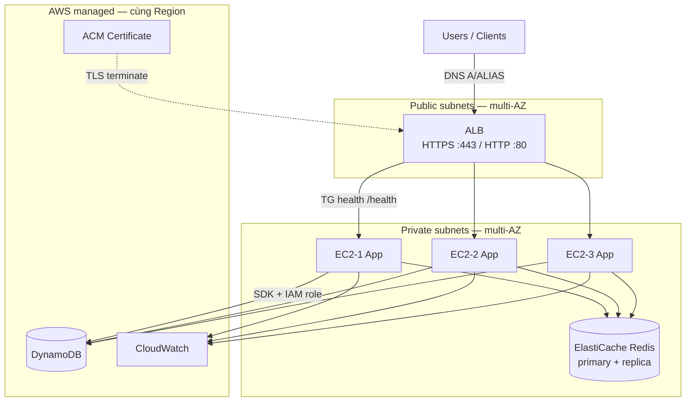
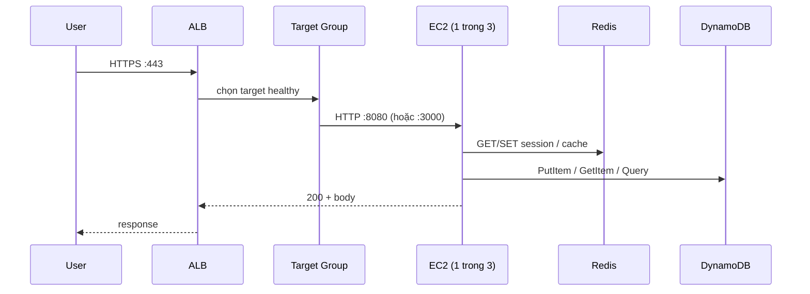
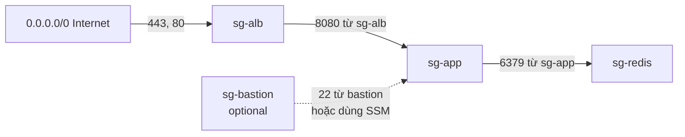
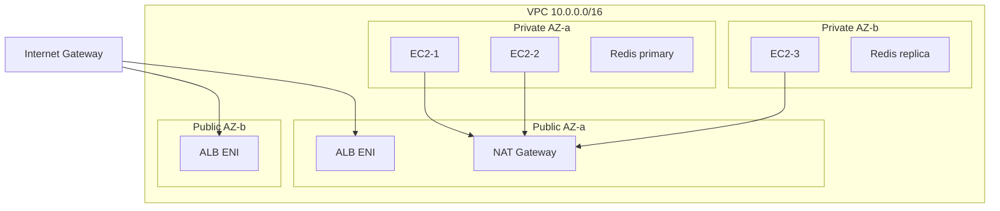
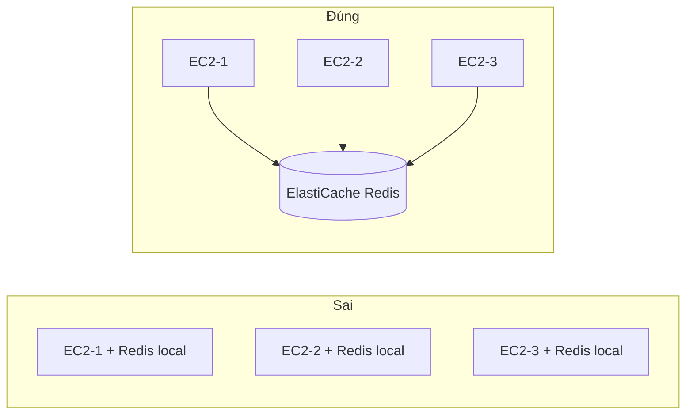
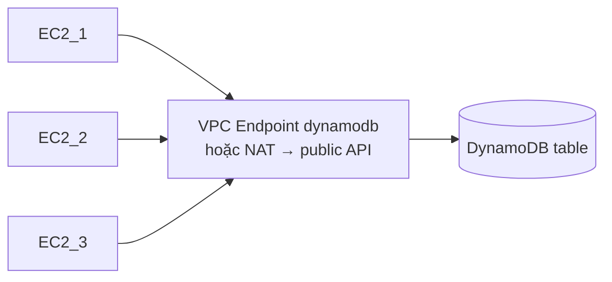
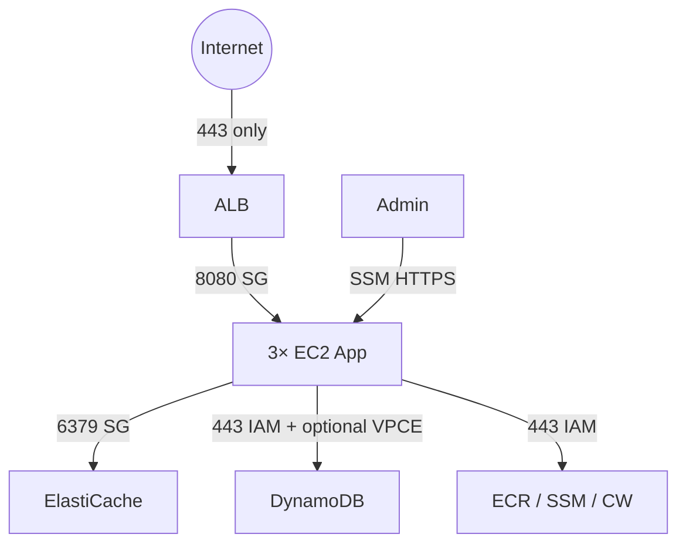

# Deploy 3 EC2 + ALB + Redis + DynamoDB

> Sơ đồ và hướng dẫn setup **một hệ thống app** với **3 EC2** phía sau Load Balancer, kèm **Security**, **DynamoDB**, và **Redis dùng chung** (không cài Redis riêng trên từng máy).

Khái niệm scale/LB: [`scale-problem.md`](./scale-problem.md) · Tạo 1 EC2: [`how-to-create.md`](./how-to-create.md)

---

## 0. Nguyên tắc quan trọng

| Thành phần | Đặt ở đâu | Vì sao |
|------------|-----------|--------|
| App (API / worker HTTP) | **3× EC2** (private subnet) | Scale ngang, HA |
| Load balancer | **ALB** (public subnet, ≥ 2 AZ) | Điểm vào duy nhất, TLS, health check |
| Redis | **1 cluster ElastiCache** (private) — **không** 3 Redis trên 3 EC2 | Session/cache phải **dùng chung** |
| DynamoDB | **Managed AWS** (region) — không cài trên EC2 | App gọi qua AWS API + IAM |
| SSH | **SSM Session Manager** (khuyến nghị) hoặc bastion | Không mở port 22 ra internet |

```text
❌ SAI:  EC2-1 có Redis riêng | EC2-2 có Redis riêng | EC2-3 có Redis riêng
         → session/cache lệch, sticky bắt buộc, scale vô nghĩa

✅ ĐÚNG: 3 EC2 app → cùng 1 ElastiCache Redis endpoint
         3 EC2 app → cùng 1 bảng DynamoDB (IAM role)
```

---

## 1. Sơ đồ tổng thể



### Luồng request



---

## 2. Sơ đồ Security Group & IAM

### 2.1. Security Groups (firewall)



| Security Group | Inbound | Source | Outbound |
|----------------|---------|--------|----------|
| **sg-alb** | TCP 443, 80 | `0.0.0.0/0` (hoặc CloudFront) | Tới sg-app :8080 |
| **sg-app** | TCP 8080 (app port) | **sg-alb** only | Redis :6379, HTTPS 443 (DynamoDB/ECR/SSM), DNS |
| **sg-redis** | TCP 6379 | **sg-app** only | Thường hạn chế |
| **sg-bastion** (nếu có) | TCP 22 | IP admin `/32` | SSH tới sg-app |

**Không** mở Redis (`6379`) hay app port ra `0.0.0.0/0`.  
**Không** cần SG cho DynamoDB — DynamoDB không nằm trong VPC theo kiểu “cổng 443 vào SG DB”; kiểm soát bằng **IAM** (+ VPC Endpoint tùy chọn).

### 2.2. IAM (Instance Profile gắn 3 EC2)

Cả 3 instance dùng **cùng một IAM Role** (qua Instance Profile):

| Quyền | Dùng để làm gì |
|-------|----------------|
| `dynamodb:GetItem`, `PutItem`, `UpdateItem`, `Query`, `Scan` (scope ARN bảng) | App đọc/ghi DynamoDB |
| `AmazonSSMManagedInstanceCore` | SSH qua SSM, không mở 22 |
| `ecr:GetAuthorizationToken`, `BatchGetImage`, `GetDownloadUrlForLayer` | `docker pull` nếu deploy bằng image |
| `logs:CreateLogGroup/Stream`, `PutLogEvents` | CloudWatch Logs (tùy chọn) |

Ví dụ policy DynamoDB (thu hẹp ARN):

```json
{
  "Effect": "Allow",
  "Action": [
    "dynamodb:GetItem",
    "dynamodb:PutItem",
    "dynamodb:UpdateItem",
    "dynamodb:DeleteItem",
    "dynamodb:Query",
    "dynamodb:Scan"
  ],
  "Resource": [
    "arn:aws:dynamodb:ap-southeast-1:ACCOUNT_ID:table/MyAppTable",
    "arn:aws:dynamodb:ap-southeast-1:ACCOUNT_ID:table/MyAppTable/index/*"
  ]
}
```

App **không** chứa access key cứng — SDK lấy credential từ **instance metadata (IMDSv2)**.

---

## 3. Sơ đồ mạng (VPC)



| Resource | Subnet | Ghi chú |
|----------|--------|---------|
| ALB | Public ≥ 2 AZ | Bắt buộc multi-AZ |
| EC2 × 3 | Private ≥ 2 AZ | Ví dụ 2 máy AZ-a, 1 máy AZ-b |
| ElastiCache | Private (subnet group multi-AZ) | Primary + replica |
| NAT Gateway | Public | EC2 private gọi ra ECR, DynamoDB public endpoint, apt |
| VPC Endpoint (tùy chọn) | Private | `com.amazonaws.region.dynamodb` — khỏi đi NAT cho DynamoDB |

---

## 4. Setup Load Balancer cho 3 EC2

### 4.1. Thành phần

| Bước | Resource | Cấu hình gợi ý |
|------|----------|----------------|
| 1 | **Target Group** `tg-app` | Protocol HTTP, port **8080**, target type **instance**, VPC đúng |
| 2 | Health check | Path `/health`, interval 30s, healthy threshold 2, unhealthy 3, matcher `200` |
| 3 | **ALB** `alb-app` | Scheme **internet-facing**, subnets public ≥ 2 AZ, SG = `sg-alb` |
| 4 | Listener 80 | Redirect → HTTPS 443 |
| 5 | Listener 443 | Forward → `tg-app`; certificate **ACM** |
| 6 | Register targets | Gắn EC2-1, EC2-2, EC2-3 vào TG (hoặc ASG gắn TG) |
| 7 | DNS | Route 53 Alias → ALB DNS name |

### 4.2. Security Group chi tiết ALB → EC2

```text
sg-alb inbound:
  443  ← 0.0.0.0/0
  80   ← 0.0.0.0/0

sg-app inbound:
  8080 ← sg-alb     # chỉ ALB được gọi app
  # 22 ← sg-bastion  # chỉ nếu dùng bastion; ưu tiên SSM
```

### 4.3. Checklist ALB

- [ ] Cả 3 target **Healthy** trên Console
- [ ] App mỗi EC2 listen đúng port TG
- [ ] `/health` không phụ thuộc Redis/DynamoDB (hoặc degrade nhẹ) — tránh cascade unhealthy
- [ ] Không dùng Elastic IP từng EC2 cho DNS public

---

## 5. Setup Redis cho 3 instance (ElastiCache)

### 5.1. Vì sao không cài Redis trên mỗi EC2?



Cả 3 app phải nói chuyện với **một** Redis endpoint — session, rate limit, cache mới nhất quán sau ALB (round-robin).

### 5.2. Các bước tạo ElastiCache Redis

| Bước | Thao tác | Gợi ý |
|------|----------|-------|
| 1 | ElastiCache → Redis OSS caches → Create | Engine Redis |
| 2 | **Cluster mode** | Tắt nếu mới học (1 shard); bật khi cần scale shard |
| 3 | Node type | `cache.t3.micro` (lab) / `cache.r6g.large` (prod) |
| 4 | Replicas | ≥ 1 (Multi-AZ) cho staging/prod |
| 5 | Subnet group | Private subnets ≥ 2 AZ |
| 6 | Security group | `sg-redis` — inbound **6379 chỉ từ sg-app** |
| 7 | Encryption | Transit + at-rest (prod) |
| 8 | Auth | Redis AUTH / ACL token lưu Secrets Manager |

Sau khi tạo, copy **Primary endpoint** (ví dụ `my-redis.xxxxx.apse1.cache.amazonaws.com:6379`).

### 5.3. Cấu hình trên 3 EC2 (giống nhau)

Biến môi trường / `.env` trên **mọi** app instance:

```bash
REDIS_HOST=my-redis.xxxxx.apse1.cache.amazonaws.com
REDIS_PORT=6379
REDIS_TLS=true          # nếu bật encryption in-transit
REDIS_PASSWORD=...      # nếu bật AUTH — lấy từ Secrets Manager
```

Kiểm tra từ một EC2 (SSM vào):

```bash
# Cài redis-cli tạm để test (Ubuntu)
sudo apt-get update && sudo apt-get install -y redis-tools

# Không TLS
redis-cli -h "$REDIS_HOST" -p 6379 ping
# PONG

# Có TLS + AUTH
redis-cli -h "$REDIS_HOST" -p 6379 --tls -a "$REDIS_PASSWORD" ping
```

Lặp lại trên EC2-2 và EC2-3 — cùng host, cùng kết quả `PONG`.

### 5.4. App code (ý tưởng)

- Dùng **một** connection pool tới `REDIS_HOST` (ioredis / redis npm / StackExchange.Redis…).
- Key session: `sess:{sessionId}` — mọi request dù vào EC2 nào cũng đọc cùng key.
- **Không** bật sticky session trên ALB nếu đã dùng Redis session (trừ khi cần sticky vì lý do khác).

### 5.5. (Lab only) Redis trên một EC2 riêng — không khuyến nghị prod

Nếu chưa dùng ElastiCache: tạo **EC2-redis** thứ 4 trong private subnet, SG giống `sg-redis`, 3 app trỏ `REDIS_HOST=<private-ip-ec2-redis>`. Vẫn là **một** Redis dùng chung — không phải Redis trên từng app EC2.

---

## 6. Setup DynamoDB cho 3 instance

### 6.1. DynamoDB không chạy trên EC2



| Bước | Thao tác |
|------|----------|
| 1 | DynamoDB → Create table (ví dụ `MyAppTable`, PK `pk`, SK `sk` nếu cần) |
| 2 | Billing: On-demand (lab) hoặc Provisioned |
| 3 | Gắn IAM policy (mục 2.2) vào instance role của 3 EC2 |
| 4 | (Khuyến nghị) Interface/Gateway VPC Endpoint cho DynamoDB — traffic không ra internet |
| 5 | App: `AWS_REGION=ap-southeast-1`, SDK mặc định dùng instance role |

Ví dụ env trên cả 3 EC2:

```bash
AWS_REGION=ap-southeast-1
DYNAMODB_TABLE=MyAppTable
# Không set AWS_ACCESS_KEY_ID / SECRET — dùng instance profile
```

Smoke test từ EC2 (AWS CLI đã có role):

```bash
aws dynamodb describe-table --table-name MyAppTable --region ap-southeast-1
aws dynamodb put-item --table-name MyAppTable \
  --item '{"pk":{"S":"health"},"sk":{"S":"ping"},"ts":{"S":"'"$(date -Is)"'"}}'
```

### 6.2. Phân vai Redis vs DynamoDB

| Nhu cầu | Dùng |
|---------|------|
| Session, cache ngắn, rate limit, lock tạm | **Redis** |
| Dữ liệu bền, query theo key, không cần SQL | **DynamoDB** |
| Quan hệ phức tạp, JOIN | RDS (Postgres) — ngoài scope file này |

---

## 7. Ba EC2 — cách tạo đồng nhất

| Cách | Mô tả |
|------|--------|
| **A. Launch Template + ASG** `desired=3` | Khuyến nghị — máy giống nhau, gắn TG tự động |
| **B. Launch 3 instance tay** | Cùng AMI, type, SG `sg-app`, IAM role, user data; register tay vào TG |

User data tối thiểu (Ubuntu — cài Docker + env placeholder):

```bash
#!/bin/bash
set -eux
# cài Docker (rút gọn — xem how-to-create.md)
# ghi env chung
cat >/etc/app.env <<EOF
REDIS_HOST=${REDIS_HOST}
REDIS_PORT=6379
AWS_REGION=ap-southeast-1
DYNAMODB_TABLE=MyAppTable
PORT=8080
EOF
```

Với ASG: truyền `REDIS_HOST` qua user data template / SSM Parameter — **không** hardcode khác nhau từng máy.

---

## 8. Bảng checklist triển khai (thứ tự)

```text
1. VPC + public/private subnets + IGW + NAT
2. SG: sg-alb, sg-app, sg-redis
3. IAM role + instance profile (DynamoDB + SSM + ECR)
4. DynamoDB table
5. ElastiCache Redis (+ sg-redis)
6. (Optional) VPC Endpoint DynamoDB
7. Launch Template / 3× EC2 (sg-app, private, IAM)
8. Target Group + ALB + ACM + listeners
9. Register 3 EC2 → TG; đợi Healthy
10. DNS → ALB
11. Verify: curl https://domain/health
12. Verify Redis PONG từ cả 3 EC2
13. Verify DynamoDB put/get từ cả 3 EC2
```

---

## 9. Sơ đồ “ai nói chuyện với ai” (tóm tắt bảo mật)



| Cạnh | Kiểm soát |
|------|-----------|
| Internet → ALB | SG + ACM TLS |
| ALB → EC2 | SG source = sg-alb |
| EC2 → Redis | SG source = sg-app; AUTH/TLS |
| EC2 → DynamoDB | IAM resource ARN; VPCE |
| Admin → EC2 | SSM (không 22 public) |

---

## Tài liệu liên quan

- [`scale-problem.md`](./scale-problem.md) — scale dọc/ngang, ASG, ALB
- [`concept.md`](./concept.md) — khái niệm EC2
- [`how-to-create.md`](./how-to-create.md) — launch 1 instance
- [`../ecr.md`](../ecr.md) — image Docker
- [ALB User Guide](https://docs.aws.amazon.com/elasticloadbalancing/latest/application/introduction.html)
- [ElastiCache for Redis](https://docs.aws.amazon.com/AmazonElastiCache/latest/red-ug/WhatIs.html)
- [DynamoDB Developer Guide](https://docs.aws.amazon.com/amazondynamodb/latest/developerguide/Introduction.html)
