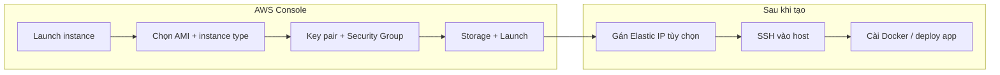

# Tạo EC2 instance — từng bước (AWS Console)

> Hướng dẫn **Launch instance** trên AWS Console: mỗi bước ghi rõ **dùng để làm gì** và **chọn gì** cho môi trường dev/staging (chạy Docker, nginx, SSH deploy).

**EC2** (Elastic Compute Cloud) = máy ảo (VM) trên AWS. Bạn thuê CPU/RAM/disk theo giờ, cài OS (thường Linux), SSH vào và chạy app — ví dụ stack APA Orchestration Layer (Postgres, Redis, backend, frontend, nginx).



---

## 0. Trước khi bắt đầu — cần có gì?

| Hạng mục | Dùng để làm gì |
|----------|----------------|
| **Tài khoản AWS** + quyền `ec2:*` (hoặc policy tối thiểu: launch, describe, terminate) | Đăng nhập Console và tạo instance |
| **VPC mặc định** (hoặc VPC riêng) | Mạng ảo — instance phải nằm trong một VPC |
| **Region** (ví dụ `ap-southeast-1` Singapore) | Instance, EBS, Elastic IP **gắn cứng** một region — chọn gần user hoặc cùng region với ECR/RDS |
| **Key pair** (hoặc tạo mới khi launch) | File `.pem` để **SSH** vào Linux — không có key thì không login được (trừ khi dùng SSM Session Manager) |

**Khi nào cần tạo EC2:**

- Host dev/staging chạy Docker Compose (như deploy qua GitHub Actions SSH)
- Bastion / jump host vào VPC private
- Worker chạy lâu, cần SSH, cron, daemon — không phù hợp Lambda

**Khi nào không cần EC2:**

- API serverless → Lambda + API Gateway
- Container orchestration production → ECS/EKS
- Static site → S3 + CloudFront

---

## 1. Mở wizard Launch instance

| Bước | Thao tác | Dùng để làm gì |
|------|----------|----------------|
| **1.1** | Đăng nhập [AWS Console](https://console.aws.amazon.com/) | Xác thực tài khoản |
| **1.2** | Chọn **Region** góc phải trên (ví dụ **Asia Pacific (Singapore) `ap-southeast-1`**) | Mọi resource tạo sau này nằm region này — **đổi region = tạo lại** nếu chọn nhầm |
| **1.3** | Tìm service **EC2** → menu trái **Instances** → **Launch instances** | Mở form tạo máy ảo mới |

---

## 2. Name and tags (Tên và tag)

| Trường | Gợi ý | Dùng để làm gì |
|--------|-------|----------------|
| **Name** | `orch-dev`, `staging-app-01` | Nhãn hiển thị trong Console — dễ phân biệt khi có nhiều instance |
| **Tags** (tùy chọn) | `Environment=dev`, `Project=one-orch-layer`, `Owner=team-backend` | Phân loại chi phí (Cost Allocation), automation, compliance — billing report theo tag |

> Tag không ảnh hưởng chức năng kỹ thuật, nhưng **nên gắn** `Environment` để tránh terminate nhầm production.

---

## 3. Application and OS Images (AMI)

**AMI** = ảnh đĩa gốc (OS + có thể có package sẵn).

| Lựa chọn | Dùng để làm gì | Gợi ý dev/staging |
|----------|----------------|-------------------|
| **Amazon Linux 2023** | OS chuẩn AWS, tích hợp SSM, `yum`/`dnf` | Phổ biến cho server AWS-native |
| **Ubuntu Server 22.04/24.04 LTS** | Quen thuộc, nhiều tutorial Docker | **Khuyến nghị** nếu team quen Ubuntu |
| **Amazon Linux 2** | Legacy — vẫn dùng được | Chỉ chọn nếu policy công ty bắt buộc |

| Thuộc tính AMI | Dùng để làm gì |
|----------------|----------------|
| **Architecture: 64-bit (x86)** | Chạy hầu hết image Docker public |
| **Architecture: arm64 (Graviton)** | Rẻ hơn — cần image Docker build cho ARM |

Chọn **Ubuntu 22.04 LTS**, **64-bit (x86)** nếu không có lý do đặc biệt.

---

## 4. Instance type (Loại máy)

Quyết định **CPU, RAM, mạng** — và **chi phí theo giờ**.

| Type | vCPU | RAM | Dùng để làm gì |
|------|------|-----|----------------|
| **t3.micro** | 2 | 1 GiB | Free tier / thử nghiệm — **quá nhỏ** cho Docker stack đầy đủ |
| **t3.small** | 2 | 2 GiB | Dev nhẹ, 1–2 container |
| **t3.medium** | 2 | 4 GiB | **Dev hợp lý**: Postgres + Redis + BE + FE + nginx |
| **t3.large** | 2 | 8 GiB | Staging / nhiều service / bộ nhớ thoải mái hơn |
| **m6i.large** | 2 | 8 GiB | CPU ổn định hơn t3 (không burst credit) |

**t3.* (burstable):** CPU có “credit” — spike ngắn OK; chạy full load lâu có thể bị throttle.

**Dùng để làm gì bước này:** Cân bằng chi phí vs đủ RAM cho `docker compose` (Postgres + app thường cần **≥ 4 GiB**).

---

## 5. Key pair (login)

| Bước | Thao tác | Dùng để làm gì |
|------|----------|----------------|
| **5.1** | **Create new key pair** hoặc chọn key có sẵn | AWS gắn public key vào instance; bạn giữ private key (`.pem`) |
| **5.2** | Đặt tên: `orch-dev-ssh` | Nhận diện key trên nhiều project |
| **5.3** | Type: **RSA**, Format: **`.pem`** (OpenSSH) | `ssh` trên Linux/macOS/WSL dùng PEM |
| **5.4** | **Download** file `.pem` — chỉ tải **một lần** | Mất file = không SSH được (phải tạo instance mới hoặc dùng SSM) |

```bash
# Sau khi có file .pem — giới hạn quyền (bắt buộc)
chmod 400 ~/Downloads/orch-dev-ssh.pem

# SSH (Ubuntu AMI — user mặc định: ubuntu)
ssh -i ~/Downloads/orch-dev-ssh.pem ubuntu@<PUBLIC_IP>
```

| Lưu ý | Dùng để làm gì |
|-------|----------------|
| Lưu `.pem` an toàn (password manager, SSM — như `DEV_SSH_KEY_SSM_PATH` trong CI) | GitHub Actions deploy SSH cần private key |
| **Không** commit `.pem` lên git | Rò rỉ key = ai cũng vào được server |

---

## 6. Network settings (Mạng)

Quyết định instance **nằm subnet nào**, **có IP public không**, **firewall (Security Group)** mở cổng gì.

### 6.1. VPC và Subnet

| Trường | Gợi ý | Dùng để làm gì |
|--------|-------|----------------|
| **VPC** | `default` hoặc VPC app | Isolation mạng — RDS private thường cùng VPC |
| **Subnet** | **Public subnet** (có route tới Internet Gateway) | Instance cần **Public IP** để SSH từ internet / GitHub Actions |
| **Auto-assign public IP** | **Enable** (dev) | Gán IP public tạm — đổi khi stop/start (trừ khi gắn Elastic IP) |

### 6.2. Security Group (SG) — firewall instance

Tạo **security group mới** hoặc chọn SG có sẵn.

| Inbound rule | Port | Source | Dùng để làm gì |
|--------------|------|--------|----------------|
| SSH | **22** | **IP của bạn** / `x.x.x.x/32` | Remote shell — **không** mở `0.0.0.0/0` trừ khi chấp nhận rủi ro |
| SSH | **22** | IP egress GitHub Actions (hoặc dùng SSM) | CI deploy qua SSH |
| HTTP | **80** | `0.0.0.0/0` | Nginx HTTP (thường redirect HTTPS) |
| Custom TCP | **8080** | `0.0.0.0/0` hoặc ALB SG | Stack dev expose qua nginx `:8080` (xem [`../tours/index.md`](../tours/index.md)) |
| HTTPS | **443** | `0.0.0.0/0` | TLS terminate tại nginx |

| Outbound | Mặc định **All traffic → 0.0.0.0/0** | Instance pull image ECR, apt, gọi API AWS |

**Dùng để làm gì bước này:** Chỉ mở cổng **cần thiết** — SG là lớp bảo vệ đầu tiên trước khi traffic tới OS.

### 6.3. (Tùy chọn) Placement / IPv6

Bỏ qua khi mới học — không bắt buộc cho dev server.

---

## 7. Configure storage (Ổ đĩa EBS)

| Trường | Gợi ý dev | Dùng để làm gì |
|--------|-----------|----------------|
| **Root volume** | **gp3**, **30–50 GiB** | OS + Docker images + logs — image ECR pull nhiều lần tốn disk |
| **Volume type gp3** | SSD cân bằng giá/hiệu năng | Mặc định tốt cho hầu hết workload |
| **Delete on termination** | **Yes** (dev) / **No** (data quan trọng) | Terminate instance → xóa luôn disk (tránh phí orphan volume) |
| **Encrypted** | Bật (KMS mặc định) | Mã hóa disk at-rest — compliance |

**Dùng để làm gì:** Tránh full disk khi `docker pull` + Postgres data — monitor bằng `df -h` (deploy workflow cũng check disk).

---

## 8. Advanced details (Nâng cao — chọn lọc)

Không bắt buộc hết; các mục hay dùng:

| Mục | Gợi ý | Dùng để làm gì |
|-----|-------|----------------|
| **IAM instance profile** | Role có quyền `AmazonSSMManagedInstanceCore`, `ecr:GetAuthorizationToken`, `ecr:BatchGetImage` | Instance gọi AWS API **không cần** access key cứng trên disk |
| **User data** (shell script lần đầu boot) | Cài Docker, Docker Compose, agent | Tự động hóa setup — chạy **một lần** khi instance khởi động lần đầu |
| **Metadata version** | IMDSv2 (bắt buộc mới) | Bảo mật lấy credential từ metadata service |
| **Termination protection** | Bật cho staging quan trọng | Tránh xóa nhầm instance |
| **Detailed CloudWatch monitoring** | Tắt (dev) để tiết kiệm | Metric 1 phút vs 5 phút |

### Ví dụ User data (Ubuntu — cài Docker)

```bash
#!/bin/bash
set -eux
apt-get update
apt-get install -y ca-certificates curl
install -m 0755 -d /etc/apt/keyrings
curl -fsSL https://download.docker.com/linux/ubuntu/gpg -o /etc/apt/keyrings/docker.asc
chmod a+r /etc/apt/keyrings/docker.asc
echo "deb [arch=$(dpkg --print-architecture) signed-by=/etc/apt/keyrings/docker.asc] https://download.docker.com/linux/ubuntu $(. /etc/os-release && echo "$VERSION_CODENAME") stable" > /etc/apt/sources.list.d/docker.list
apt-get update
apt-get install -y docker-ce docker-ce-cli containerd.io docker-compose-plugin
usermod -aG docker ubuntu
```

**Dùng để làm gì:** Sau launch, SSH vào đã có Docker — không phải cài tay từng bước.

---

## 9. Summary → Launch instance

| Bước | Thao tác | Dùng để làm gì |
|------|----------|----------------|
| **9.1** | Xem lại AMI, type, SG, storage | Tránh nhầm region / mở port quá rộng |
| **9.2** | **Number of instances**: `1` | Scale ngang thì dùng Auto Scaling Group — không launch hàng loạt tay |
| **9.3** | Bấm **Launch instance** | AWS tạo VM + gắn EBS + áp SG |
| **9.4** | Đợi **Instance state = Running**, **Status check = 2/2** | Instance sẵn sàng nhận SSH |

Copy **Public IPv4 address** (hoặc Public DNS) từ bảng Instances.

---

## 10. Sau khi tạo — các bước tiếp theo

### 10.1. Elastic IP (tùy chọn nhưng nên có cho dev host)

| Bước | Dùng để làm gì |
|------|----------------|
| **EC2 → Elastic IPs → Allocate** | Giữ **IP cố định** — stop/start instance không đổi IP |
| **Associate** với instance vừa tạo | DNS trỏ A record ổn định (`one-dev.example.com` → IP cố định) |

> Public IP mặc định **đổi** khi stop/start — CI/CD và DNS sẽ gãy nếu không dùng Elastic IP.

### 10.2. SSH lần đầu

```bash
chmod 400 orch-dev-ssh.pem
ssh -i orch-dev-ssh.pem ubuntu@<ELASTIC_IP>

# Kiểm tra
uname -a
docker --version   # nếu đã chạy user data
df -h
```

**Dùng để làm gì:** Xác nhận login OK, disk đủ, Docker sẵn sàng trước khi deploy.

### 10.3. DNS (nếu có domain)

| Bước | Dùng để làm gì |
|------|----------------|
| Tạo **A record** trỏ domain → Elastic IP | User truy cập `https://one-dev...` thay vì IP thô |
| (Sau đó) Certbot / ACM cho HTTPS | TLS cho nginx |

### 10.4. Chuẩn bị deploy (liên quan monorepo APA)

| Bước | Dùng để làm gì |
|------|----------------|
| Tạo thư mục deploy trên host (`DEV_DEPLOY_DIR`) | Nơi `docker-compose.deploy.yml`, `.env`, nginx config được `scp` tới |
| Cấu hình `docker login` ECR (hoặc để workflow deploy copy credentials) | `docker pull` image từ ECR |
| Mở SG cho GitHub Actions runner IP (hoặc dùng SSM) | Workflow SSH deploy thành công |

Chi tiết pipeline: [`../index.vi.md`](../index.vi.md) §5–§6.

---

## 11. Checklist nhanh (dev server Docker)

- [ ] Region đúng (`ap-southeast-1` cùng ECR)
- [ ] AMI Ubuntu 22.04 LTS (x86)
- [ ] Instance type ≥ **t3.medium** (4 GiB RAM)
- [ ] Key pair đã tải `.pem`, `chmod 400`
- [ ] Security Group: SSH hạn chế IP; mở **8080** (hoặc 80/443) cho app
- [ ] Public subnet + public IP (hoặc Elastic IP)
- [ ] Root volume ≥ **30 GiB** gp3
- [ ] (Khuyến nghị) IAM role: SSM + ECR read
- [ ] (Khuyến nghị) User data cài Docker
- [ ] SSH thành công
- [ ] Elastic IP + DNS (nếu cần domain cố định)

---

## 12. Troubleshooting

| Triệu chứng | Nguyên nhân thường gặp | Cách xử lý |
|-------------|------------------------|------------|
| SSH timeout | SG chưa mở 22 hoặc sai IP | Sửa inbound SG; kiểm tra public IP |
| `Permission denied (publickey)` | Sai key hoặc sai user (`ubuntu` vs `ec2-user`) | Đúng file `.pem`; Amazon Linux dùng `ec2-user` |
| Instance Running nhưng 1/2 status check | Boot chậm hoặc lỗi system | Đợi thêm; xem **System log** / **Instance screenshot** |
| Không pull được ECR | Thiếu IAM hoặc chưa `docker login` | Gắn instance profile; chạy `aws ecr get-login-password` |
| Full disk | Image Docker tích lũy | `docker system prune -a`; tăng EBS volume |
| IP đổi sau stop/start | Chưa gắn Elastic IP | Allocate + Associate Elastic IP |

---

## 13. Tạo bằng AWS CLI (tham khảo)

Dùng khi script hóa hoặc học IaC — **cùng ý nghĩa** các bước Console trên.

```bash
# Biến — thay theo môi trường
export AWS_REGION=ap-southeast-1
export KEY_NAME=orch-dev-ssh
export SG_NAME=orch-dev-sg
export AMI_ID=$(aws ssm get-parameters \
  --names /aws/service/canonical/ubuntu/server/22.04/stable/current/amd64/hvm/ebs-gp2/ami-id \
  --query 'Parameters[0].Value' --output text)

# Security group (mở 22 từ IP bạn — thay YOUR_IP)
export MY_IP=$(curl -s ifconfig.me)
aws ec2 create-security-group --group-name "$SG_NAME" --description "Orch dev" \
  --vpc-id "$(aws ec2 describe-vpcs --filters Name=isDefault,Values=true --query 'Vpcs[0].VpcId' --output text)"
aws ec2 authorize-security-group-ingress --group-name "$SG_NAME" --protocol tcp --port 22 --cidr "${MY_IP}/32"
aws ec2 authorize-security-group-ingress --group-name "$SG_NAME" --protocol tcp --port 8080 --cidr 0.0.0.0/0

# Launch
aws ec2 run-instances \
  --image-id "$AMI_ID" \
  --instance-type t3.medium \
  --key-name "$KEY_NAME" \
  --security-groups "$SG_NAME" \
  --block-device-mappings '[{"DeviceName":"/dev/sda1","Ebs":{"VolumeSize":40,"VolumeType":"gp3","DeleteOnTermination":true}}]' \
  --tag-specifications 'ResourceType=instance,Tags=[{Key=Name,Value=orch-dev}]' \
  --region "$AWS_REGION"
```

---

## 14. Chi phí & dọn tài nguyên

| Hạng mục | Dùng để làm gì khi học |
|----------|------------------------|
| **Stop** instance | Dừng tính phí CPU/RAM — **vẫn tính phí EBS** |
| **Terminate** instance | Xóa VM — disk xóa theo nếu `Delete on termination = Yes` |
| **Release Elastic IP** nếu không gắn instance | IP idle vẫn mất phí nhỏ |

Luôn **terminate** instance lab + **release** Elastic IP khi không dùng.

---

## 15. Tài liệu liên quan

- Nginx reverse proxy trên EC2: [`../tours/index.md`](../tours/index.md)
- CI/CD SSH deploy lên EC2: [`../index.vi.md`](../index.vi.md)
- Amazon ECR (image Docker): [`../ecr.md`](../ecr.md)
- [AWS — Launch an instance (official)](https://docs.aws.amazon.com/AWSEC2/latest/UserGuide/EC2_GetStarted.html)
