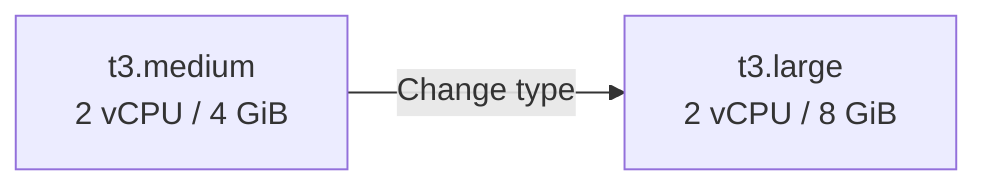
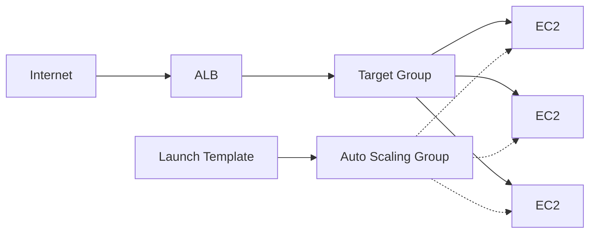
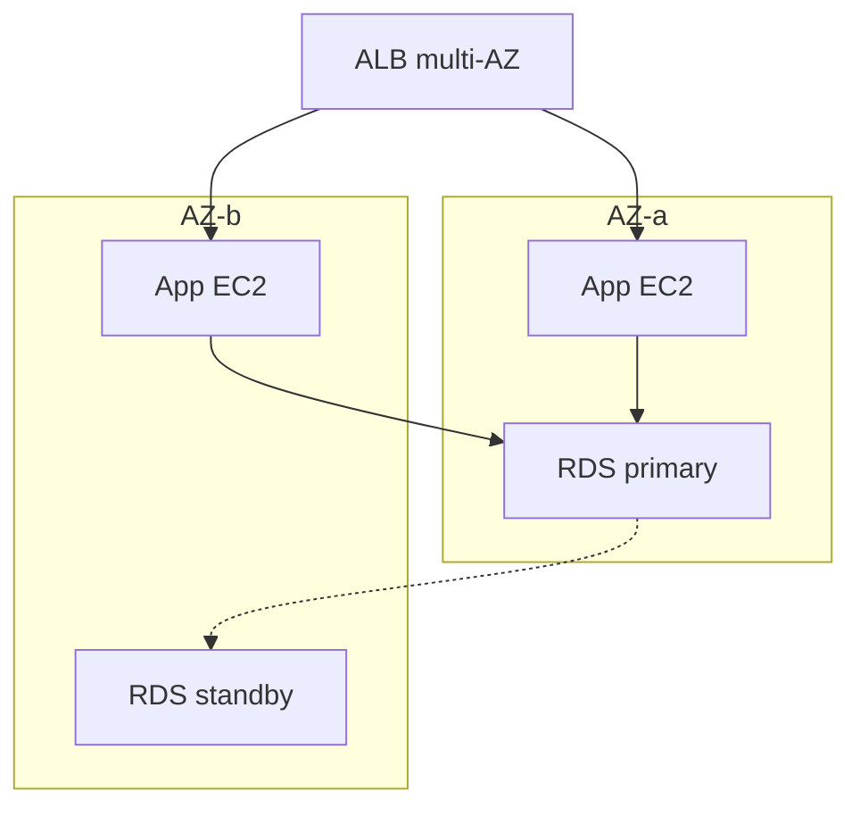

# EC2 — Scale & Load Balancer (vấn đề và khái niệm)

> Tài liệu hiện tại ([`concept.md`](./concept.md), [`how-to-create.md`](./how-to-create.md)) đủ cho **1 máy dev/staging**. File này giải thích phần còn thiếu khi cần **scale** và **load balancer**.

Scale ngang **không** chỉ là “thêm máy” nếu Postgres/Redis/app vẫn nằm chung một EC2 — DB và state phải tách trước.

---

## 0. Đã có vs còn thiếu

| Đã cover | Chưa cover (quan trọng nếu lên production) |
|----------|--------------------------------------------|
| Launch 1 instance, AMI, type, SG, EBS, EIP, SSH | Scale dọc / ngang |
| User data, IAM, chi phí stop/terminate | Load balancer (ALB/NLB) + health check |
| Docker Compose trên 1 host | Launch Template, ASG, multi-AZ |
| | Stateful vs stateless, session, shared storage |

---

## 1. Scale dọc (vertical scaling)

**Là gì:** Đổi instance type lớn hơn (`t3.medium` → `t3.large` / `m6i.xlarge`) — tăng CPU/RAM trên **cùng một** máy.

### Cách làm thực tế

1. Stop instance (hoặc resize với downtime ngắn).
2. Change instance type.
3. Start lại.

### Lưu ý

| Điểm | Chi tiết |
|------|----------|
| Public IP | IP mặc định có thể đổi → cần **Elastic IP** |
| Trần cứng | Mỗi type/family có giới hạn — không scale vô hạn |
| t3 burstable | Tăng RAM nhưng vẫn chọn `t3` → CPU credit hết vẫn throttle |
| Downtime | Stop/start vài phút — staging OK, production thường tránh |
| EBS | Giữ nguyên; chỉ đổi compute |

**Khi dùng:** Dev/staging, traffic thấp, muốn đơn giản. **Không** phải giải pháp HA.



---

## 2. Scale ngang (horizontal scaling)

**Là gì:** Nhiều instance giống nhau phía sau load balancer; thêm/bớt máy theo tải.

### Kiến trúc chuẩn trên AWS

```text
Internet → ALB → Target Group → [EC2, EC2, EC2...]  ← Auto Scaling Group
                                      ↑
                              Launch Template (AMI + user data + SG + IAM)
```



### Khái niệm bắt buộc

| Khái niệm | Vai trò |
|-----------|---------|
| **Launch Template** | “Công thức” tạo máy: AMI, type, SG, IAM, user data — ASG dùng template này spawn instance |
| **Auto Scaling Group (ASG)** | `min` / `desired` / `max`; policy scale theo CPU, ALB request count, custom metric |
| **Target Group** | Đăng ký instance; ALB forward traffic; **health check** (HTTP `/health`) quyết định nhận traffic |
| **ALB / NLB** | Phân phối request vào Target Group |

### Điều kiện app phải thỏa

- **Stateless** (hoặc session trên Redis/DB chung) — không lưu session chỉ trên disk local.
- **Không** chạy Postgres/Redis “primary” trên mỗi EC2 scale ngang.
- Deploy giống nhau mọi máy (AMI bake hoặc user data + pull image từ ECR).
- Health endpoint ổn định để ALB không gửi traffic vào máy đang boot/deploy.

Với stack Compose full (Postgres + Redis + BE + FE + nginx trên 1 host): scale ngang nghĩa là **tách DB (RDS), cache (ElastiCache), rồi chỉ scale tầng app** — không scale cả Compose nguyên khối.

### ASG — tham số hay dùng

| Tham số | Ý nghĩa |
|---------|---------|
| **Min** | Số instance tối thiểu (HA thường ≥ 2, span 2 AZ) |
| **Desired** | Số đang muốn chạy |
| **Max** | Trần scale-out |
| **Scaling policy** | Target tracking (ví dụ CPU 50%, hoặc RequestCountPerTarget) |
| **Health check** | EC2 status + (khuyến nghị) ELB health check |

---

## 3. Load balancer

### ALB (Application Load Balancer) — hay dùng nhất cho HTTP/HTTPS

| Mục | Ý nghĩa |
|-----|---------|
| Layer 7 | Route theo path/host (`/api` → TG backend, `/` → TG frontend) |
| TLS | Cert **ACM** gắn ALB — không cần Certbot trên từng EC2 |
| Health check | Path, interval, healthy/unhealthy threshold |
| SG pattern | Internet → ALB:80/443; ALB → EC2: chỉ SG của ALB (không mở `0.0.0.0/0` vào app) |
| Sticky session | Cookie — chỉ khi chưa chuyển session sang Redis |

### NLB (Network Load Balancer)

Layer 4 (TCP/UDP), latency thấp, IP tĩnh — dùng khi cần TCP thô, không cần path routing.

### CLB (Classic Load Balancer)

Legacy — gần như không học mới.

### Setup tối thiểu (mental model)

1. Tạo ALB ở **public subnets** (≥ 2 AZ).
2. Tạo Target Group (HTTP, port app, health check).
3. Listener 443 → TG; (optional) 80 redirect → 443.
4. EC2 ở **private subnet**; SG chỉ nhận từ SG của ALB.
5. ASG gắn Target Group → instance mới tự register.
6. DNS (Route 53 / domain) → ALB — **không** trỏ EIP từng máy.

Đây là bước nhảy lớn so với “1 EC2 + Elastic IP + nginx” trong tours hiện tại.

### So sánh nhanh ALB vs nginx trên 1 EC2

| | Nginx trên 1 EC2 | ALB |
|--|------------------|-----|
| SPOF | Có (máy chết = hết service) | Không (managed, multi-AZ) |
| Scale ngang app | Thủ công / khó | Tự nhiên với Target Group + ASG |
| TLS | Certbot trên host | ACM trên ALB |
| Path routing | Có | Có |

---

## 4. Multi-AZ & HA (đi kèm scale ngang)

| Khái niệm | Vì sao cần |
|-----------|------------|
| ASG span **≥ 2 AZ** | Một AZ sập vẫn còn capacity |
| ALB multi-subnet | Bắt buộc cho HA |
| RDS Multi-AZ | DB không single point trên 1 EC2 |
| Không dùng EIP cho từng app instance | Traffic vào ALB DNS |



---

## 5. Vấn đề thường gặp khi scale

| Vấn đề | Nguyên nhân | Hướng xử lý |
|--------|-------------|-------------|
| Scale ngang nhưng session mất | Session lưu local disk / memory từng máy | Redis / sticky session (tạm) |
| Instance mới Unhealthy | App boot chậm / sai health path / SG chặn ALB | Nới grace period; sửa `/health`; mở SG từ ALB |
| Scale-out nhưng DB chết | Postgres trên EC2 bị quá tải hoặc không share | Chuyển **RDS**; connection pool |
| Upload file “mất” trên máy khác | File lưu local EBS | S3 (hoặc EFS nếu bắt buộc shared FS) |
| Deploy lệch từng máy | SSH patch tay | Launch Template + AMI bake / rolling replace |
| IP whitelist CI gãy | Trỏ EIP từng instance | Trỏ ALB; hoặc SSM deploy, không SSH theo IP máy |

---

## 6. Khái niệm EC2 liên quan (ngoài scale thuần)

Ưu tiên khi “lên thật”:

| Chủ đề | Dùng để làm gì |
|--------|----------------|
| **AMI bake / Immutable** | Packer hoặc EC2 Image Builder; deploy = thay instance, không SSH patch tay |
| **Spot vs On-Demand** | Spot rẻ, có thể bị reclaim; ASG mixed instances |
| **CloudWatch alarms** | CPU, StatusCheckFailed → notify hoặc scale policy |
| **Systems Manager (SSM)** | Thay SSH mở port 22; Patch Manager |
| **EBS snapshot / AMI backup** | Phục hồi / nhân bản máy |
| **Savings Plans / RI** | Giảm phí khi chạy 24/7 |
| **ECS / EKS / Fargate** | Container production — thay “nhiều EC2 + Compose tay” |
| **Lambda** | Serverless — không quản lý EC2 (xem [`../lambda.md`](../lambda.md)) |

---

## 7. Lộ trình học (khớp repo)

```text
Giai đoạn 1 (đã có)     1 EC2 + Docker Compose + EIP + nginx
        ↓
Giai đoạn 2             Tách RDS + ElastiCache; EC2 chỉ chạy app
        ↓
Giai đoạn 3             ALB + Target Group + 2 instance cố định (học LB trước)
        ↓
Giai đoạn 4             Launch Template + ASG (min=2) + scale policy
        ↓
Giai đoạn 5             Private subnet + SSM; ACM trên ALB; không SSH public
```

---

## 8. Tóm tắt nhanh

| Hướng | Cách | Giới hạn |
|-------|------|----------|
| **Scale dọc** | Đổi instance type | Downtime, trần type, không HA |
| **Scale ngang** | Launch Template + ASG + Target Group + ALB | App stateless; DB/cache tách khỏi EC2 |
| **Load balancer** | ALB cho web HTTP/HTTPS | Health check + SG + multi-AZ là phần setup cốt lõi |

---

## Tài liệu liên quan

- Khái niệm EC2 cơ bản: [`concept.md`](./concept.md)
- Tạo 1 instance (Console): [`how-to-create.md`](./how-to-create.md)
- Nginx reverse proxy trên EC2: [`../tours/index.md`](../tours/index.md)
- [AWS — Auto Scaling groups](https://docs.aws.amazon.com/autoscaling/ec2/userguide/auto-scaling-groups.html)
- [AWS — Application Load Balancers](https://docs.aws.amazon.com/elasticloadbalancing/latest/application/introduction.html)
