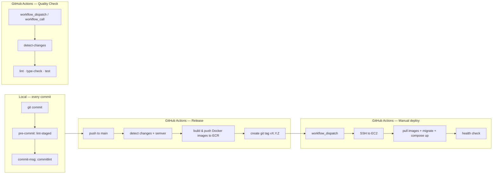
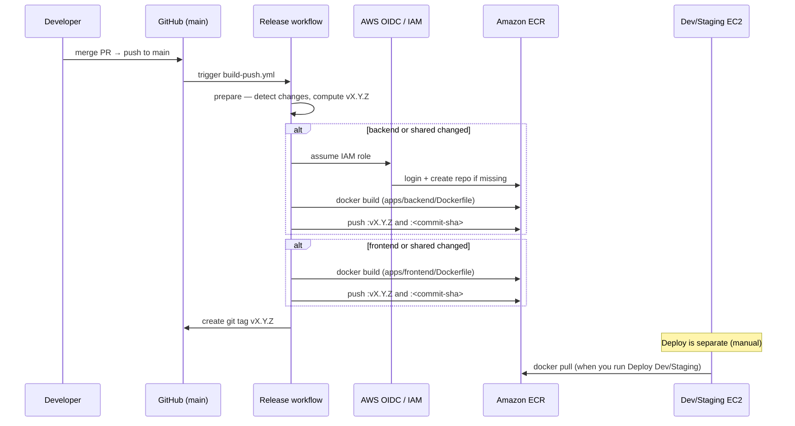

# APA Orchestration Layer — CI/CD Step by Step

> Vietnamese: [`index.vi.md`](index.vi.md)

This document describes the end-to-end Continuous Integration and Continuous Delivery pipeline for the **one-orch-layer** monorepo (NestJS backend + React frontend).

---

## 1. Pipeline overview



| Stage | Trigger | Where it runs | Output |
|-------|---------|---------------|--------|
| **Local hooks** | Every `git commit` | Developer machine | Formatted, linted staged files; conventional commit message |
| **Quality Check** | Manual or called by another workflow | `ubuntu-latest` | Lint, type-check, test pass/fail |
| **Release → ECR push** | Push to `main` (or `ci-sandbox`) | `ubuntu-latest` → **Amazon ECR** | New Docker images built & **pushed** to ECR (`vX.Y.Z` + `<sha>`) — see **§4.1** |
| **Deploy Dev / Staging** | Manual (`workflow_dispatch`) | `ubuntu-latest` → EC2 via SSH | Running stack on target host |

Workflow files live in [`.github/workflows/`](.github/workflows/).

---

## 2. Local CI (pre-push quality gate)

Local hooks run automatically after `pnpm install` (via the `prepare` → `husky` script).

### Step 2.1 — Pre-commit (`lint-staged`)

**File:** [`.husky/pre-commit`](.husky/pre-commit)

On every commit:

1. Husky runs `lint-staged`.
2. `lint-staged` (configured in root [`package.json`](package.json)) runs per changed file:
   - **Backend** (`apps/backend/**`): ESLint with fix + Prettier
   - **Frontend** (`apps/frontend/**`): ESLint with fix + Prettier
   - **Shared types** (`packages/shared-types/**`): ESLint with fix + Prettier
   - **JSON / Markdown / YAML / HTML / CSS**: Prettier only

If lint or format fails, the commit is blocked.

### Step 2.2 — Commit message (`commitlint`)

**File:** [`.husky/commit-msg`](.husky/commit-msg)

1. Reads the commit message.
2. Validates [Conventional Commits](https://www.conventionalcommits.org/) format via `@commitlint/config-conventional`.
3. Rejects commits that do not match (e.g. `feat:`, `fix:`, `chore:`, `docs:`, `test:`, `ci:`).

These commit prefixes also drive **semantic versioning** in the Release workflow (see §4).

### Step 2.3 — Run the same checks locally (optional)

```bash
pnpm install
pnpm lint
pnpm type-check
pnpm test
pnpm format:check
```

---

## 3. GitHub Actions — Quality Check (`ci.yml`)

**Workflow name:** Quality Check  
**File:** [`.github/workflows/ci.yml`](.github/workflows/ci.yml)

### Triggers

- `workflow_dispatch` — run manually from the GitHub Actions UI
- `workflow_call` — reusable workflow (can be invoked by other workflows)

> **Note:** This workflow is **not** wired to `pull_request` today. PR safety currently relies on local hooks plus manual or downstream invocation of Quality Check.

### Step-by-step execution

| Step | Job | What happens |
|------|-----|--------------|
| 1 | **Detect changes** | Checkout with full history. `dorny/paths-filter` sets flags for `backend`, `frontend`, `shared` (packages + lockfile + turbo config), and `workflows`. |
| 2 | **Gate** | If none of the above changed (and not a manual dispatch), the CI job is skipped. |
| 3 | **CI job** | `pnpm install --frozen-lockfile` → `pnpm lint` → `pnpm type-check` → `pnpm test`. |
| 4 | **Concurrency** | In-flight runs for the same PR/SHA are cancelled (`cancel-in-progress: true`). |

**Runtime:** Node version from [`.nvmrc`](.nvmrc), pnpm cache enabled.

---

## 4. GitHub Actions — Release (`build-push.yml`)

**Workflow name:** Release  
**File:** [`.github/workflows/build-push.yml`](.github/workflows/build-push.yml)

### Trigger

Push to branch **`main`** or **`ci-sandbox`**.

### Step-by-step execution

#### Job 1 — `prepare` (detect changes & compute version)

1. Checkout with full git history.
2. **Path filter** — decide what to build:
   - **Backend image** if `apps/backend/**` or shared workspace files changed.
   - **Frontend image** if `apps/frontend/**` or shared workspace files changed.
3. **Read latest tag** — highest `v*` tag (default `v0.0.0` if none).
4. **Semver bump** — scan commit messages since last tag:
   - `feat:` → **minor** bump
   - `fix:`, `chore:`, `refactor:`, etc. → **patch** bump
   - `!` or `BREAKING CHANGE` → **major** bump
   - Merge commits are ignored.

#### Job 2 — `build-backend` (conditional)

Runs only if backend (or shared) changed.

1. **AWS OIDC** — assume IAM role (`AWS_OIDC_ROLE_NAME`).
2. **ECR login** — authenticate to Amazon ECR.
3. **Ensure repository** — create ECR repo if missing (scan on push enabled).
4. **Docker Buildx** — build from repo root using [`apps/backend/Dockerfile`](apps/backend/Dockerfile).
5. **Push tags:**
   - `{account}.dkr.ecr.{region}.amazonaws.com/{ECR_BACKEND_REPO}:v{version}`
   - `...:{github.sha}`
6. **Cache** — GitHub Actions cache for faster rebuilds.

#### Job 3 — `build-frontend` (conditional)

Same flow as backend, using [`apps/frontend/Dockerfile`](apps/frontend/Dockerfile) and `ECR_FRONTEND_REPO`.

#### Job 4 — `release` (tag & summarize)

Runs if at least one build job succeeded.

1. **Resolve image tags** — for services not rebuilt, reuse the tag from the previous release annotation or latest ECR image.
2. **Create annotated git tag** `v{version}` with message body:
   ```
   backend=vX.Y.Z
   frontend=vX.Y.Z
   - commit messages...
   ```
3. **Push tag** to `origin`.
4. **Write job summary** — table of built/skipped apps and image URIs.

### Required GitHub configuration (Release)

| Type | Name | Purpose |
|------|------|---------|
| Variable | `AWS_REGION` | ECR region |
| Variable | `AWS_ACCOUNT_ID` | AWS account |
| Variable | `ECR_BACKEND_REPO` | Backend ECR repository name |
| Variable | `ECR_FRONTEND_REPO` | Frontend ECR repository name |
| Variable | `AWS_OIDC_ROLE_NAME` | IAM role for GitHub OIDC |

**Permissions:** `contents: write`, `id-token: write`.

---

## 4.1 Push & update new images on Amazon ECR

This is the step that **publishes new Docker images to ECR**. It runs inside the **Release** workflow (`build-push.yml`) — not during deploy. Deploy only **pulls** images that Release already pushed.

### When does ECR get new images?

| Event | Images pushed to ECR? |
|-------|----------------------|
| Merge / push to **`main`** or **`ci-sandbox`** | **Yes** — automatic |
| Open or update a PR | No |
| Run **Quality Check** (`ci.yml`) | No |
| Run **Deploy Dev / Staging** | No — only `docker pull` on the EC2 host |
| Local `docker build` on your laptop | No — unless you push manually |

**Rule of thumb:** code lands on `main` → GitHub Actions builds → images appear in ECR with a new `vX.Y.Z` tag.

### ECR push flow (diagram)



### Step-by-step: how a new image lands in ECR

| Step | Actor | Action |
|------|-------|--------|
| **1** | Developer | Merge PR into `main` (or push directly to `main` / `ci-sandbox`). |
| **2** | GitHub | Starts workflow **Release** ([`build-push.yml`](.github/workflows/build-push.yml)). |
| **3** | Job `prepare` | Checks which paths changed since last run (see table below). Computes next semver `X.Y.Z` from conventional commits since the latest `v*` git tag. |
| **4** | Job `build-backend` | Runs **only if** backend or shared files changed. Skipped otherwise. |
| **5** | Job `build-frontend` | Runs **only if** frontend or shared files changed. Skipped otherwise. |
| **6** | AWS auth | Workflow assumes IAM role via **GitHub OIDC** (`arn:aws:iam::{AWS_ACCOUNT_ID}:role/{AWS_OIDC_ROLE_NAME}`). No static AWS keys in the workflow. |
| **7** | ECR login | `aws-actions/amazon-ecr-login` — runner can push to your registry. |
| **8** | Ensure repository | If the ECR repo does not exist yet, it is **created automatically** (`scanOnPush=true`, tags **MUTABLE**). |
| **9** | Docker build | Build context = **repo root**. Dockerfiles: [`apps/backend/Dockerfile`](apps/backend/Dockerfile), [`apps/frontend/Dockerfile`](apps/frontend/Dockerfile). Uses Buildx + GHA layer cache. |
| **10** | Docker push | Image is **pushed** to ECR with **two tags** (see next subsection). |
| **11** | Job `release` | Creates annotated git tag `vX.Y.Z` on GitHub recording which backend/frontend image tags this release uses. |
| **12** | You | Use tag `vX.Y.Z` in **Deploy Dev** or **Deploy Staging** to roll out the new image (§5–§6). |

### Image URI and tags

Registry host:

```text
{AWS_ACCOUNT_ID}.dkr.ecr.{AWS_REGION}.amazonaws.com
```

Full image references (examples):

```text
# Backend
{AWS_ACCOUNT_ID}.dkr.ecr.{AWS_REGION}.amazonaws.com/{ECR_BACKEND_REPO}:v1.2.3
{AWS_ACCOUNT_ID}.dkr.ecr.{AWS_REGION}.amazonaws.com/{ECR_BACKEND_REPO}:a1b2c3d4e5f6...   # full commit SHA

# Frontend
{AWS_ACCOUNT_ID}.dkr.ecr.{AWS_REGION}.amazonaws.com/{ECR_FRONTEND_REPO}:v1.2.3
{AWS_ACCOUNT_ID}.dkr.ecr.{AWS_REGION}.amazonaws.com/{ECR_FRONTEND_REPO}:a1b2c3d4e5f6...
```

| Tag | Purpose |
|-----|---------|
| `vX.Y.Z` | **Deploy tag** — use this in Deploy Dev/Staging (`backend_tag` / `frontend_tag`). Bumped by semver rules in the `prepare` job. |
| `<commit-sha>` | **Traceability** — exact git commit that produced the image. Useful for debugging; deploy workflows normally use `vX.Y.Z`. |

Repository names come from GitHub variables `ECR_BACKEND_REPO` and `ECR_FRONTEND_REPO` (not hardcoded in the repo).

### What code changes trigger a new ECR image?

| Path changed | Backend image rebuilt? | Frontend image rebuilt? |
|--------------|------------------------|-------------------------|
| `apps/backend/**` | Yes | No |
| `apps/frontend/**` | No | Yes |
| `packages/**` | Yes | Yes |
| `pnpm-lock.yaml`, `package.json`, `pnpm-workspace.yaml` | Yes | Yes |
| Docs only (`docs/**`) | No | No |
| `.github/workflows/build-push.yml` only | No* | No* |

\*Unless app/shared paths also changed in the same push.

If only the backend changed, the frontend image in ECR is **not** rebuilt; the `release` job keeps the previous frontend tag in the git release annotation.

### Verify new images in ECR

After Release succeeds, check the **job summary** in GitHub Actions (table with image URIs), or use AWS CLI:

```bash
# List recent backend images
aws ecr describe-images \
  --repository-name "$ECR_BACKEND_REPO" \
  --region "$AWS_REGION" \
  --query 'sort_by(imageDetails,& imagePushedAt)[-5:].imageTags' \
  --output table

# List recent frontend images
aws ecr describe-images \
  --repository-name "$ECR_FRONTEND_REPO" \
  --region "$AWS_REGION" \
  --query 'sort_by(imageDetails,& imagePushedAt)[-5:].imageTags' \
  --output table

# Confirm a specific tag exists
aws ecr describe-images \
  --repository-name "$ECR_BACKEND_REPO" \
  --image-ids imageTag=v1.2.3 \
  --region "$AWS_REGION"
```

In the **AWS Console**: ECR → Repositories → `{ECR_BACKEND_REPO}` / `{ECR_FRONTEND_REPO}` → see tags and push time.

### From ECR push to running on a server

Pushing to ECR does **not** restart servers automatically.

```text
1. Release workflow finishes → images in ECR tagged v1.2.3
2. You run "Deploy Dev" or "Deploy Staging" with backend_tag=v1.2.3 (and/or frontend_tag=...)
3. Deploy workflow SSHs to EC2, writes .env.compose with BACKEND_TAG / FRONTEND_TAG
4. On the host: docker compose -f docker-compose.deploy.yml pull
5. On the host: docker compose up -d  → containers use the new ECR images
```

See [§5](#5-github-actions--deploy-dev-deploy-devyml) and [§6](#6-github-actions--deploy-staging-deploy-stagingyml) for deploy details.

### Monitor a Release run in GitHub

1. Open the repo on GitHub → **Actions** → workflow **Release**.
2. Click the run for your `main` commit.
3. Check jobs:
   - **Detect changes & compute version** — which apps will build, computed `vX.Y.Z`
   - **Build & push backend** / **Build & push frontend** — ECR push happens here (`push: true` in `docker/build-push-action`)
   - **Tag & summarize release** — git tag + summary table with full image URIs

If **Build & push** is skipped, no new image was produced for that app (no relevant file changes).

---

## 5. GitHub Actions — Deploy Dev (`deploy-dev.yml`)

**Workflow name:** Deploy Dev (manual)  
**File:** [`.github/workflows/deploy-dev.yml`](.github/workflows/deploy-dev.yml)

### Trigger

`workflow_dispatch` with inputs:

| Input | Required | Description |
|-------|----------|-------------|
| `backend_tag` | No* | e.g. `v0.6.0` (auto-prefixed with `v` if omitted) |
| `frontend_tag` | No* | e.g. `v0.3.0 |

\* At least one tag must be provided.

### Step-by-step execution

| # | Step | Details |
|---|------|---------|
| 1 | **Validate inputs** | Normalize tags; fail if both empty. |
| 2 | **AWS OIDC** | Assume deploy role. |
| 3 | **ECR login** | Export Docker config for the remote host. |
| 4 | **SSH key** | Load private key from SSM (`DEV_SSH_KEY_SSM_PATH`). |
| 5 | **Resolve running tags** | SSH to dev host; read current `orch-backend` / `orch-frontend` image tags (used when only one service is deployed). |
| 6 | **Prepare deploy bundle** | Copy `docker-compose.deploy.yml`, `nginx/`, `.env.dev`; inject GitHub secrets (session, AWS keys, Entra ID, FXO credentials). Write `.env.compose` with ECR registry and image tags. |
| 7 | **Pre-deploy checks** | Disk space, running containers, Docker disk usage. |
| 8 | **Backup** | Backup backend `.env` on host; snapshot image list. |
| 9 | **Free disk space** | `docker image prune` on host. |
| 10 | **Upload bundle** | `scp` compose file, env files, nginx config, Docker credentials to `DEV_DEPLOY_DIR`. |
| 11 | **Pull images** | `docker compose pull` for selected services only. |
| 12 | **Run migrations** | If backend is deployed: start Postgres, run `node run-migrations.js` in a one-off backend container. |
| 13 | **Start containers** | `docker compose up -d` for postgres, redis, nginx, and changed app services. |
| 14 | **Health check** | Up to 6 × 10s: `GET http://localhost:8080/api/health/sqs` must return 2xx/3xx. |
| 15 | **Cleanup** | Prune images on host; remove temp SSH key locally. |

**GitHub Environment:** `dev` (can enforce reviewers).

### Deploy stack on the host

Defined in [`docker-compose.deploy.yml`](docker-compose.deploy.yml):

- **postgres** — Postgres 15
- **redis** — Redis 7
- **backend** — ECR image (`orch-backend`)
- **frontend** — ECR image (`orch-frontend`)
- **nginx** — reverse proxy on port **8080**

---

## 6. GitHub Actions — Deploy Staging (`deploy-staging.yml`)

**Workflow name:** Deploy Staging (manual)  
**File:** [`.github/workflows/deploy-staging.yml`](.github/workflows/deploy-staging.yml)

Same flow as **Deploy Dev** (§5), with these differences:

| Item | Dev | Staging |
|------|-----|---------|
| Environment | `dev` | `staging` |
| Host vars | `DEV_HOST`, `DEV_USER`, `DEV_DEPLOY_DIR` | `STAGING_HOST`, `STAGING_USER`, `STAGING_DEPLOY_DIR` |
| SSH key SSM path | `DEV_SSH_KEY_SSM_PATH` | `STAGING_SSH_KEY_SSM_PATH` |
| Env file | `.env.dev` + multiple secrets | `.env.staging` + `STAGING_SESSION_COOKIE_SECRET` |
| Pre-deploy backup / disk cleanup | More extensive | Lighter (no backup step) |

---

## 7. End-to-end developer workflow

### Day-to-day development

```text
1. Create a feature branch from main
2. Make changes in apps/backend, apps/frontend, or packages/
3. Run locally: pnpm dev | pnpm test | pnpm lint
4. git add && git commit
   → pre-commit formats/lints staged files
   → commit-msg enforces conventional commit message
5. Open a PR to main
6. (Optional) Manually run "Quality Check" workflow on the branch
7. Merge PR to main
```

### After merge to `main` (automatic release + ECR push)

```text
1. Push to main triggers "Release" workflow (build-push.yml)
2. GitHub Actions builds Docker images and PUSHES them to Amazon ECR
3. Each built image gets two tags: vX.Y.Z (deploy) and <commit-sha> (traceability)
4. New git tag vX.Y.Z is created on the repo (see Release job summary)
5. Verify images in ECR (AWS Console or aws ecr describe-images) — see §4.1
6. Deploy does NOT happen yet — ECR only stores the images until you run Deploy Dev/Staging
```

### Deploy to an environment (manual)

```text
1. GitHub → Actions → "Deploy Dev (manual)" or "Deploy Staging (manual)"
2. Click "Run workflow"
3. Enter backend_tag and/or frontend_tag (from Release summary)
4. Approve environment gate if configured
5. Monitor job logs; confirm health check passes
6. Verify app at http://<host>:8080
```

**CLI alternative:**

```bash
gh workflow run deploy-dev.yml \
  -f backend_tag=v0.6.0 \
  -f frontend_tag=v0.3.0
```

---

## 8. Configuration reference

### GitHub Variables (repository or organization)

| Variable | Used by |
|----------|---------|
| `AWS_REGION` | Release, Deploy |
| `AWS_ACCOUNT_ID` | Release, Deploy |
| `ECR_BACKEND_REPO` | Release, Deploy |
| `ECR_FRONTEND_REPO` | Release, Deploy |
| `AWS_OIDC_ROLE_NAME` | Release, Deploy |
| `DEV_HOST`, `DEV_USER`, `DEV_DEPLOY_DIR` | Deploy Dev |
| `DEV_SSH_KEY_SSM_PATH` | Deploy Dev |
| `STAGING_HOST`, `STAGING_USER`, `STAGING_DEPLOY_DIR` | Deploy Staging |
| `STAGING_SSH_KEY_SSM_PATH` | Deploy Staging |

### GitHub Secrets

| Secret | Environment |
|--------|-------------|
| `DEV_SESSION_COOKIE_SECRET` | Dev |
| `DEV_AWS_ACCESS_KEY_ID`, `DEV_AWS_SECRET_ACCESS_KEY` | Dev |
| `DEV_ENTRA_TENANT_ID`, `DEV_ENTRA_CLIENT_ID`, `DEV_ENTRA_CLIENT_SECRET` | Dev |
| `DEV_FXO_API_KEY`, `DEV_FXO_PASSWORD` | Dev |
| `STAGING_SESSION_COOKIE_SECRET` | Staging |

### Auth model

- **CI/CD → AWS:** GitHub OIDC (no long-lived AWS keys in workflows for build/deploy orchestration).
- **Deploy → EC2:** SSH private key stored in **AWS SSM Parameter Store** (SecureString).
- **EC2 → ECR:** Docker credentials copied to the host during deploy.

---

## 9. Versioning & image promotion

- **One monorepo version** (`vX.Y.Z`) tags the release; each service may or may not have been rebuilt.
- Release tag annotation records per-service image tags:
  ```
  backend=v1.2.3
  frontend=v1.2.3
  ```
- If only backend changed, frontend keeps its previous image tag in the annotation.
- Deploy workflows accept **independent** `backend_tag` and `frontend_tag` so you can roll out one service at a time.

---

## 10. Production (planned)

Production delivery is **not** implemented in this repo yet. The design target ([`docs/superpowers/specs/2026-06-09-cicd-github-actions-design.md`](docs/superpowers/specs/2026-06-09-cicd-github-actions-design.md)) is:

- Build once → push to ECR (same as today)
- Promote via **GitOps** (`apa-gitops` + ArgoCD on EKS)
- Manual approval gate on the `prod` GitHub Environment

Until that workflow exists, use Dev and Staging manual deploys for pre-production validation.

---

## 11. Troubleshooting

| Symptom | Likely cause | What to check |
|---------|--------------|---------------|
| Commit rejected locally | lint-staged or commitlint failure | Run `pnpm lint` / fix commit message format |
| No new image in ECR after merge | Release job skipped build (no app/shared changes) or workflow failed | Actions → Release → check "Build & push" job; see §4.1 path filter table |
| Release skipped a service | No path changes for that app | Confirm diff includes `apps/<app>/` or shared packages |
| Deploy health check warning | Backend slow to start or misconfigured env | Workflow logs tail `backend` container; verify `.env.deploy` secrets |
| ECR pull fails on host | Expired Docker login or wrong tag | Re-run deploy; confirm tag exists in ECR |
| Migration step fails | Postgres not ready or schema conflict | SSH to host; inspect `orch-postgres` and migration logs |

---

## 12. Quick command reference

```bash
# Local development
pnpm install
pnpm dev

# Full local quality suite
pnpm lint && pnpm type-check && pnpm test

# Trigger Quality Check (requires gh CLI)
gh workflow run ci.yml

# Deploy dev with specific image tags
gh workflow run deploy-dev.yml -f backend_tag=v0.6.0 -f frontend_tag=v0.6.0

# List release tags
git tag --list 'v*' --sort=-v:refname | head
```
