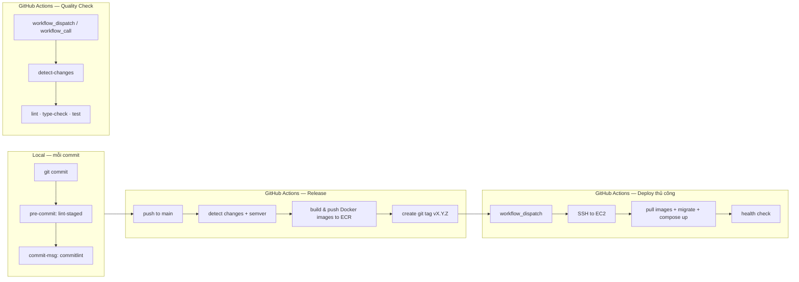
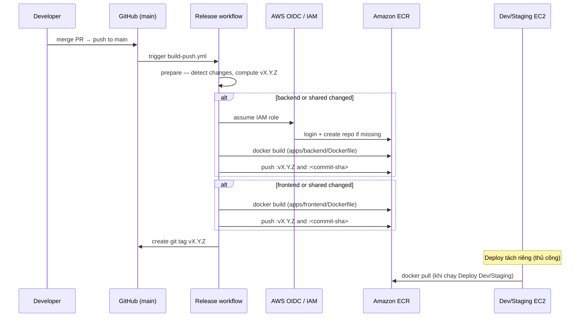

# APA Orchestration Layer — CI/CD từng bước

> Bản tiếng Việt của [`index.md`](index.md).

Tài liệu này mô tả pipeline Continuous Integration và Continuous Delivery end-to-end cho monorepo **one-orch-layer** (NestJS backend + React frontend).

---

## 1. Tổng quan pipeline



| Giai đoạn | Trigger | Chạy ở đâu | Kết quả |
|-----------|---------|------------|---------|
| **Local hooks** | Mỗi `git commit` | Máy developer | File staged được format/lint; commit message theo conventional commits |
| **Quality Check** | Thủ công hoặc workflow khác gọi | `ubuntu-latest` | Lint, type-check, test pass/fail |
| **Release → đẩy ECR** | Push lên `main` (hoặc `ci-sandbox`) | `ubuntu-latest` → **Amazon ECR** | Image Docker mới được build & **push** lên ECR (`vX.Y.Z` + `<sha>`) — xem **§4.1** |
| **Deploy Dev / Staging** | Thủ công (`workflow_dispatch`) | `ubuntu-latest` → EC2 qua SSH | Stack chạy trên host đích |

Các file workflow nằm trong [`.github/workflows/`](.github/workflows/).

---

## 2. CI cục bộ (cổng chất lượng trước khi push)

Hook cục bộ chạy tự động sau `pnpm install` (qua script `prepare` → `husky`).

### Bước 2.1 — Pre-commit (`lint-staged`)

**File:** [`.husky/pre-commit`](.husky/pre-commit)

Mỗi lần commit:

1. Husky chạy `lint-staged`.
2. `lint-staged` (cấu hình trong [`package.json`](package.json) ở root) chạy theo từng file thay đổi:
   - **Backend** (`apps/backend/**`): ESLint với fix + Prettier
   - **Frontend** (`apps/frontend/**`): ESLint với fix + Prettier
   - **Shared types** (`packages/shared-types/**`): ESLint với fix + Prettier
   - **JSON / Markdown / YAML / HTML / CSS**: chỉ Prettier

Nếu lint hoặc format thất bại, commit bị chặn.

### Bước 2.2 — Commit message (`commitlint`)

**File:** [`.husky/commit-msg`](.husky/commit-msg)

1. Đọc nội dung commit message.
2. Kiểm tra định dạng [Conventional Commits](https://www.conventionalcommits.org/) qua `@commitlint/config-conventional`.
3. Từ chối commit không đúng format (ví dụ: `feat:`, `fix:`, `chore:`, `docs:`, `test:`, `ci:`).

Các prefix commit này cũng quyết định **semantic versioning** trong workflow Release (xem §4).

### Bước 2.3 — Chạy cùng bộ kiểm tra trên máy local (tùy chọn)

```bash
pnpm install
pnpm lint
pnpm type-check
pnpm test
pnpm format:check
```

---

## 3. GitHub Actions — Quality Check (`ci.yml`)

**Tên workflow:** Quality Check  
**File:** [`.github/workflows/ci.yml`](.github/workflows/ci.yml)

### Trigger

- `workflow_dispatch` — chạy thủ công từ giao diện GitHub Actions
- `workflow_call` — workflow tái sử dụng (có thể được workflow khác gọi)

> **Lưu ý:** Workflow này **chưa** gắn với `pull_request`. An toàn PR hiện dựa vào hook cục bộ và việc chạy Quality Check thủ công hoặc từ workflow downstream.

### Thực thi từng bước

| Bước | Job | Diễn biến |
|------|-----|-----------|
| 1 | **Detect changes** | Checkout với full history. `dorny/paths-filter` đặt cờ cho `backend`, `frontend`, `shared` (packages + lockfile + turbo config), và `workflows`. |
| 2 | **Gate** | Nếu không có thay đổi ở các path trên (và không phải manual dispatch), job CI bị bỏ qua. |
| 3 | **CI job** | `pnpm install --frozen-lockfile` → `pnpm lint` → `pnpm type-check` → `pnpm test`. |
| 4 | **Concurrency** | Run đang chạy cho cùng PR/SHA bị hủy (`cancel-in-progress: true`). |

**Runtime:** Phiên bản Node từ [`.nvmrc`](.nvmrc), bật cache pnpm.

---

## 4. GitHub Actions — Release (`build-push.yml`)

**Tên workflow:** Release  
**File:** [`.github/workflows/build-push.yml`](.github/workflows/build-push.yml)

### Trigger

Push lên nhánh **`main`** hoặc **`ci-sandbox`**.

### Thực thi từng bước

#### Job 1 — `prepare` (phát hiện thay đổi & tính version)

1. Checkout với full git history.
2. **Path filter** — quyết định build gì:
   - **Image backend** nếu `apps/backend/**` hoặc file shared workspace thay đổi.
   - **Image frontend** nếu `apps/frontend/**` hoặc file shared workspace thay đổi.
3. **Đọc tag mới nhất** — tag `v*` cao nhất (mặc định `v0.0.0` nếu chưa có).
4. **Semver bump** — quét commit message từ tag trước:
   - `feat:` → bump **minor**
   - `fix:`, `chore:`, `refactor:`, v.v. → bump **patch**
   - `!` hoặc `BREAKING CHANGE` → bump **major**
   - Commit merge bị bỏ qua.

#### Job 2 — `build-backend` (có điều kiện)

Chỉ chạy khi backend (hoặc shared) thay đổi.

1. **AWS OIDC** — assume IAM role (`AWS_OIDC_ROLE_NAME`).
2. **ECR login** — xác thực với Amazon ECR.
3. **Ensure repository** — tạo repo ECR nếu chưa có (bật scan on push).
4. **Docker Buildx** — build từ repo root dùng [`apps/backend/Dockerfile`](apps/backend/Dockerfile).
5. **Push tags:**
   - `{account}.dkr.ecr.{region}.amazonaws.com/{ECR_BACKEND_REPO}:v{version}`
   - `...:{github.sha}`
6. **Cache** — GitHub Actions cache để build nhanh hơn.

#### Job 3 — `build-frontend` (có điều kiện)

Giống backend, dùng [`apps/frontend/Dockerfile`](apps/frontend/Dockerfile) và `ECR_FRONTEND_REPO`.

#### Job 4 — `release` (tag & tóm tắt)

Chạy khi ít nhất một job build thành công.

1. **Resolve image tags** — service không rebuild sẽ giữ tag từ release annotation trước hoặc image ECR mới nhất.
2. **Tạo annotated git tag** `v{version}` với nội dung:
   ```
   backend=vX.Y.Z
   frontend=vX.Y.Z
   - commit messages...
   ```
3. **Push tag** lên `origin`.
4. **Ghi job summary** — bảng app đã build/bỏ qua và URI image.

### Cấu hình GitHub bắt buộc (Release)

| Loại | Tên | Mục đích |
|------|-----|----------|
| Variable | `AWS_REGION` | Region ECR |
| Variable | `AWS_ACCOUNT_ID` | Tài khoản AWS |
| Variable | `ECR_BACKEND_REPO` | Tên repo ECR backend |
| Variable | `ECR_FRONTEND_REPO` | Tên repo ECR frontend |
| Variable | `AWS_OIDC_ROLE_NAME` | IAM role cho GitHub OIDC |

**Permissions:** `contents: write`, `id-token: write`.

---

## 4.1 Đẩy & cập nhật image mới lên Amazon ECR

Đây là bước **publish image Docker mới lên ECR**. Chạy trong workflow **Release** (`build-push.yml`) — **không** chạy lúc deploy. Deploy chỉ **pull** image mà Release đã push.

### Khi nào ECR có image mới?

| Sự kiện | Có push image lên ECR? |
|---------|------------------------|
| Merge / push lên **`main`** hoặc **`ci-sandbox`** | **Có** — tự động |
| Mở hoặc cập nhật PR | Không |
| Chạy **Quality Check** (`ci.yml`) | Không |
| Chạy **Deploy Dev / Staging** | Không — chỉ `docker pull` trên EC2 |
| `docker build` local trên laptop | Không — trừ khi bạn push thủ công |

**Ghi nhớ nhanh:** code lên `main` → GitHub Actions build → image xuất hiện trên ECR với tag `vX.Y.Z` mới.

### Luồng push ECR (sơ đồ)



### Từng bước: image mới lên ECR như thế nào

| Bước | Ai | Hành động |
|------|-----|-----------|
| **1** | Developer | Merge PR vào `main` (hoặc push trực tiếp lên `main` / `ci-sandbox`). |
| **2** | GitHub | Khởi chạy workflow **Release** ([`build-push.yml`](.github/workflows/build-push.yml)). |
| **3** | Job `prepare` | Kiểm tra path nào thay đổi (xem bảng bên dưới). Tính semver `X.Y.Z` từ conventional commits kể từ git tag `v*` mới nhất. |
| **4** | Job `build-backend` | Chỉ chạy **nếu** backend hoặc shared thay đổi. Ngược lại bỏ qua. |
| **5** | Job `build-frontend` | Chỉ chạy **nếu** frontend hoặc shared thay đổi. Ngược lại bỏ qua. |
| **6** | AWS auth | Workflow assume IAM role qua **GitHub OIDC** (`arn:aws:iam::{AWS_ACCOUNT_ID}:role/{AWS_OIDC_ROLE_NAME}`). Không dùng AWS key tĩnh trong workflow. |
| **7** | ECR login | `aws-actions/amazon-ecr-login` — runner có quyền push lên registry. |
| **8** | Ensure repository | Nếu repo ECR chưa tồn tại, **tự tạo** (`scanOnPush=true`, tag **MUTABLE**). |
| **9** | Docker build | Build context = **repo root**. Dockerfile: [`apps/backend/Dockerfile`](apps/backend/Dockerfile), [`apps/frontend/Dockerfile`](apps/frontend/Dockerfile). Dùng Buildx + cache layer GHA. |
| **10** | Docker push | Image được **push** lên ECR với **hai tag** (xem mục tiếp theo). |
| **11** | Job `release` | Tạo annotated git tag `vX.Y.Z` trên GitHub, ghi tag image backend/frontend của release này. |
| **12** | Bạn | Dùng tag `vX.Y.Z` trong **Deploy Dev** hoặc **Deploy Staging** để triển khai image mới (§5–§6). |

### URI image và tag

Host registry:

```text
{AWS_ACCOUNT_ID}.dkr.ecr.{AWS_REGION}.amazonaws.com
```

Tham chiếu image đầy đủ (ví dụ):

```text
# Backend
{AWS_ACCOUNT_ID}.dkr.ecr.{AWS_REGION}.amazonaws.com/{ECR_BACKEND_REPO}:v1.2.3
{AWS_ACCOUNT_ID}.dkr.ecr.{AWS_REGION}.amazonaws.com/{ECR_BACKEND_REPO}:a1b2c3d4e5f6...   # full commit SHA

# Frontend
{AWS_ACCOUNT_ID}.dkr.ecr.{AWS_REGION}.amazonaws.com/{ECR_FRONTEND_REPO}:v1.2.3
{AWS_ACCOUNT_ID}.dkr.ecr.{AWS_REGION}.amazonaws.com/{ECR_FRONTEND_REPO}:a1b2c3d4e5f6...
```

| Tag | Mục đích |
|-----|----------|
| `vX.Y.Z` | **Tag deploy** — dùng trong Deploy Dev/Staging (`backend_tag` / `frontend_tag`). Tăng theo semver trong job `prepare`. |
| `<commit-sha>` | **Truy vết** — commit git chính xác tạo ra image. Hữu ích khi debug; workflow deploy thường dùng `vX.Y.Z`. |

Tên repository lấy từ GitHub variables `ECR_BACKEND_REPO` và `ECR_FRONTEND_REPO` (không hardcode trong repo).

### Thay đổi code nào kích hoạt build image ECR mới?

| Path thay đổi | Rebuild image backend? | Rebuild image frontend? |
|---------------|------------------------|-------------------------|
| `apps/backend/**` | Có | Không |
| `apps/frontend/**` | Không | Có |
| `packages/**` | Có | Có |
| `pnpm-lock.yaml`, `package.json`, `pnpm-workspace.yaml` | Có | Có |
| Chỉ docs (`docs/**`) | Không | Không |
| Chỉ `.github/workflows/build-push.yml` | Không* | Không* |

\*Trừ khi cùng push có thay đổi app/shared.

Nếu chỉ backend thay đổi, image frontend trên ECR **không** rebuild; job `release` giữ tag frontend cũ trong git release annotation.

### Kiểm tra image mới trên ECR

Sau khi Release thành công, xem **job summary** trên GitHub Actions (bảng URI image), hoặc dùng AWS CLI:

```bash
# Liệt kê image backend gần đây
aws ecr describe-images \
  --repository-name "$ECR_BACKEND_REPO" \
  --region "$AWS_REGION" \
  --query 'sort_by(imageDetails,& imagePushedAt)[-5:].imageTags' \
  --output table

# Liệt kê image frontend gần đây
aws ecr describe-images \
  --repository-name "$ECR_FRONTEND_REPO" \
  --region "$AWS_REGION" \
  --query 'sort_by(imageDetails,& imagePushedAt)[-5:].imageTags' \
  --output table

# Xác nhận tag cụ thể tồn tại
aws ecr describe-images \
  --repository-name "$ECR_BACKEND_REPO" \
  --image-ids imageTag=v1.2.3 \
  --region "$AWS_REGION"
```

Trên **AWS Console**: ECR → Repositories → `{ECR_BACKEND_REPO}` / `{ECR_FRONTEND_REPO}` → xem tag và thời gian push.

### Từ push ECR đến chạy trên server

Push lên ECR **không** tự restart server.

```text
1. Workflow Release hoàn tất → image trên ECR có tag v1.2.3
2. Bạn chạy "Deploy Dev" hoặc "Deploy Staging" với backend_tag=v1.2.3 (và/hoặc frontend_tag=...)
3. Workflow deploy SSH vào EC2, ghi .env.compose với BACKEND_TAG / FRONTEND_TAG
4. Trên host: docker compose -f docker-compose.deploy.yml pull
5. Trên host: docker compose up -d  → container dùng image ECR mới
```

Xem [§5](#5-github-actions--deploy-dev-deploy-devyml) và [§6](#6-github-actions--deploy-staging-deploy-stagingyml) để biết chi tiết deploy.

### Theo dõi run Release trên GitHub

1. Mở repo trên GitHub → **Actions** → workflow **Release**.
2. Chọn run tương ứng commit `main` của bạn.
3. Kiểm tra các job:
   - **Detect changes & compute version** — app nào sẽ build, `vX.Y.Z` đã tính
   - **Build & push backend** / **Build & push frontend** — push ECR diễn ra ở đây (`push: true` trong `docker/build-push-action`)
   - **Tag & summarize release** — git tag + bảng tóm tắt URI image đầy đủ

Nếu **Build & push** bị skip, không có image mới cho app đó (không có thay đổi path liên quan).

---

## 5. GitHub Actions — Deploy Dev (`deploy-dev.yml`)

**Tên workflow:** Deploy Dev (manual)  
**File:** [`.github/workflows/deploy-dev.yml`](.github/workflows/deploy-dev.yml)

### Trigger

`workflow_dispatch` với input:

| Input | Bắt buộc | Mô tả |
|-------|----------|-------|
| `backend_tag` | Không* | ví dụ `v0.6.0` (tự thêm `v` nếu thiếu) |
| `frontend_tag` | Không* | ví dụ `v0.3.0` |

\* Phải cung cấp ít nhất một tag.

### Thực thi từng bước

| # | Bước | Chi tiết |
|---|------|----------|
| 1 | **Validate inputs** | Chuẩn hóa tag; fail nếu cả hai đều trống. |
| 2 | **AWS OIDC** | Assume role deploy. |
| 3 | **ECR login** | Export Docker config cho host remote. |
| 4 | **SSH key** | Load private key từ SSM (`DEV_SSH_KEY_SSM_PATH`). |
| 5 | **Resolve running tags** | SSH vào host dev; đọc tag image hiện tại của `orch-backend` / `orch-frontend` (dùng khi chỉ deploy một service). |
| 6 | **Prepare deploy bundle** | Copy `docker-compose.deploy.yml`, `nginx/`, `.env.dev`; inject GitHub secrets (session, AWS keys, Entra ID, FXO credentials). Ghi `.env.compose` với registry ECR và image tag. |
| 7 | **Pre-deploy checks** | Dung lượng disk, container đang chạy, Docker disk usage. |
| 8 | **Backup** | Backup `.env` backend trên host; snapshot danh sách image. |
| 9 | **Free disk space** | `docker image prune` trên host. |
| 10 | **Upload bundle** | `scp` compose file, env files, nginx config, Docker credentials tới `DEV_DEPLOY_DIR`. |
| 11 | **Pull images** | `docker compose pull` chỉ cho service được chọn. |
| 12 | **Run migrations** | Nếu deploy backend: start Postgres, chạy `node run-migrations.js` trong container backend one-off. |
| 13 | **Start containers** | `docker compose up -d` cho postgres, redis, nginx và app service thay đổi. |
| 14 | **Health check** | Tối đa 6 × 10s: `GET http://localhost:8080/api/health/sqs` phải trả 2xx/3xx. |
| 15 | **Cleanup** | Prune image trên host; xóa SSH key tạm trên runner. |

**GitHub Environment:** `dev` (có thể bắt buộc reviewer).

### Stack deploy trên host

Định nghĩa trong [`docker-compose.deploy.yml`](docker-compose.deploy.yml):

- **postgres** — Postgres 15
- **redis** — Redis 7
- **backend** — image ECR (`orch-backend`)
- **frontend** — image ECR (`orch-frontend`)
- **nginx** — reverse proxy cổng **8080**

---

## 6. GitHub Actions — Deploy Staging (`deploy-staging.yml`)

**Tên workflow:** Deploy Staging (manual)  
**File:** [`.github/workflows/deploy-staging.yml`](.github/workflows/deploy-staging.yml)

Luồng giống **Deploy Dev** (§5), khác biệt:

| Hạng mục | Dev | Staging |
|----------|-----|---------|
| Environment | `dev` | `staging` |
| Host vars | `DEV_HOST`, `DEV_USER`, `DEV_DEPLOY_DIR` | `STAGING_HOST`, `STAGING_USER`, `STAGING_DEPLOY_DIR` |
| SSH key SSM path | `DEV_SSH_KEY_SSM_PATH` | `STAGING_SSH_KEY_SSM_PATH` |
| Env file | `.env.dev` + nhiều secrets | `.env.staging` + `STAGING_SESSION_COOKIE_SECRET` |
| Backup / dọn disk trước deploy | Đầy đủ hơn | Nhẹ hơn (không có bước backup) |

---

## 7. Quy trình developer end-to-end

### Phát triển hàng ngày

```text
1. Tạo feature branch từ main
2. Sửa code trong apps/backend, apps/frontend, hoặc packages/
3. Chạy local: pnpm dev | pnpm test | pnpm lint
4. git add && git commit
   → pre-commit format/lint file staged
   → commit-msg bắt conventional commit message
5. Mở PR vào main
6. (Tùy chọn) Chạy thủ công workflow "Quality Check" trên branch
7. Merge PR vào main
```

### Sau khi merge vào `main` (release tự động + push ECR)

```text
1. Push lên main kích hoạt workflow "Release" (build-push.yml)
2. GitHub Actions build image Docker và PUSH lên Amazon ECR
3. Mỗi image được build có hai tag: vX.Y.Z (deploy) và <commit-sha> (truy vết)
4. Git tag vX.Y.Z mới được tạo trên repo (xem Release job summary)
5. Kiểm tra image trên ECR (AWS Console hoặc aws ecr describe-images) — xem §4.1
6. Chưa deploy — ECR chỉ lưu image cho đến khi bạn chạy Deploy Dev/Staging
```

### Deploy lên môi trường (thủ công)

```text
1. GitHub → Actions → "Deploy Dev (manual)" hoặc "Deploy Staging (manual)"
2. Bấm "Run workflow"
3. Nhập backend_tag và/hoặc frontend_tag (từ Release summary)
4. Approve environment gate nếu được cấu hình
5. Theo dõi log job; xác nhận health check pass
6. Kiểm tra app tại http://<host>:8080
```

**Thay thế bằng CLI:**

```bash
gh workflow run deploy-dev.yml \
  -f backend_tag=v0.6.0 \
  -f frontend_tag=v0.3.0
```

---

## 8. Tham chiếu cấu hình

### GitHub Variables (repository hoặc organization)

| Variable | Dùng bởi |
|----------|----------|
| `AWS_REGION` | Release, Deploy |
| `AWS_ACCOUNT_ID` | Release, Deploy |
| `ECR_BACKEND_REPO` | Release, Deploy |
| `ECR_FRONTEND_REPO` | Release, Deploy |
| `AWS_OIDC_ROLE_NAME` | Release, Deploy |
| `DEV_HOST`, `DEV_USER`, `DEV_DEPLOY_DIR` | Deploy Dev |
| `DEV_SSH_KEY_SSM_PATH` | Deploy Dev |
| `STAGING_HOST`, `STAGING_USER`, `STAGING_DEPLOY_DIR` | Deploy Staging |
| `STAGING_SSH_KEY_SSM_PATH` | Deploy Staging |

### GitHub Secrets

| Secret | Môi trường |
|--------|------------|
| `DEV_SESSION_COOKIE_SECRET` | Dev |
| `DEV_AWS_ACCESS_KEY_ID`, `DEV_AWS_SECRET_ACCESS_KEY` | Dev |
| `DEV_ENTRA_TENANT_ID`, `DEV_ENTRA_CLIENT_ID`, `DEV_ENTRA_CLIENT_SECRET` | Dev |
| `DEV_FXO_API_KEY`, `DEV_FXO_PASSWORD` | Dev |
| `STAGING_SESSION_COOKIE_SECRET` | Staging |

### Mô hình xác thực

- **CI/CD → AWS:** GitHub OIDC (không dùng AWS key lâu dài trong workflow cho build/deploy).
- **Deploy → EC2:** SSH private key lưu trong **AWS SSM Parameter Store** (SecureString).
- **EC2 → ECR:** Docker credentials được copy lên host khi deploy.

---

## 9. Versioning & promote image

- **Một version monorepo** (`vX.Y.Z`) gắn với release; mỗi service có thể hoặc không được rebuild.
- Annotation git tag release ghi tag image từng service:
  ```
  backend=v1.2.3
  frontend=v1.2.3
  ```
- Nếu chỉ backend thay đổi, frontend giữ tag image cũ trong annotation.
- Workflow deploy chấp nhận `backend_tag` và `frontend_tag` **độc lập** để rollout từng service.

---

## 10. Production (đang lên kế hoạch)

Triển khai production **chưa** có trong repo này. Thiết kế mục tiêu ([`docs/superpowers/specs/2026-06-09-cicd-github-actions-design.md`](docs/superpowers/specs/2026-06-09-cicd-github-actions-design.md)):

- Build một lần → push lên ECR (giống hiện tại)
- Promote qua **GitOps** (`apa-gitops` + ArgoCD trên EKS)
- Cổng phê duyệt thủ công trên GitHub Environment `prod`

Cho đến khi có workflow đó, dùng Deploy Dev và Staging thủ công để validate trước production.

---

## 11. Xử lý sự cố

| Triệu chứng | Nguyên nhân có thể | Cần kiểm tra |
|-------------|-------------------|--------------|
| Commit bị từ chối local | lint-staged hoặc commitlint fail | Chạy `pnpm lint` / sửa format commit message |
| Không có image mới trên ECR sau merge | Job Release skip build (không đổi app/shared) hoặc workflow fail | Actions → Release → job "Build & push"; xem bảng path filter §4.1 |
| Release skip một service | Không có thay đổi path của app đó | Xác nhận diff có `apps/<app>/` hoặc shared packages |
| Deploy health check warning | Backend khởi động chậm hoặc env sai | Log workflow tail container `backend`; kiểm tra secrets `.env.deploy` |
| ECR pull fail trên host | Docker login hết hạn hoặc tag sai | Chạy lại deploy; xác nhận tag tồn tại trên ECR |
| Bước migration fail | Postgres chưa sẵn sàng hoặc xung đột schema | SSH vào host; kiểm tra `orch-postgres` và log migration |

---

## 12. Lệnh tham khảo nhanh

```bash
# Phát triển local
pnpm install
pnpm dev

# Bộ kiểm tra chất lượng đầy đủ trên local
pnpm lint && pnpm type-check && pnpm test

# Kích hoạt Quality Check (cần gh CLI)
gh workflow run ci.yml

# Deploy dev với image tag cụ thể
gh workflow run deploy-dev.yml -f backend_tag=v0.6.0 -f frontend_tag=v0.6.0

# Liệt kê release tag
git tag --list 'v*' --sort=-v:refname | head
```
