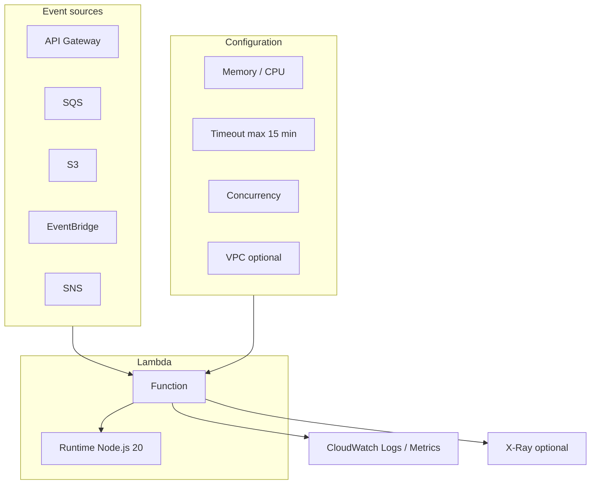

# AWS Lambda — Các khái niệm cốt lõi

> Giải thích **từng khái niệm** khi thiết kế và vận hành Lambda. Hướng dẫn deploy Node.js: [`lambda.md`](./lambda.md).

**AWS Lambda** = chạy code **không quản lý server** — AWS lo scale, bạn chỉ upload handler + cấu hình trigger.



---

## 1. Function — đơn vị triển khai

| Thuộc tính | Ý nghĩa |
|------------|---------|
| **Function name** | Định danh trong region — `order-api-handler` |
| **Handler** | Entry point: `src/handler.handler` = file `src/handler.js`, export `handler` |
| **Runtime** | `nodejs20.x`, `python3.12`, `java21`… — AWS cung cấp runtime managed |
| **Architecture** | `arm64` (Graviton, rẻ hơn) hoặc `x86_64` (cần lib native x86) |
| **Package type** | `Zip` (mặc định) hoặc `Image` (container từ ECR) |

**Version vs Alias:**

```
$LATEST  →  code mới nhất (dev/test)
Version 1, 2, 3…  →  immutable snapshot
Alias prod  →  trỏ Version 3 (blue/green, rollback)
```

---

## 2. Invocation types — sync vs async

| Loại | Trigger ví dụ | Hành vi |
|------|-----------------|---------|
| **Synchronous** | API Gateway, ALB, direct invoke | Caller **chờ** response; lỗi trả về client ngay |
| **Asynchronous** | S3, SNS, EventBridge (mặc định) | Lambda queue nội bộ, retry 2 lần; fail → DLQ (nếu cấu hình) |
| **Poll-based** | SQS, DynamoDB Streams, Kinesis | Lambda service **poll** source thay bạn |

```
API Gateway ──sync──► Lambda ──► response 200/500 về client

S3 upload ──async──► Lambda (retry tự động) ──► DLQ nếu vẫn fail
```

**SAA hay hỏi:** API Gateway = sync; S3 notification = async (có retry + DLQ).

---

## 3. Memory, CPU và timeout

| Cấu hình | Phạm vi | Ảnh hưởng |
|----------|---------|-----------|
| **Memory** | 128 MB – 10,240 MB | Tăng memory → **tăng CPU tỷ lệ** → có thể chạy nhanh hơn, bill theo GB-second |
| **Timeout** | 1 s – **900 s (15 phút)** | Hết timeout = invocation fail |
| **Ephemeral storage** | 512 MB – 10,240 MB | `/tmp` — xử lý file tạm |

```
Bill = (memory GB) × (duration giây) × số invocation
     + số request

Tune: tăng memory đôi khi **rẻ hơn** vì duration giảm mạnh hơn
```

**Quy tắc:** Handler timeout < Lambda timeout; Lambda timeout < SQS visibility timeout.

---

## 4. Cold start vs warm start

| | Cold start | Warm start |
|---|------------|------------|
| **Khi nào** | Instance execution mới (scale up, idle lâu) | Reuse container cũ |
| **Chi phí thời gian** | Init runtime + load code + top-level imports | Chỉ chạy handler |
| **Ảnh hưởng** | Latency p99 cao — API latency-sensitive | Ổn định |

**Init phase:**

```
1. Download deployment package (hoặc pull image layer)
2. Start runtime (Node.js, JVM…)
3. Chạy code ngoài handler (import, connect pool…)
4. Gọi handler lần đầu
```

→ Chi tiết tối ưu: [`cold-start-scale.md`](./cold-start-scale.md).

---

## 5. Concurrency — scale tự động

Lambda scale **theo số invocation đồng thời** (concurrent executions), không phải “số instance cố định”.

```
Account limit (mặc định): 1,000 concurrent / region (có thể tăng quota)
Function A: 200 concurrent
Function B: 800 concurrent
→ Tổng account không vượt 1,000 (trừ khi reserved riêng)
```

| Khái niệm | Dùng để làm gì |
|-----------|----------------|
| **Reserved concurrency** | **Giữ** slot cho function quan trọng; đồng thời **giới hạn** max concurrent |
| **Provisioned concurrency** | Pre-warm N instance — giảm cold start (tốn phí cố định) |
| **Throttling** | Vượt limit → `429 TooManyRequestsException` |

**Blast radius:** Function không set reserved concurrency có thể chiếm hết quota account → function khác bị throttle.

---

## 6. Execution role (IAM)

Lambda **assume** IAM role khi chạy — quyền gọi DynamoDB, S3, SQS…

```
Trust policy: lambda.amazonaws.com được AssumeRole
Managed policy tối thiểu: AWSLambdaBasicExecutionRole (CloudWatch Logs)
Custom policy: DynamoDB, S3, SQS… theo least privilege
```

```
□ Không dùng AdministratorAccess
□ Resource ARN cụ thể (table, bucket, queue)
□ VPC Lambda cần thêm AWSLambdaVPCAccessExecutionRole
```

---

## 7. Environment variables & secrets

| Nguồn | Khi dùng |
|-------|----------|
| **Env vars** | Config không nhạy cảm — `TABLE_NAME`, `NODE_ENV` |
| **SSM Parameter Store** | Config + secret nhẹ — `SecureString` |
| **Secrets Manager** | Secret rotation, DB credential |
| **KMS** | Mã hóa env var at rest |

Secret **không** hardcode trong zip; cache trong global variable có TTL (reuse warm container).

---

## 8. VPC — khi nào cần?

```
Lambda (default, no VPC) ──internet──► public API, DynamoDB, S3

Lambda (in VPC) ──private subnet──► RDS, ElastiCache, internal ALB
```

| | Không VPC | Trong VPC |
|---|-----------|-----------|
| Cold start | Nhanh hơn | Chậm hơn (ENI setup) |
| RDS private | Không reach được | Reach được |
| Internet | Có (managed) | Cần NAT Gateway cho outbound internet |

**Pattern:** RDS private → Lambda trong VPC + **RDS Proxy** (giảm connection storm). Chi tiết: [`db-connections.md`](./db-connections.md).

---

## 9. Event sources — bản đồ trigger

| Source | Model | File chi tiết |
|--------|-------|---------------|
| **API Gateway** (HTTP/REST) | Sync | [`lambda.md`](./lambda.md) §3.1 |
| **ALB** | Sync | Target group Lambda |
| **SQS** | Poll + batch | [`sqs.md`](./sqs.md) |
| **SNS** | Async push | [`sns.md`](./sns.md) |
| **S3** | Async notify | [`s3-trigger.md`](./s3-trigger.md) |
| **EventBridge** | Async rule | [`eventbridge.md`](./eventbridge.md) |
| **DynamoDB Streams** | Poll | Change data capture |
| **Kinesis** | Poll | Stream processing |
| **Cognito** | Sync | Custom auth trigger |
| **Schedule (cron)** | EventBridge rule | [`eventbridge.md`](./eventbridge.md) |

---

## 10. Dead Letter Queue (DLQ)

| Invocation type | DLQ gắn ở đâu |
|-----------------|---------------|
| **Async** | Cấu hình **trên Lambda** — SQS ho SNS topic |
| **SQS trigger** | DLQ trên **queue** (redrive policy) — khuyến nghị |
| **Sync** | Không có DLQ Lambda — client nhận lỗi trực tiếp |

```
Async Lambda fail 3 lần → message vào DLQ → CloudWatch alarm → ops replay
```

---

## 11. Limits quan trọng (SAA)

| Giới hạn | Giá trị |
|----------|---------|
| Deployment package (zip direct) | 50 MB compressed |
| Deployment package (via S3) | 250 MB |
| Unzipped total (code + layers) | 250 MB |
| `/tmp` storage | 512 MB – 10 GB |
| Timeout | 15 phút |
| Env var total size | 4 KB |
| Layers per function | 5 |
| Concurrent executions (default/account) | 1,000 (tăng được) |

Payload lớn → S3 reference; dependency nặng → **Lambda Layer** hoặc **container image**.

---

## 12. Monitoring

| Tool | Metric / log |
|------|--------------|
| **CloudWatch Logs** | `/aws/lambda/<function-name>` — stdout/stderr |
| **CloudWatch Metrics** | Invocations, Errors, Duration, Throttles, ConcurrentExecutions |
| **X-Ray** | Distributed trace — bật `TracingConfig Mode=Active` |
| **Lambda Insights** | Enhanced monitoring (CPU, memory GC) |

```bash
aws logs tail /aws/lambda/my-api-handler --follow
```

Alarm thường dùng: `Errors > 0`, `Throttles > 0`, `Duration p99 > threshold`.

---

## 13. Lambda vs lựa chọn khác

| Nhu cầu | Thường chọn |
|---------|-------------|
| API event-driven, traffic không đều | **Lambda + API Gateway** |
| WebSocket dài, stateful connection | EC2 / ECS / App Runner |
| Process > 15 phút | ECS Fargate, Batch, Step Functions |
| Latency cực thấp ổn định | EC2/ECS + ALB (tránh cold start) |
| Container đã có, team quen Docker | Lambda **container image** hoặc Fargate |

---

## 14. Bản đồ khái niệm ↔ thi công

| Khái niệm | Xem thêm |
|-----------|----------|
| Viết handler + deploy | [`lambda.md`](./lambda.md) |
| SQS consumer, partial batch | [`sqs.md`](./sqs.md) |
| Fan-out event | [`sns.md`](./sns.md) |
| Cron / event bus | [`eventbridge.md`](./eventbridge.md) |
| Upload S3 → xử lý | [`s3-trigger.md`](./s3-trigger.md) |
| Docker image thay zip | [`ecr.md`](./ecr.md) |
| Cold start, concurrency | [`cold-start-scale.md`](./cold-start-scale.md) |
| SQS tổng quát (queue) | [`../sqs.md`](../sqs.md) |

---

## 15. Tóm tắt — mang đi phỏng vấn SAA

| Câu hỏi | Trả lời ngắn |
|---------|--------------|
| **Lambda là gì?** | Serverless compute — event-driven, pay per invocation |
| **Sync vs async?** | API GW sync; S3/SNS async có retry + DLQ |
| **Scale?** | Tự động theo concurrent executions |
| **Cold start?** | Init lần đầu — giảm bằng provisioned concurrency, arm64, bundle nhỏ |
| **RDS private?** | Lambda in VPC + RDS Proxy |
| **Giới hạn timeout?** | 15 phút |
| **Reserved vs provisioned concurrency?** | Reserved = cap/guarantee slot; Provisioned = pre-warm instance |
