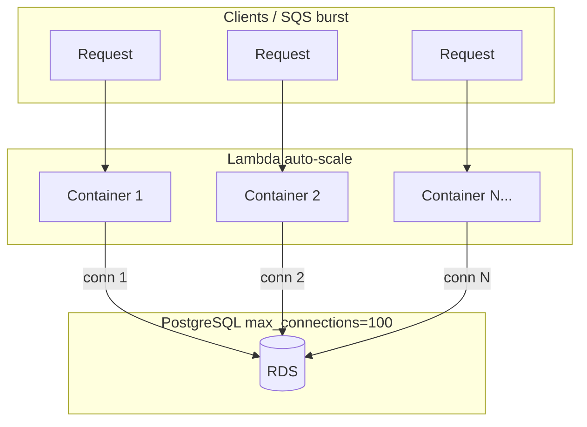

# Lambda + Database — Connection storm khi nhiều serverless kết nối 1 DB

> **Vấn đề cốt lõi:** Lambda scale theo **concurrent executions** — mỗi execution environment có thể mở connection riêng. Nhiều function Lambda (hoặc Lambda + ECS) cùng trỏ 1 RDS/Postgres → dễ vượt `max_connections` và làm DB sập.

Pool tổng quát: [`../../database/connection-pool.md`](../../database/connection-pool.md). Scale/concurrency: [`cold-start-scale.md`](./cold-start-scale.md).

---

## 1. Vì sao Lambda khác EC2/ECS?

### 1.1. EC2/ECS — số process có giới hạn

```
ECS: 3 task × pool max 5 = tối đa 15 connection tới DB
     → Số connection **dự đoán được** trước khi deploy
```

### 1.2. Lambda — scale theo concurrency, không theo “số máy”

```
Traffic spike
    → Lambda tự scale: 10…100…500 concurrent executions
    → Mỗi warm container có thể giữ 1+ connection
    → Tổng connection = không kiểm soát nếu không có proxy/cap
```



**Lambda không có “số instance cố định”** — AWS tạo execution environment theo nhu cầu. Bạn không set “chạy tối đa 3 container” trừ khi dùng **reserved concurrency**.

---

## 2. Connection storm — công thức tính

### 2.1. Một Lambda function

```
Tổng connection ≈ concurrent executions × connection mỗi container
```

| Cấu hình code | Concurrent = 200 | Kết quả |
|---------------|------------------|---------|
| Mở 1 conn/invoke (không reuse) | 200 | **200 connection** |
| Singleton pool `max: 1` (reuse warm) | 200 warm container | **~200 connection** (worst case) |
| Singleton pool `max: 1` + **RDS Proxy** | 200 client → proxy | **~vài chục** connection thật tới RDS |

> Reuse warm container **giảm** overhead tạo connection, nhưng **không giảm** số connection khi có N container warm đồng thời.

### 2.2. Nhiều Lambda function cùng 1 DB

```
order-api-lambda     ──┐
payment-worker-lambda ─┼──► PostgreSQL (max_connections = 100)
report-lambda        ──┘
user-api (ECS)       ──┘
```

**Connection cộng dồn** — DB không biết đó là Lambda hay ECS:

```
Tổng ≈ Σ (concurrent Lambda_i × pool_max_i) + Σ (ECS_instance_j × pool_max_j)
```

**Ví dụ thực tế:**

| Component | Concurrent / instance | pool max | Connection |
|-----------|----------------------|----------|------------|
| `order-api` Lambda | 150 | 1 | 150 |
| `payment-worker` Lambda | 80 | 1 | 80 |
| `user-api` ECS × 3 | 3 instance | 5 | 15 |
| **Tổng** | | | **245** |
| RDS `max_connections` | | | **100** → **CRASH** |

---

## 3. Triệu chứng trên production

| Triệu chứng | Log / metric |
|-------------|--------------|
| `FATAL: too many connections` | PostgreSQL log |
| `timeout acquiring a connection` | App log — pool full hoặc DB từ chối |
| API 500 đột ngột khi traffic tăng | CloudWatch Lambda Errors |
| RDS `DatabaseConnections` spike | CloudWatch RDS |
| Chỉ xảy ra lúc peak / sau deploy scale | Không reproduce ở dev (traffic thấp) |

```
Dev: 2 concurrent Lambda → 2 connection → OK
Prod flash sale: 400 concurrent → 400 connection → DB die
```

---

## 4. Anti-pattern hay gặp

### 4.1. Tạo pool mới mỗi invocation

```javascript
// ❌ SAI — mỗi invoke tạo pool mới (hoặc connect mới)
export const handler = async (event) => {
  const pool = new Pool({ host: process.env.DB_HOST, max: 10 });
  const res = await pool.query('SELECT ...');
  await pool.end(); // đóng pool mỗi lần — vẫn tốn connection lúc peak
  return res.rows;
};
```

### 4.2. Dùng `max: 10` (default pg) trên Lambda

```javascript
// ❌ SAI — 1 container có thể giữ 10 connection
const pool = new Pool({ max: 10 });
```

100 concurrent container × `max: 10` = **1000 connection** (lý thuyết).

### 4.3. Connect thẳng RDS endpoint (bỏ qua proxy)

```
Lambda ──► rds.xxx.amazonaws.com:5432
           (mỗi container 1 TCP connection tới DB)
```

### 4.4. Nhiều microservice Lambda “mỗi cái pool riêng” không budget

Không có bảng phân bổ connection → deploy thêm 1 Lambda là vượt ngưỡng.

### 4.5. `callbackWaitsForEmptyEventLoop = true` + pool idle

Connection treo trong event loop → bill kéo dài, slot pool không release đúng lúc.

```javascript
// ✅ Sync API — thường set false khi dùng pg pool
context.callbackWaitsForEmptyEventLoop = false;
```

---

## 5. Giải pháp — theo thứ tự ưu tiên

### 5.1. RDS Proxy (khuyến nghị AWS / SAA)

**RDS Proxy** đứng giữa Lambda và RDS — **multiplex** nhiều client connection → ít connection thật tới database.

```
Lambda × N containers ──► RDS Proxy (pool ~50-100) ──► RDS/Aurora
         (client conn)              (server conn)
```

| Lợi ích | Chi tiết |
|---------|----------|
| **Multiplexing** | Hàng trăm Lambda client → vài chục DB connection |
| **Failover** | Aurora failover nhanh hơn — proxy giữ pool |
| **IAM auth** | Không cần password cứng trong env |
| **Secrets Manager** | Credential rotation |

```yaml
# SAM — Lambda qua RDS Proxy
Globals:
  Function:
    VpcConfig:
      SecurityGroupIds: [!Ref LambdaSG]
      SubnetIds: [!Ref PrivateSubnet1, !Ref PrivateSubnet2]
    Environment:
      Variables:
        DB_HOST: !GetAtt OrderDbProxy.Endpoint

OrderDbProxy:
  Type: AWS::RDS::DBProxy
  Properties:
    DBProxyName: order-db-proxy
    EngineFamily: POSTGRESQL
    Auth:
      - AuthScheme: SECRETS
        SecretArn: !Ref DbSecret
    RoleArn: !GetAtt ProxyRole.Arn
    VpcSubnetIds: [!Ref PrivateSubnet1, !Ref PrivateSubnet2]
    TargetGroupName: default
    VpcSecurityGroupIds: [!Ref ProxySG]
```

**Lambda bắt buộc trong VPC** nếu RDS private — trade-off cold start (xem [`concept.md`](./concept.md) §8).

### 5.2. Singleton pool `max: 1` per container

```typescript
// db/pool.ts — module scope, NGOÀI handler
import { Pool } from 'pg';

let pool: Pool | undefined;

export function getPool(): Pool {
  if (!pool) {
    pool = new Pool({
      host: process.env.DB_HOST,        // RDS Proxy endpoint
      port: 5432,
      database: process.env.DB_NAME,
      user: process.env.DB_USER,
      password: process.env.DB_PASSWORD,
      max: 1,                           // 1 connection per warm container
      idleTimeoutMillis: 60_000,
      connectionTimeoutMillis: 5_000,
      application_name: 'order-api-lambda',
    });
  }
  return pool;
}
```

```javascript
// src/handler.js
import { getPool } from './db/pool.js';

export const handler = async (event, context) => {
  context.callbackWaitsForEmptyEventLoop = false;

  const { rows } = await getPool().query(
    'SELECT * FROM orders WHERE id = $1',
    [event.pathParameters.id],
  );

  return { statusCode: 200, body: JSON.stringify(rows[0]) };
};

// ❌ KHÔNG gọi pool.end() — container reuse
```

| Pattern | Production? |
|---------|-------------|
| RDS Proxy + singleton `max: 1` | ✅ Chuẩn |
| PgBouncer + singleton `max: 1` | ✅ Self-hosted / hybrid |
| Singleton `max: 1` **không** proxy | ⚠️ Chỉ traffic thấp |
| Connect mới mỗi invoke | ❌ |
| `max: 10` default pg | ❌ |

### 5.3. Giới hạn Lambda concurrency (guardrail)

Khi chưa có proxy hoặc cần bảo vệ DB khẩn cấp:

```bash
# Function này tối đa 30 concurrent → tối đa ~30 connection (với max:1)
aws lambda put-function-concurrency \
  --function-name payment-worker \
  --reserved-concurrent-executions 30
```

```
□ Reserved concurrency = cap cứng
□ Có thể gây throttle (429) nếu traffic vượt cap
□ Dùng kèm RDS Proxy — không thay thế proxy
```

SQS mapping:

```yaml
ScalingConfig:
  MaximumConcurrency: 20   # tối đa 20 Lambda poll queue này
```

### 5.4. PgBouncer (thay / bổ sung RDS Proxy)

Phù hợp hybrid: ECS + Lambda cùng DB, hoặc self-managed.

```
Lambda ──┐
ECS    ──┼──► PgBouncer (transaction mode, pool ~40) ──► PostgreSQL
Worker ──┘
```

→ Chi tiết: [`../../database/connection-pool.md`](../../database/connection-pool.md) §4.

**Lưu ý PgBouncer transaction mode:** tắt prepared statements (`prepare: false` với `pg`).

### 5.5. Tách workload — async qua queue

Giảm Lambda concurrent truy cập DB đồng thời:

```
API Lambda (read nhẹ, DynamoDB) ──► SQS ──► Worker Lambda (write DB, concurrency cap 20)
```

→ [`sqs.md`](./sqs.md)

### 5.6. DynamoDB thay RDS (khi phù hợp)

Serverless-native — không connection pool:

```
API Lambda ──► DynamoDB (HTTP API, auto-scale)
```

Không phải lúc nào cũng thay được RDS (join, transaction phức tạp).

---

## 6. Kiến trúc thực tế — nhiều service + Lambda

```
                    ┌─────────────────────────────────────┐
                    │     RDS Proxy (pool ~80)            │
                    │     hoặc PgBouncer                  │
                    └──────────────┬──────────────────────┘
                                   │
                    ┌──────────────▼──────────────────────┐
                    │   Aurora PostgreSQL / RDS           │
                    │   max_connections = 200             │
                    └──────────────┬──────────────────────┘
           ┌───────────────────────┼───────────────────────┐
           │                       │                       │
    ┌──────▼──────┐        ┌───────▼───────┐      ┌───────▼───────┐
    │ order-api   │        │ payment-worker│      │ user-api ECS  │
    │ Lambda      │        │ Lambda        │      │ 3 × max:5     │
    │ max:1 × N   │        │ max:1 × cap 30│      │ = 15 conn     │
    │ reserved 100│        │ SQS max conc  │      │               │
    └─────────────┘        └───────────────┘      └───────────────┘
```

**Connection budget** (bắt buộc khi ≥ 2 service):

| Service | Loại | Max concurrent | pool max | Budget |
|---------|------|----------------|----------|--------|
| order-api | Lambda | 100 (reserved) | 1 | 100 client → proxy |
| payment-worker | Lambda | 30 | 1 | 30 client → proxy |
| user-api | ECS × 3 | 3 instance | 5 | 15 |
| **Proxy → DB** | | | | **~50–80** server conn |

---

## 7. Prisma / TypeORM trên Lambda

### Prisma

```typescript
// prisma.ts — singleton
import { PrismaClient } from '@prisma/client';

let prisma: PrismaClient;

export function getPrisma() {
  if (!prisma) {
    prisma = new PrismaClient({
      datasources: {
        db: { url: process.env.DATABASE_URL }, // trỏ RDS Proxy
      },
    });
  }
  return prisma;
}

// DATABASE_URL qua RDS Proxy + ?connection_limit=1
```

### TypeORM / DataSource

```typescript
let dataSource: DataSource;

export async function getDataSource() {
  if (!dataSource?.isInitialized) {
    dataSource = new DataSource({
      type: 'postgres',
      host: process.env.DB_HOST,
      extra: { max: 1 },
    });
    await dataSource.initialize();
  }
  return dataSource;
}
```

```
□ Không tạo PrismaClient / DataSource mới mỗi invoke
□ connection_limit=1 (Prisma) hoặc extra.max: 1
```

---

## 8. Monitor & debug

### CloudWatch RDS

| Metric | Ý nghĩa |
|--------|---------|
| `DatabaseConnections` | Tổng connection hiện tại |
| `CPUUtilization` spike | Có thể do connection storm + query |

### PostgreSQL

```sql
-- Ai đang chiếm connection?
SELECT application_name, state, count(*)
FROM pg_stat_activity
WHERE datname = current_database()
GROUP BY 1, 2
ORDER BY 3 DESC;

-- Connection limit
SHOW max_connections;
```

### RDS Proxy

CloudWatch: `ClientConnections`, `DatabaseConnections`, `QueryDatabaseConnections`.

```
Alarm: DatabaseConnections > 80% max_connections
Alarm: Lambda ConcurrentExecutions spike + DB connections spike (correlation)
```

---

## 9. Load test — đừng chỉ test dev

```bash
# Artillery / k6 — simulate concurrent requests
# Quan sát RDS DatabaseConnections trong khi chạy

aws cloudwatch get-metric-statistics \
  --namespace AWS/RDS \
  --metric-name DatabaseConnections \
  --dimensions Name=DBInstanceIdentifier,Value=my-db \
  --start-time ... --end-time ... \
  --period 60 --statistics Maximum
```

Checklist trước go-live:

```
□ Load test với concurrent ≥ expected peak
□ RDS Proxy (hoặc PgBouncer) đã bật
□ Lambda pool max: 1, singleton module scope
□ Connection budget document cho mỗi service
□ Reserved / SQS maximum concurrency trên worker ghi DB
□ Alarm DatabaseConnections
```

---

## 10. Decision tree (SAA / thiết kế)

```
Lambda cần RDS/Aurora private?
  ├─ Yes → Lambda in VPC
  │         ├─ Nhiều concurrent / nhiều function → RDS Proxy (hoặc PgBouncer)
  │         ├─ Singleton pool max: 1 per container
  │         └─ Cap concurrency nếu downstream yếu
  └─ No (chỉ DynamoDB/S3) → Không VPC, không connection issue

Nhiều Lambda + ECS cùng 1 Postgres?
  └─ Bắt buộc proxy layer + connection budget tổng hệ thống

Burst traffic ghi DB nặng?
  └─ API trả 202 → SQS → worker Lambda (concurrency cap) → DB
```

---

## 11. Tóm tắt — mang đi phỏng vấn

| Câu hỏi | Trả lời ngắn |
|---------|--------------|
| Vì sao Lambda làm DB chết? | Scale concurrent cao → mỗi container giữ connection → vượt `max_connections` |
| Pool trong Lambda có đủ không? | **Không** — pool chỉ reuse **trong 1 container**; N container = N×pool.max |
| Giải pháp AWS chuẩn? | **RDS Proxy** + singleton `max: 1` + VPC |
| Cap concurrency để làm gì? | Guardrail — giới hạn connection tối đa, tránh throttle DB |
| Nhiều Lambda cùng DB? | Connection **cộng dồn** — cần proxy + budget toàn hệ thống |

**Công thức nhớ:**

```
Không proxy:  connections ≈ Σ Lambda concurrent_i × pool_max_i  +  ECS connections
Có proxy:     client connections nhiều → server connections ít (multiplex)
Rule Lambda:  1 container = pool max 1 = trỏ proxy, không trỏ RDS trực tiếp
```

---

## Liên quan

| File | Nội dung |
|------|----------|
| [`../../database/connection-pool.md`](../../database/connection-pool.md) | Pool, PgBouncer, công thức tính max |
| [`problems.md`](./problems.md) | Pitfalls tổng hợp |
| [`cold-start-scale.md`](./cold-start-scale.md) | Concurrency, throttling |
| [`concept.md`](./concept.md) | VPC Lambda |
| [`sqs.md`](./sqs.md) | Buffer + cap worker DB |
