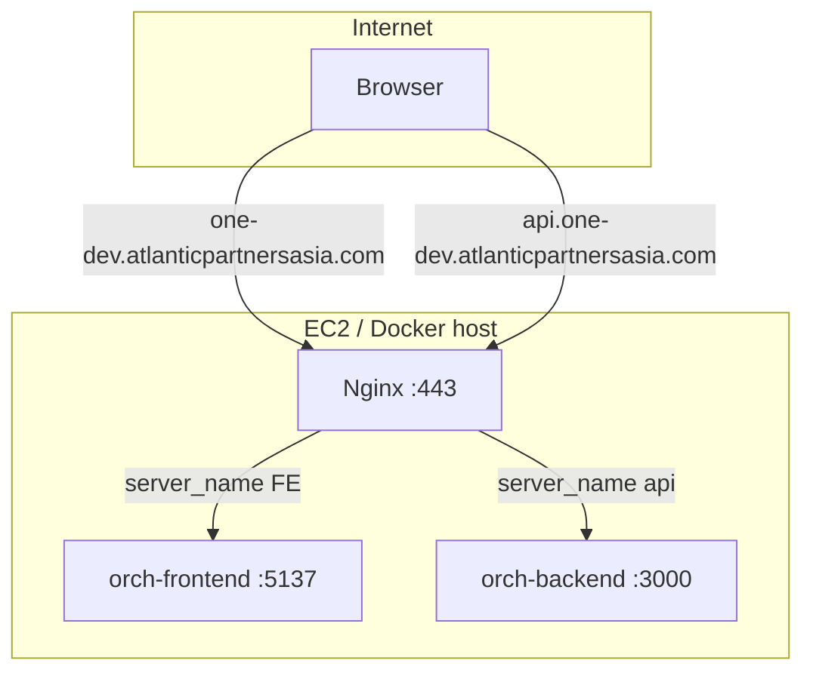
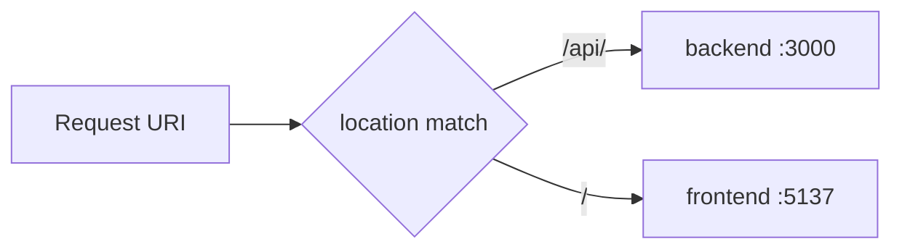

# Nginx Reverse Proxy — Host-based & Path-based Routing

Hướng dẫn cấu hình **nginx** làm reverse proxy cho stack **APA Orchestration Layer** (React FE + NestJS BE) trên môi trường dev.

| Thành phần | Port nội bộ | Domain công khai |
|------------|-------------|------------------|
| **Frontend** | `5137` | `https://one-dev.atlanticpartnersasia.com/` |
| **Backend** | `3000` | `https://api.one-dev.atlanticpartnersasia.com/` |
| **Nginx** | `80` / `443` (hoặc `8080` nếu không bind trực tiếp 443) | Terminate SSL, route traffic |

> File cấu hình mẫu: [`nginx/`](./nginx/)

---

## 1. Khái niệm cần biết

### 1.1. Reverse proxy

**Reverse proxy** đứng **trước** ứng dụng: client chỉ nói chuyện với nginx; nginx chuyển tiếp request tới service nội bộ (FE/BE trên localhost hoặc Docker network).

```
Client ──HTTPS──► Nginx (:443) ──HTTP──► FE (:5137)
                              └──HTTP──► BE (:3000)
```

Lợi ích:

- Một cổng công khai (443) thay vì expose nhiều port app
- SSL/TLS tập trung tại nginx
- Load balancing, rate limit, gzip, cache tĩnh
- Ẩn topology nội bộ

### 1.2. Host-based routing (routing theo domain)

Mỗi **hostname** map tới một upstream khác nhau.

| Request tới | Nginx chuyển tới |
|-------------|------------------|
| `Host: one-dev.atlanticpartnersasia.com` | `http://127.0.0.1:5137` (FE) |
| `Host: api.one-dev.atlanticpartnersasia.com` | `http://127.0.0.1:3000` (BE) |

Đây là **cách bạn đang dùng**: FE domain chính, BE subdomain `api.`.

- FE gọi API qua URL tuyệt đối: `https://api.one-dev.../api/...`
- Cookie cross-subdomain cần cấu hình `Domain=.atlanticpartnersasia.com` (nếu dùng session cookie chung)
- CORS: BE phải allow origin `https://one-dev.atlanticpartnersasia.com`

**File mẫu:** [`nginx/host-based.conf`](./nginx/host-based.conf)

### 1.3. Path-based routing (routing theo đường dẫn)

Một **domain duy nhất**; nginx phân luồng theo **prefix path**:

| Path | Upstream |
|------|----------|
| `/` (và static assets) | FE `:5137` |
| `/api/` | BE `:3000` |

Ví dụ:

- `https://one-dev.atlanticpartnersasia.com/` → React app
- `https://one-dev.atlanticpartnersasia.com/api/health` → NestJS

Ưu điểm:

- Không cần subdomain API riêng
- Same-origin: FE gọi `/api/...` — **không cần CORS** cho browser
- Cookie/session cùng origin, đơn giản hơn

Nhược điểm / lưu ý:

- BE phải biết nó được mount dưới prefix `/api` (global prefix NestJS)
- FE build phải dùng `VITE_API_URL=/api` (relative) thay vì URL subdomain
- WebSocket/SSE: path phải khớp (`/api/ws` → BE)
- SPA fallback (`try_files`) không được nuốt request `/api`

**File mẫu:** [`nginx/path-based.conf`](./nginx/path-based.conf)

### 1.4. So sánh nhanh

| Tiêu chí | Host-based (2 domain) | Path-based (1 domain) |
|----------|----------------------|------------------------|
| URL API | `api.one-dev.../api/users` | `one-dev.../api/users` |
| CORS | Cần cấu hình BE | Không cần (same origin) |
| Cookie | Cần `Domain` chung | Tự nhiên cùng origin |
| DNS | 2 record (apex + `api`) | 1 record |
| SSL cert | SAN hoặc 2 cert | 1 cert |
| Độ phức tạp app | FE env trỏ subdomain API | BE `setGlobalPrefix('api')` + FE relative path |

### 1.5. Các directive nginx thường gặp

| Directive | Vai trò |
|-----------|---------|
| `upstream` | Đặt tên nhóm backend + địa chỉ (`server 127.0.0.1:3000`) |
| `server` | Virtual host: `listen`, `server_name`, `location` |
| `location` | Khớp URI → chọn `proxy_pass`, `root`, `try_files` |
| `proxy_pass` | Chuyển tiếp HTTP tới upstream |
| `proxy_set_header` | Gửi header gốc (`Host`, `X-Real-IP`, `X-Forwarded-*`) |
| `proxy_http_version 1.1` + `Upgrade` | WebSocket |
| `try_files` | SPA: fallback về `index.html` |
| `ssl_certificate` | Cert Let's Encrypt / ACM |

### 1.6. Header quan trọng khi proxy

Backend (NestJS) thường cần biết client thật và scheme HTTPS:

```nginx
proxy_set_header Host              $host;
proxy_set_header X-Real-IP         $remote_addr;
proxy_set_header X-Forwarded-For   $proxy_add_x_forwarded_for;
proxy_set_header X-Forwarded-Proto $scheme;
```

NestJS: bật `trust proxy` nếu đọc IP / cookie `secure` qua proxy.

---

## 2. Kiến trúc hiện tại (host-based)



Luồng request:

1. DNS `one-dev` và `api.one-dev` trỏ về IP EC2 (hoặc ALB).
2. Nginx terminate TLS trên `:443`.
3. `server_name` quyết định upstream.

---

## 3. Path-based routing — cách thực hiện

### 3.1. Mục tiêu

Gộp FE + BE dưới **một domain**:

```
https://one-dev.atlanticpartnersasia.com/          → FE
https://one-dev.atlanticpartnersasia.com/api/*     → BE
```

Subdomain `api.one-dev` có thể:

- **Redirect 301** về path-based (tương thích client cũ), hoặc
- Giữ song song (2 chế độ) trong giai đoạn chuyển đổi.

### 3.2. Luồng nginx (path-based)



Thứ tự `location` quan trọng: block `/api/` phải **cụ thể hơn** block `/`.

### 3.3. Cấu hình nginx

Xem file đầy đủ: [`nginx/path-based.conf`](./nginx/path-based.conf)

Điểm then chốt:

```nginx
# API — prefix /api/ → backend (giữ nguyên path /api/...)
location /api/ {
    proxy_pass http://backend;   # KHÔNG thêm trailing slash nếu BE có global prefix /api
}

# SPA — mọi path còn lại → frontend
location / {
    proxy_pass http://frontend;
}
```

**Hai kiểu `proxy_pass`:**

| Cấu hình | Request `GET /api/users` gửi tới BE |
|----------|-------------------------------------|
| `proxy_pass http://backend;` | `GET /api/users` |
| `proxy_pass http://backend/;` (có `/` cuối) | `GET /users` — **strip** prefix `/api` |

Chọn theo cách NestJS mount route:

- Có `app.setGlobalPrefix('api')` → dùng **không** strip: `proxy_pass http://backend;`
- BE listen `/` (không prefix) → dùng strip: `proxy_pass http://backend/;` trong `location /api/`

### 3.4. Thay đổi ứng dụng

#### Backend (NestJS)

```typescript
// main.ts
app.setGlobalPrefix('api');
app.enableCors({
  origin: process.env.CORS_ORIGIN ?? 'https://one-dev.atlanticpartnersasia.com',
  credentials: true,
});
```

Path-based trên cùng domain: có thể thu hẹp CORS hoặc tắt nếu chỉ same-origin.

#### Frontend (Vite/React)

```env
# .env.production — path-based
VITE_API_BASE_URL=/api
```

```typescript
// axios/fetch
const client = axios.create({ baseURL: import.meta.env.VITE_API_BASE_URL });
// Gọi: client.get('/users') → GET /api/users
```

Không dùng `https://api.one-dev...` khi chuyển sang path-based.

#### Health check (CI/CD)

Pipeline hiện check `GET http://localhost:8080/api/health/sqs`. Với path-based trên cùng domain, URL nội bộ vẫn là:

```bash
curl -f http://localhost:8080/api/health/sqs
```

Nginx listen `8080` và route `/api/` → BE như mô tả trong [`nginx/docker-compose.snippet.yml`](./nginx/docker-compose.snippet.yml).

### 3.5. DNS & SSL

| Hạng mục | Việc cần làm |
|----------|--------------|
| **DNS** | Chỉ cần A/ALIAS `one-dev.atlanticpartnersasia.com` (path-based). Record `api.one-dev` tùy chọn redirect. |
| **SSL** | Một cert cho `one-dev.atlanticpartnersasia.com` (Let's Encrypt `certbot` hoặc ACM trên ALB). |
| **Certbot** | `certbot --nginx -d one-dev.atlanticpartnersasia.com` |

Host-based cần cert cover cả hai name (SAN):

```bash
certbot --nginx \
  -d one-dev.atlanticpartnersasia.com \
  -d api.one-dev.atlanticpartnersasia.com
```

---

## 4. Checklist triển khai

### 4.1. Host-based (2 domain) — setup hiện tại

- [ ] DNS: `one-dev` và `api.one-dev` → IP host
- [ ] Copy [`nginx/host-based.conf`](./nginx/host-based.conf) vào `/etc/nginx/conf.d/` hoặc mount vào container
- [ ] SSL cho cả hai `server_name`
- [ ] FE env: `VITE_API_BASE_URL=https://api.one-dev.atlanticpartnersasia.com/api`
- [ ] BE CORS: allow `https://one-dev.atlanticpartnersasia.com`
- [ ] `nginx -t` && `nginx -s reload` (hoặc `docker compose restart nginx`)
- [ ] Verify:
  - `curl -I https://one-dev.atlanticpartnersasia.com/`
  - `curl https://api.one-dev.atlanticpartnersasia.com/api/health/sqs`

### 4.2. Path-based (1 domain)

- [ ] Chọn chiến lược strip prefix (mục 3.3)
- [ ] Copy [`nginx/path-based.conf`](./nginx/path-based.conf)
- [ ] BE: `setGlobalPrefix('api')` (nếu chưa có)
- [ ] FE: `VITE_API_BASE_URL=/api`
- [ ] (Tùy chọn) Redirect `api.one-dev` → `one-dev/api` cho client cũ
- [ ] Verify:
  - `curl https://one-dev.atlanticpartnersasia.com/api/health/sqs`
  - Mở browser, login, kiểm tra Network tab — API phải là same-origin `/api/...`

### 4.3. Docker Compose

Tham chiếu snippet: [`nginx/docker-compose.snippet.yml`](./nginx/docker-compose.snippet.yml)

Nginx container phụ thuộc `frontend` và `backend`; map port `8080:80` (hoặc `443:443` nếu SSL trong container).

---

## 5. Troubleshooting

| Triệu chứng | Nguyên nhân thường gặp | Cách xử lý |
|-------------|------------------------|------------|
| 502 Bad Gateway | FE/BE chưa chạy hoặc sai port upstream | `docker ps`, kiểm tra `upstream` trỏ đúng `5137`/`3000` |
| 404 trên `/api/...` | Sai `proxy_pass` (strip prefix nhầm) | So sánh mục 3.3; khớp với NestJS global prefix |
| FE refresh 404 | Thiếu SPA fallback | `try_files` hoặc proxy toàn bộ `/` về FE |
| CORS error | Host-based nhưng FE gọi sai origin | Sửa `CORS_ORIGIN` hoặc chuyển path-based |
| Cookie không gửi | `SameSite` / `Secure` / `Domain` | Path-based dễ hơn; host-based cần `Domain=.atlanticpartnersasia.com` |
| WebSocket fail | Thiếu header Upgrade | Thêm block trong `location` (xem file mẫu) |
| Redirect loop | `X-Forwarded-Proto` sai | `proxy_set_header X-Forwarded-Proto $scheme` |

### Lệnh debug

```bash
# Kiểm tra cú pháp
nginx -t

# Xem config đang load
nginx -T | less

# Test từ trong host
curl -v http://127.0.0.1:5137/
curl -v http://127.0.0.1:3000/api/health/sqs

# Test qua nginx
curl -v -H "Host: one-dev.atlanticpartnersasia.com" http://127.0.0.1:8080/
curl -v http://127.0.0.1:8080/api/health/sqs
```

---

## 6. Kết hợp cả hai (giai đoạn chuyển đổi)

Có thể chạy **đồng thời**:

1. `host-based.conf` — `api.one-dev` → BE (client cũ)
2. `path-based.conf` — `one-dev/api/` → BE (client mới)

Sau khi FE production dùng `/api`, redirect subdomain:

```nginx
server {
    listen 443 ssl;
    server_name api.one-dev.atlanticpartnersasia.com;
    return 301 https://one-dev.atlanticpartnersasia.com$request_uri;
}
```

---

## 7. Tài liệu liên quan

- CI/CD deploy nginx bundle: [`../index.vi.md`](../index.vi.md) §5
- Production URLs:
  - FE: [https://one-dev.atlanticpartnersasia.com/](https://one-dev.atlanticpartnersasia.com/)
  - BE: [https://api.one-dev.atlanticpartnersasia.com/](https://api.one-dev.atlanticpartnersasia.com/)
