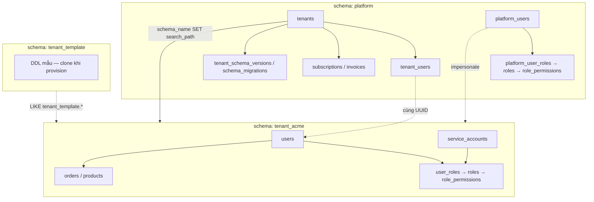
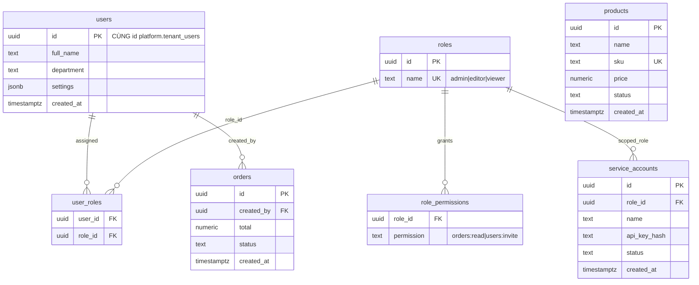

# Multi-Tenant — Schema Diagram & Column Reference

Sơ đồ các bảng được nhắc trong [index.md](./index.md), kèm giải thích từng column. Ví dụ **PostgreSQL**, model **shared DB + separate schema**.

---

## 1. Tổng quan 3 lớp schema

```
┌─────────────────────────────────────────────────────────────────────────┐
│                         PostgreSQL (1 database)                          │
├─────────────────────────────────────────────────────────────────────────┤
│  SCHEMA: platform          │  Metadata toàn hệ thống, billing, auth    │
├────────────────────────────┼────────────────────────────────────────────┤
│  SCHEMA: tenant_template   │  Bản mẫu DDL — clone khi provision tenant  │
├────────────────────────────┼────────────────────────────────────────────┤
│  SCHEMA: tenant_{slug}     │  Data business riêng từng khách (acme...)  │
│    users, orders, roles... │                                            │
└─────────────────────────────────────────────────────────────────────────┘
```

---

## 2. ER Diagram (Mermaid)

Sơ đồ khớp [index.md](./index.md): schema `platform` + schema `tenant_*` (+ `tenant_template` clone DDL). Tên entity Mermaid: `platform.roles` → `platform_roles`, `platform.role_permissions` → `role_permissions` (trong subgraph platform).

### 2.0 Tổng quan — 3 lớp & liên kết cross-schema



### 2.1 Schema `platform` — đầy đủ

```mermaid
erDiagram
    tenants ||--o{ tenant_users : "has"
    tenants ||--o| subscriptions : "has_one"
    tenants ||--o{ invoices : "has"
    tenants ||--o| tenant_schema_versions : "migration_version"
    tenants ||--o| tenant_quotas : "limits"
    tenants ||--o{ tenant_daily_stats : "aggregates"
    tenants ||--o{ impersonation_sessions : "target"
    tenants ||--o{ support_notes : "has"
    tenants ||--o{ audit_log : "scoped_to"

    tenant_users ||--o{ refresh_tokens : "sessions"
    tenant_users ||--o{ audit_log : "actor_tenant"

    platform_users ||--o{ platform_user_roles : "assigned"
    platform_roles ||--o{ platform_user_roles : "role_id"
    platform_roles ||--o{ role_permissions : "grants"
    platform_users ||--o{ impersonation_sessions : "support_id"
    platform_users ||--o{ support_notes : "author"
    platform_users ||--o{ audit_log : "actor_platform"

    tenants {
        uuid id PK
        text slug UK "acme.app.com"
        text schema_name UK "tenant_acme"
        text status "provisioning|active|suspended"
        timestamptz created_at
    }

    tenant_users {
        uuid id PK "JWT sub = tenant_users.id"
        uuid tenant_id FK
        text email
        text password_hash
        text status
    }

    refresh_tokens {
        uuid id PK
        uuid tenant_user_id FK
        text token_hash
        timestamptz expires_at
        timestamptz revoked_at
    }

    platform_users {
        uuid id PK
        text email UK
        text password_hash
        text display_name
        text status
        text mfa_secret
        timestamptz created_at
    }

    platform_roles {
        uuid id PK
        text name UK "super_admin|support|billing_ops"
    }

    platform_user_roles {
        uuid user_id FK
        uuid role_id FK
    }

    role_permissions {
        uuid role_id FK
        text permission
    }

    subscriptions {
        uuid id PK
        uuid tenant_id FK_UK
        text plan
        text status
        timestamptz trial_ends
        text external_id
        timestamptz updated_at
    }

    invoices {
        uuid id PK
        uuid tenant_id FK
        numeric amount
        text currency
        text status
        text external_id
        timestamptz created_at
    }

    impersonation_sessions {
        uuid id PK
        uuid support_id FK
        uuid tenant_id FK
        text ticket_ref
        text reason
        timestamptz started_at
        timestamptz ended_at
        boolean read_only
    }

    support_notes {
        uuid id PK
        uuid tenant_id FK
        uuid author_id FK
        text ticket_ref
        text body
        timestamptz created_at
    }

    audit_log {
        uuid id PK
        uuid actor_id
        text actor_type "platform|tenant"
        uuid tenant_id FK
        text action
        jsonb metadata
        timestamptz created_at
    }

    schema_migrations {
        int version PK
        text name
        timestamptz applied_at
    }

    tenant_schema_versions {
        uuid tenant_id PK_FK
        int version
        timestamptz applied_at
        text error
    }

    tenant_quotas {
        uuid tenant_id PK_FK
        int max_users
        int max_orders
        bigint max_storage_bytes
    }

    tenant_daily_stats {
        uuid id PK
        uuid tenant_id FK
        date stat_date
        int order_count
        numeric revenue
    }
```

> `schema_migrations` — version DDL toàn fleet, **không FK** `tenants`. Đối chiếu `tenant_schema_versions.version` để biết tenant lag migration.

### 2.2 Schema `tenant_{slug}` — đầy đủ (vd: tenant_acme)



> Không có cột `tenant_id` — isolation bằng schema. `products` độc lập catalog.

### 2.3 Nối 2 lớp user & RBAC (khớp index.md §1, §2, §3)

```
┌─────────────────────────────────────────────────────────────────────────┐
│                         schema: platform                                 │
├─────────────────────────────────────────────────────────────────────────┤
│  TENANT CUSTOMERS (acme.app.com)                                         │
│  tenants ──► tenant_users ──► refresh_tokens                             │
│                  │ id ═══════════════════════════════════════╗           │
│  PLATFORM STAFF (admin.internal.app.com)                      ║           │
│  platform_users ──► platform_user_roles ──► roles ──► role_permissions │
│       └──► impersonation_sessions ──► tenants                ║           │
└──────────────────────────────────────────────────────────────║───────────┘
                                                               ▼
┌─────────────────────────────────────────────────────────────────────────┐
│                      schema: tenant_acme                                 │
│  users ◄═════════════════════════════════════════════════════════════╝  │
│    ├── user_roles ──► roles ──► role_permissions                         │
│    ├── orders (created_by)                                               │
│    ├── products                                                          │
│    └── service_accounts ──► roles                                        │
└─────────────────────────────────────────────────────────────────────────┘
```

| Nhóm | Auth | RBAC | Business |
|------|------|------|----------|
| **Tenant user** | `platform.tenant_users` | `tenant_*.user_roles` → `roles` | `users`, `orders`, `products` |
| **Platform staff** | `platform.platform_users` | `platform_user_roles` → `roles` | `subscriptions`, `invoices` |

**Provision tenant (index.md §3.5):** `tenants` → `CREATE SCHEMA` → `tenant_users` + `users` (same UUID) → seed `roles` → `user_roles` → `tenant_schema_versions` → `status = active`

---

## 3. Schema `platform` — bảng & column

### 3.1 `platform.tenants`

Trung tâm metadata — mỗi row = một khách hàng (tenant).

| Column | Kiểu | Lưu gì |
|--------|------|--------|
| `id` | UUID PK | Định danh tenant — dùng trong JWT, FK mọi bảng platform |
| `slug` | TEXT UNIQUE | Định danh URL: subdomain `acme` từ `acme.app.com` — **detect tenant theo domain** |
| `schema_name` | TEXT UNIQUE | Tên schema PostgreSQL: `tenant_acme` — dùng `SET search_path` |
| `status` | TEXT | Vòng đời: `provisioning` → `active` → `suspended` → `archived` → `deleted` |
| `created_at` | TIMESTAMPTZ | Thời điểm tạo tenant |

**Resolve tenant:** `WHERE slug = ?` (subdomain) hoặc mở rộng bảng `tenant_domains` nếu custom domain.

---

### 3.2 `platform.tenant_users`

Credential đăng nhập **tenant user** — tách khỏi profile trong schema tenant.

| Column | Kiểu | Lưu gì |
|--------|------|--------|
| `id` | UUID PK | User id — claim `sub` trong JWT tenant |
| `tenant_id` | UUID FK → `tenants` | Thuộc tenant nào — cùng email có thể ở nhiều tenant (unique theo cặp) |
| `email` | TEXT | Email login — unique trong phạm vi `(tenant_id, email)` |
| `password_hash` | TEXT | bcrypt/argon2 — không lưu plaintext |
| `status` | TEXT | `active` / `disabled` — chặn login |

> Profile (tên, avatar, department...) thường nằm `tenant_*.users` — bảng này chỉ **identity + auth**.

---

### 3.3 `platform.platform_users`

Nhân viên nội bộ: super admin, support, billing ops — **không** thuộc tenant.

| Column | Kiểu | Lưu gì |
|--------|------|--------|
| `id` | UUID PK | Platform user id — JWT `sub` khi login `admin.internal.app.com` |
| `email` | TEXT UNIQUE | Email đăng nhập admin portal |
| `password_hash` | TEXT | Hash mật khẩu |
| `display_name` | TEXT | Tên hiển thị trong audit / UI admin |
| `status` | TEXT | `active` / `disabled` |
| `mfa_secret` | TEXT | TOTP/WebAuthn secret — bắt buộc super_admin, support |
| `created_at` | TIMESTAMPTZ | Ngày tạo account |

---

### 3.4 `platform.roles`

Định nghĩa role platform — **giống** `tenant_*.roles`.

| Column | Kiểu | Lưu gì |
|--------|------|--------|
| `id` | UUID PK | Role id |
| `name` | TEXT UNIQUE | `super_admin`, `support`, `billing_ops` — seed khi deploy |

```sql
INSERT INTO platform.roles (id, name) VALUES
  (gen_random_uuid(), 'super_admin'),
  (gen_random_uuid(), 'support'),
  (gen_random_uuid(), 'billing_ops');
```

---

### 3.5 `platform.platform_user_roles`

Junction: gán role cho **platform user** — `user_id` → `roles.id` qua `role_id`.

| Column | Kiểu | Lưu gì |
|--------|------|--------|
| `user_id` | UUID FK → `platform_users.id` | Nhân viên nội bộ |
| `role_id` | UUID FK → `platform.roles.id` | Role được gán |

```sql
CREATE TABLE platform.platform_user_roles (
  user_id UUID NOT NULL REFERENCES platform.platform_users(id) ON DELETE CASCADE,
  role_id UUID NOT NULL REFERENCES platform.roles(id) ON DELETE CASCADE,
  PRIMARY KEY (user_id, role_id)
);
```

> Một user có thể nhiều role (vd: `support` + `billing_ops`).

---

### 3.6 `platform.role_permissions`

Permission theo role platform — format `resource:action` hoặc `domain.action`.

| Column | Kiểu | Lưu gì |
|--------|------|--------|
| `role_id` | UUID FK → `platform.roles.id` | Role |
| `permission` | TEXT | `tenants.create`, `tenants.impersonate`, `billing.refund`... |

```sql
-- Ví dụ seed
INSERT INTO platform.role_permissions (role_id, permission)
SELECT r.id, p.permission
FROM platform.roles r
CROSS JOIN (VALUES
  ('tenants.create'), ('tenants.suspend'), ('migration.run')
) AS p(permission)
WHERE r.name = 'super_admin';
```

---

### 3.7 `platform.subscriptions`

Gói dịch vụ / billing — **billing_ops** chủ yếu thao tác đây.

| Column | Kiểu | Lưu gì |
|--------|------|--------|
| `id` | UUID PK | Subscription id |
| `tenant_id` | UUID FK UNIQUE | 1 tenant = 1 subscription active |
| `plan` | TEXT | `free`, `pro`, `enterprise` |
| `status` | TEXT | `active`, `past_due`, `canceled` |
| `trial_ends` | TIMESTAMPTZ | Hết trial — null nếu không trial |
| `external_id` | TEXT | ID Stripe/Paddle — sync webhook |
| `updated_at` | TIMESTAMPTZ | Lần cập nhật gần nhất |

---

### 3.8 `platform.invoices`

Hóa đơn theo tenant.

| Column | Kiểu | Lưu gì |
|--------|------|--------|
| `id` | UUID PK | Invoice id |
| `tenant_id` | UUID FK | Tenant được charge |
| `amount` | NUMERIC | Số tiền |
| `currency` | TEXT | `USD`, `VND`... |
| `status` | TEXT | `draft`, `paid`, `void`, `refunded` |
| `external_id` | TEXT | ID payment provider |
| `created_at` | TIMESTAMPTZ | Ngày tạo invoice |

---

### 3.9 `platform.impersonation_sessions`

Support/super_admin vào tenant dưới dạng user — audit & time-box.

| Column | Kiểu | Lưu gì |
|--------|------|--------|
| `id` | UUID PK | Session id |
| `support_id` | UUID FK → `platform_users` | Ai đang impersonate |
| `tenant_id` | UUID FK → `tenants` | Tenant được vào |
| `ticket_ref` | TEXT | Mã ticket Jira/Zendesk — bắt buộc support |
| `reason` | TEXT | Lý do impersonate |
| `started_at` | TIMESTAMPTZ | Bắt đầu session |
| `ended_at` | TIMESTAMPTZ | Kết thúc — null nếu đang active |
| `read_only` | BOOLEAN | Mặc định `true` — support không write |

---

### 3.10 `platform.schema_migrations`

Migration **fleet-wide** — version DDL mới nhất áp dụng cho tenant schema.

| Column | Kiểu | Lưu gì |
|--------|------|--------|
| `version` | INT PK | Số version migration (1, 2, 3...) |
| `name` | TEXT | Tên file migration: `add_orders_phone` |
| `applied_at` | TIMESTAMPTZ | Khi chạy xong trên hệ thống |

---

### 3.11 `platform.tenant_schema_versions`

Theo dõi **từng tenant** đã lên version migration nào.

| Column | Kiểu | Lưu gì |
|--------|------|--------|
| `tenant_id` | UUID PK FK | Tenant |
| `version` | INT | Version hiện tại của schema `tenant_*` |
| `applied_at` | TIMESTAMPTZ | Lần migrate gần nhất |
| `error` | TEXT | Lỗi nếu migration fail giữa chừng — dùng repair job |

**Alert:** `version < MAX(schema_migrations.version)` → tenant chưa migrate kịp.

---

### 3.12 `platform.tenant_daily_stats` *(được nhắc — aggregate)*

Bảng summary cross-tenant — **không** scan N schema lúc runtime.

| Column | Kiểu | Lưu gì |
|--------|------|--------|
| `tenant_id` | UUID FK | Tenant |
| `date` | DATE | Ngày thống kê |
| `order_count` | INT | Số order (sync từ worker) |
| `revenue` | NUMERIC | Doanh thu aggregate |

> Worker/cron đọc từng `tenant_*.orders` → ghi summary — admin dashboard query bảng này.

---

### 3.13 `platform.audit_log` *(được nhắc — chưa có DDL đầy đủ)*

Ghi mọi hành động nhạy cảm: login, impersonate, suspend tenant, refund.

| Column gợi ý | Lưu gì |
|--------------|--------|
| `id` | PK |
| `actor_id` | `platform_users.id` hoặc `tenant_users.id` |
| `actor_type` | `platform` \| `tenant` |
| `tenant_id` | Nullable — action liên quan tenant nào |
| `action` | `login.success`, `tenant.suspend`, `impersonate.start` |
| `metadata` | JSONB — IP, user-agent, payload rút gọn |
| `created_at` | Thời điểm |

---

### 3.14 `platform.support_notes` *(được nhắc — chưa có DDL đầy đủ)*

Ghi chú nội bộ support trên ticket — không nằm trong tenant schema.

| Column gợi ý | Lưu gì |
|--------------|--------|
| `id` | PK |
| `tenant_id` | FK tenant |
| `author_id` | FK `platform_users` |
| `ticket_ref` | Mã ticket |
| `body` | Nội dung note |
| `created_at` | Thời gian |

---

## 4. Schema `tenant_{slug}` — bảng & column

Mỗi tenant có schema riêng (`tenant_acme`, `tenant_globex`...). Cấu trúc **giống nhau**, clone từ `tenant_template`.

### 4.1 `tenant_*.roles`

Định nghĩa role trong tenant (khác platform roles).

| Column | Kiểu | Lưu gì |
|--------|------|--------|
| `id` | UUID PK | Role id |
| `name` | TEXT UNIQUE | `admin`, `editor`, `viewer` — seed khi provision |

---

### 4.2 `tenant_*.user_roles`

Gán role cho user trong tenant — **FK logic** tới `users.id` (cùng schema).

| Column | Kiểu | Lưu gì |
|--------|------|--------|
| `user_id` | UUID FK → `users.id` | User trong tenant — **cùng UUID** với `platform.tenant_users.id` |
| `role_id` | UUID FK → `roles.id` | Role được gán (`admin`, `editor`...) |

```sql
-- user_roles.user_id luôn trỏ users.id trong CÙNG schema tenant
ALTER TABLE tenant_acme.user_roles
  ADD CONSTRAINT fk_user_roles_user
  FOREIGN KEY (user_id) REFERENCES tenant_acme.users(id);
```

---

### 4.3 `tenant_*.role_permissions`

Permission chi tiết theo role — format `resource:action`.

| Column | Kiểu | Lưu gì |
|--------|------|--------|
| `role_id` | UUID FK → `roles` | Role |
| `permission` | TEXT | `orders:read`, `orders:write`, `users:invite` |

---

### 4.4 `tenant_*.users` *(business profile)*

Profile nhân viên / user trong công ty tenant — tách với `platform.tenant_users` (auth).

| Column gợi ý | Lưu gì |
|--------------|--------|
| `id` | PK — link `tenant_users.id` |
| `full_name` | Tên hiển thị |
| `department` | Phòng ban |
| `settings` | JSONB preferences |
| `created_at` | Ngày tham gia |

> Tạo bằng `CREATE TABLE tenant_acme.users (LIKE tenant_template.users INCLUDING ALL)`.

---

### 4.5 `tenant_*.orders`, `tenant_*.products` *(business data)*

Data nghiệp vụ — **chỉ** tồn tại trong schema tenant, không có `tenant_id` column (isolation bằng schema).

| Bảng | Vai trò |
|------|---------|
| `orders` | Đơn hàng — ví dụ trong doc flow request |
| `products` | Catalog sản phẩm |

Cột cụ thể tùy domain app — doc chỉ liệt kê tên bảng điển hình.

---

## 5. Schema `tenant_template`

Không phải bảng — là **schema mẫu** chứa DDL chuẩn (`users`, `orders`, `roles`...). Khi provision:

```
CREATE SCHEMA tenant_acme;
CREATE TABLE tenant_acme.users (LIKE tenant_template.users INCLUDING ALL);
-- ... copy toàn bộ bảng template
```

---

## 6. Quan hệ chính (đọc nhanh)

```
platform.tenants (1)
    ├── tenant_users (N) ──► refresh_tokens (N)
    ├── subscriptions (1)
    ├── invoices (N)
    ├── tenant_schema_versions (1)  ← đối chiếu schema_migrations (fleet)
    ├── tenant_quotas (1)
    ├── tenant_daily_stats (N)
    ├── impersonation_sessions (N)
    ├── support_notes (N)
    └── audit_log (N, scoped tenant_id)

platform.platform_users (1)
    ├── platform_user_roles (N) → roles → role_permissions
    ├── impersonation_sessions (N)
    ├── support_notes (N)
    └── audit_log (N, actor platform)

tenant_{slug} (schema — clone từ tenant_template)
    ├── users (profile) ←── cùng UUID ──→ platform.tenant_users (auth)
    ├── user_roles → roles → role_permissions
    ├── service_accounts → roles
    └── orders, products — business
```

---

## 7. Detect tenant — column nào?

| Cách | Column / bảng |
|------|----------------|
| Subdomain `acme.app.com` | `platform.tenants.slug` = `'acme'` |
| Sau khi biết tenant | `platform.tenants.schema_name` → `SET search_path` |
| JWT tenant user | `tenant_id` + `schema` (từ `tenants`) |
| Custom domain *(mở rộng)* | Bảng `tenant_domains.domain` — chưa có trong index.md |

---

## Tham chiếu

- [index.md](./index.md) — auth, migration, data access
- [../security.md](../security.md) — RLS, least privilege
