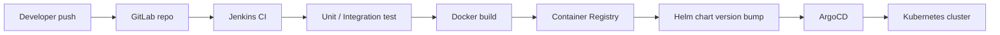

# CI/CD — Luồng triển khai

## Tóm tắt một câu

**CI** tự động build/test mỗi commit. **CD** deploy artifact lên môi trường. Luồng điển hình: Git push → CI test + build image → push registry → CD (Helm/ArgoCD) apply lên K8s.

---

## Ví dụ stack: GitLab → Jenkins → Helm → ArgoCD → K8s

### Từng bước

| Bước | Công cụ | Việc làm |
|------|---------|----------|
| 1 | **GitLab** | Source control, MR, webhook trigger |
| 2 | **Jenkins** | Pipeline: checkout, test, build, push |
| 3 | **Test** | `go test`, lint, SAST |
| 4 | **Build** | `docker build` → tag `app:1.2.3+abc123` |
| 5 | **Registry** | ECR/GCR/Harbor lưu image |
| 6 | **Helm** | Chart mô tả Deployment, Service, Ingress, values per env |
| 7 | **ArgoCD** | GitOps — sync manifest/chart từ Git → cluster |
| 8 | **K8s** | Rolling update pods |

---

## CI best practices

- Pipeline **fail fast** — lint trước integration test dài.
- Cache dependency (`go mod`, docker layer).
- Không deploy branch trực tiếp production — chỉ tag/release.
- Artifact immutable — cùng image promote staging → prod.

---

## CD strategies

| Strategy | Mô tả |
|----------|--------|
| **Rolling update** | Thay pod dần — default K8s |
| **Blue/Green** | Hai env, switch traffic |
| **Canary** | 5% traffic version mới, monitor, tăng dần |
| **GitOps** | Git = source of truth; ArgoCD reconcile |

---

## ArgoCD (GitOps)

- Monitor Git repo chứa Helm/Kustomize manifests.
- Drift detection — cluster khác Git → sync hoặc alert.
- Rollback = revert Git commit hoặc Argo history.

---

## Câu trả lời ngắn (phỏng vấn)

CI: mỗi push → test + build image + push registry. CD: Helm chart versioned, ArgoCD sync Git → K8s. GitOps giúp audit và rollback. Canary/blue-green giảm rủi ro release. Cùng image promote qua env, config khác qua values.
