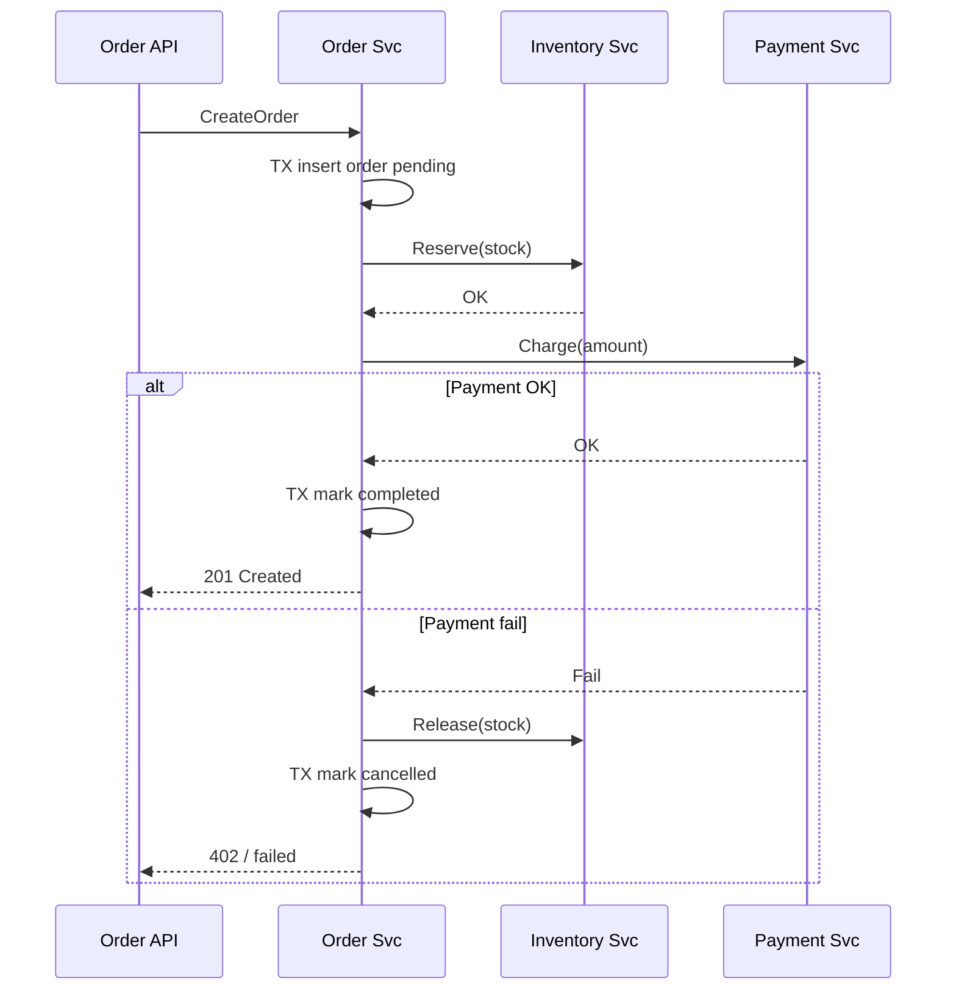

# Microservice — Toàn vẹn & thống nhất dữ liệu giữa các service

> Demo code: [demo/microservice-data-consistency](./demo/microservice-data-consistency/)

## Tóm tắt một câu

Microservice **không có transaction ACID xuyên service** — mỗi service sở hữu DB riêng. Đảm bảo toàn vẹn bằng **Saga** (bước + bù trừ), **Outbox/Inbox** (publish event đáng tin), **idempotency**, và chấp nhận **eventual consistency** ở chỗ business cho phép; chỉ dùng **strong consistency** (sync + lock) khi thật sự cần.

---

## Vấn đề gốc

| Monolith | Microservice |
|----------|--------------|
| Một DB, một transaction `BEGIN … COMMIT` | Mỗi service **database per service** |
| FK, JOIN, rollback toàn cục | Không JOIN trực tiếp DB service khác |
| Strong consistency “miễn phí” | Ghi Order + trừ Inventory + charge Payment = **3 hệ thống** |

**Distributed transaction (2PC/XA)** đồng bộ mọi participant — chậm, dễ block, khó scale, nhiều stack hiện đại **tránh**. Thay vào đó dùng pattern **eventually consistent** có kiểm soát.

---

## Phân loại consistency cần nói rõ trong phỏng vấn

| Loại | Ý nghĩa | Ví dụ |
|------|---------|--------|
| **Strong / immediate** | Đọc ngay sau ghi thấy kết quả cuối | Chuyển tiền — số dư phải khớp tức thì |
| **Eventual** | Tạm lệch, sau vài ms/giây sẽ khớp | Search index, dashboard tổng hợp |
| **Causal** | Thứ tự nhân quả được giữ | Comment sau post — comment không hiện trước post |

Không phải mọi luồng đều cần strong — **chọn đúng mức** theo business.

---

## Nguyên tắc thiết kế

1. **Single writer** — mỗi aggregate (Order, User, Inventory) chỉ **một service** được ghi.
2. **Không share DB** giữa service — share schema = coupling ngầm.
3. **API hoặc event** là contract — không đọc DB neighbor.
4. **Idempotent** mọi side effect (payment, gửi email, trừ kho).
5. **At-least-once delivery** + idempotency → effectively-once.
6. **Compensation** thay rollback — “undo” bằng nghiệp vụ (hoàn tiền, hủy reservation).
7. **Observability** — correlation ID xuyên service để trace saga.

---

## Các pattern chính

### 1. Saga — giao dịch phân tán nhiều bước

Chuỗi **local transaction**; bước sau fail → **compensating transaction** cho các bước trước.

**Ví dụ đặt hàng:**

```
CreateOrder (pending)
  → ReserveInventory
    → ChargePayment
      → ConfirmOrder (completed)
```

Payment fail:

```
  → RefundInventory (compensate)
  → CancelOrder (compensate)
```

| Kiểu | Mô tả | Ưu / Nhược |
|------|--------|------------|
| **Orchestration** | Một orchestrator điều phối từng bước | Dễ theo dõi, debug; orchestrator là điểm tập trung |
| **Choreography** | Mỗi service publish/subscribe event, tự phản ứng | Loose coupling; khó nhìn full flow |

**Lưu ý:** compensation không phải lúc nào cũng “xóa” được (đã gửi email) — thiết kế **semantic rollback** (hoàn tiền, mark cancelled).

### 2. Transactional Outbox

**Vấn đề:** ghi DB xong, publish Kafka fail → service khác không biết.

**Giải pháp:** trong **cùng local transaction**, ghi business row + row `outbox`. Worker đọc outbox → publish → mark sent.

```
BEGIN;
  INSERT INTO orders ...;
  INSERT INTO outbox (event_type, payload) VALUES ('OrderCreated', ...);
COMMIT;
-- relay process publish event, idempotent consumer phía kia
```

Đảm bảo **không mất event** (at-least-once từ DB ra bus).

### 3. Inbox (idempotent consumer)

Consumer lưu `message_id` đã xử lý — nhận duplicate thì **skip**.

```
BEGIN;
  IF EXISTS (SELECT 1 FROM inbox WHERE msg_id = ?) ROLLBACK/skip;
  -- xử lý nghiệp vụ
  INSERT INTO inbox (msg_id) VALUES (?);
COMMIT;
```

Kết hợp Outbox + Inbox → pipeline event **đáng tin** hơn.

### 4. Event-driven + eventual consistency

Service B cập nhật **read model / cache** khi nhận `OrderCreated`. Tạm thời Order service thấy `completed` nhưng search chưa index — chấp nhận nếu SLA cho phép.

**Projection lag** cần monitor; UI có thể hiển thị “đang xử lý”.

### 5. Sync API + retry (dùng hạn chế)

Gọi HTTP/gRPC đồng bộ giữa service khi cần phản hồi ngay (vd. kiểm tra tồn kho trước khi hiển thị).

| Cần | Cách |
|-----|------|
| Timeout | `context.WithTimeout` mọi call |
| Retry | Chỉ retry **idempotent** GET hoặc POST có idempotency key |
| Circuit breaker | Tránh cascade khi downstream chết |
| Fallback | Degrade gracefully |

Không dùng chuỗi sync dài làm “transaction” — latency và failure nhân lên.

### 6. Idempotency key

Client gửi `Idempotency-Key: uuid` — server lưu kết quả; request trùng trả cùng response, **không charge hai lần**.

Bắt buộc với: payment, tạo order, gửi notification.

### 7. Distributed lock (Redis, etcd) — cẩn thận

Chỉ khi cần **exclusive** trên resource xuyên service (vd. một SKU flash sale). Lock **ngắn**, có TTL, không thay saga. Sai lock → deadlock, split-brain.

### 8. 2PC / XA — biết nhưng thường không chọn

Đồng bộ commit tất cả participant — phù hợp legacy bank-internal; microservice cloud-native thường **không** dùng vì availability và coupling.

---

## So sánh nhanh pattern

| Pattern | Consistency | Độ phức tạp | Khi dùng |
|---------|-------------|-------------|----------|
| Local transaction only | Strong trong 1 service | Thấp | Mọi ghi trong boundary |
| Saga | Eventual / business-level | Trung bình–cao | Luồng nhiều bước (order, booking) |
| Outbox + event | Eventual | Trung bình | Notify service khác đáng tin |
| Sync API | Tùy downstream | Thấp–trung bình | Đọc/validate ngay, ít bước |
| 2PC | Strong distributed | Cao | Hiếm trong greenfield MS |

---

## Luồng mẫu: Place Order (orchestrated saga)



Mỗi hộp “TX” là **một DB, một transaction**. Toàn bộ flow là **saga**.

---

## Xử lý lỗi & edge case

| Tình huống | Xử lý |
|------------|--------|
| Bước giữa timeout | Retry idempotent; nếu không chắc → query trạng thái downstream |
| Compensation fail | Retry compensate; alert; **manual intervention** queue |
| Duplicate event | Inbox / idempotency table |
| Message out of order | Version field, ignore stale event |
| Partial failure khi scale | Mỗi saga instance có `saga_id` trace được |

**Poison message** → DLQ sau N retry, không block consumer mãi.

---

## Nhầm lẫn thường gặp

| Nhầm | Thực tế |
|------|---------|
| “Microservice vẫn dùng chung 1 Postgres cho tiện” | Mất ranh giới; coupling + không scale độc lập |
| “Gọi REST tuần tự 5 service = transaction” | Không atomic; cần saga + compensate |
| “Eventual = không cần đúng” | Eventual vẫn phải **đạt trạng thái đúng** cuối cùng |
| “Retry vô hạn” | Charge trùng, duplicate order — cần idempotency + cap retry |
| “Strong consistency mọi nơi” | Giết availability & latency — chọn chỗ cần |

---

## Câu trả lời ngắn (phỏng vấn)

1. Microservice = **DB riêng** → không ACID xuyên service.
2. **Strong** trong từng service (local TX); **cross-service** dùng **Saga** + compensation.
3. **Outbox** ghi + publish event an toàn; consumer **idempotent** (Inbox).
4. **Idempotency key** cho mọi side effect; at-least-once + idempotent ≈ exactly-once effect.
5. Chấp nhận **eventual consistency** cho read model; sync API ngắn khi cần đọc ngay.
6. Tránh 2PC; monitor saga, DLQ, projection lag; correlation ID để debug.

---

## Chạy demo

```bash
cd go-interviews/demo/microservice-data-consistency
go test ./...
go run ./cmd/demo
```

| File demo | Nội dung |
|-----------|----------|
| `saga.go` | Orchestrated saga — success & compensation |
| `outbox.go` | Ghi business + outbox cùng transaction |
| `idempotency.go` | Xử lý request trùng idempotency key |
| `01_saga_success_test.go` | Saga hoàn tất |
| `02_saga_compensation_test.go` | Payment fail → compensate |
| `03_outbox_test.go` | Outbox relay publish event |
| `04_idempotency_test.go` | Duplicate key không charge 2 lần |
| `cmd/demo/main.go` | In luồng saga ra console |
