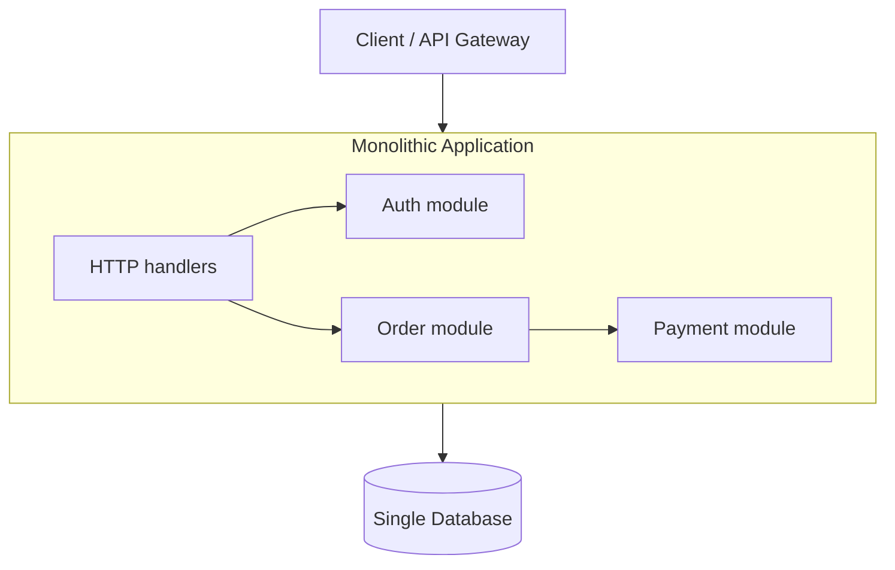
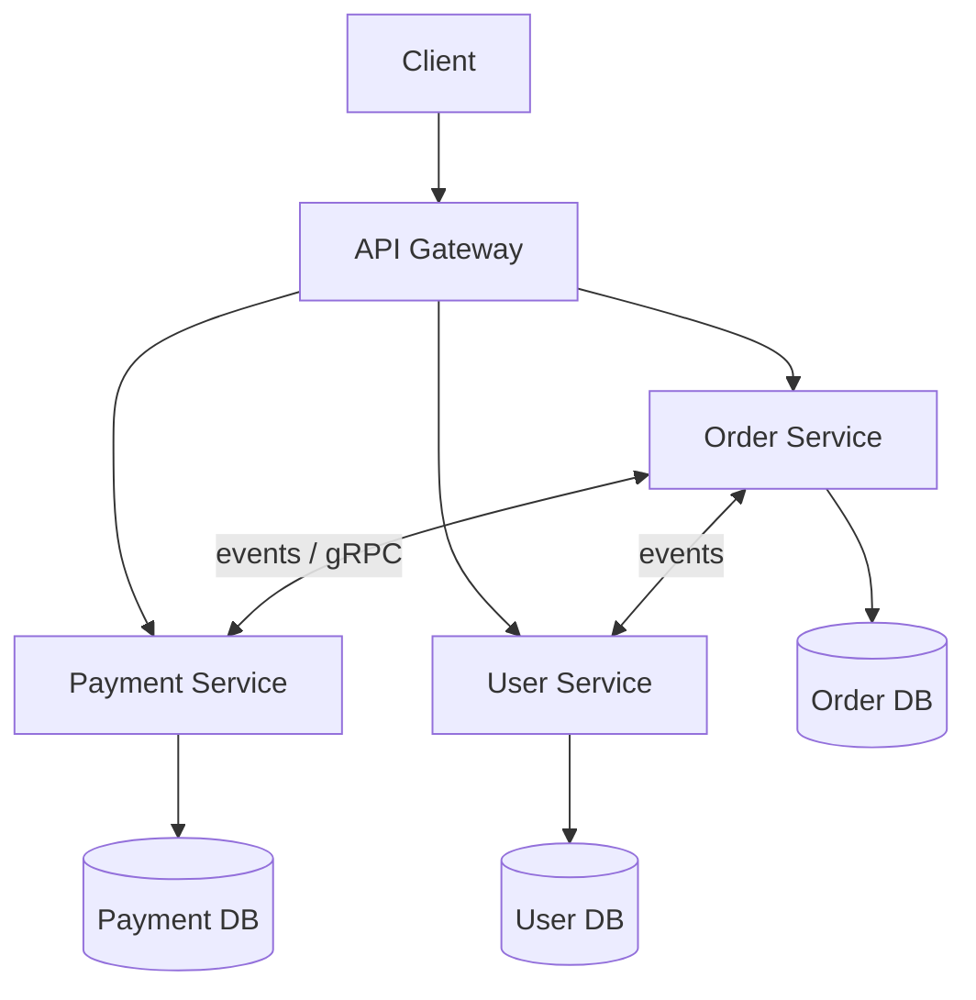

# Monolithic vs Microservice — Khác biệt, ưu & nhược điểm

> Liên quan: [toàn vẹn dữ liệu microservice](./microservice-data-consistency.md)

## Tóm tắt một câu

**Monolith** = một ứng dụng deploy chung, thường một codebase/DB — đơn giản, transaction dễ, phù hợp team nhỏ và sản phẩm mới. **Microservice** = nhiều service độc lập deploy/scale — linh hoạt khi lớn, nhưng phức tạp vận hành, distributed data, observability. Không có cái nào “luôn đúng” — chọn theo **quy mô team, domain, và giai đoạn** sản phẩm.

---

## Định nghĩa

| | **Monolithic** | **Microservice** |
|---|----------------|------------------|
| **Deploy** | Một artifact (một binary / một container chính) | Nhiều service deploy riêng |
| **Codebase** | Thường một repo (hoặc vài module trong một app) | Nhiều repo / service boundary rõ |
| **Database** | Thường **một DB** dùng chung | **Database per service** (lý tưởng) |
| **Giao tiếp** | Gọi hàm trong process | HTTP/gRPC/message queue **qua mạng** |
| **Team** | Một team sở hữu toàn bộ | Team theo service / domain |

**Modular monolith** (giữa hai thái cực): một deploy unit nhưng **module rõ ranh giới** trong code — dễ tách service sau này.

---

## Sơ đồ kiến trúc

### Monolith

### Microservice

---

## Bảng so sánh chi tiết

| Tiêu chí | Monolith | Microservice |
|----------|----------|--------------|
| **Độ phức tạp ban đầu** | Thấp | Cao (infra, mesh, CI/CD nhiều service) |
| **Time-to-market** | Nhanh lúc đầu | Chậm hơn khi greenfield (setup nặng) |
| **Transaction / consistency** | ACID trong một DB | Saga, eventual consistency ([xem thêm](./microservice-data-consistency.md)) |
| **Scale** | Scale **cả app** (vertical hoặc replicate full) | Scale **từng service** (order 10×, catalog 1×) |
| **Deploy** | Một thay đổi → deploy cả khối | Deploy độc lập từng service |
| **Fault isolation** | Lỗi một module có thể kéo sập cả process | Lỗi một service có thể **cô lập** (nếu thiết kế đúng) |
| **Tech stack** | Một ngôn ngữ/framework thống nhất | Mỗi service có thể khác stack |
| **Testing** | Integration test trong một app | Contract test, test environment phức tạp |
| **Debug / trace** | Stack trace một process | Distributed tracing (Jaeger, …) bắt buộc |
| **Chi phí vận hành** | Thấp (ít moving parts) | Cao (K8s, mesh, nhiều DB, monitoring) |
| **Coupling** | Dễ coupling ngầm (import chéo, share table) | Ranh giới rõ — nhưng coupling chuyển sang **network contract** |
| **Phù hợp team** | Team nhỏ–vừa, một codebase | Nhiều team song song, Conway's Law |

---

## Ưu điểm Monolith

| Ưu điểm | Giải thích |
|---------|------------|
| **Đơn giản phát triển** | Một project, chạy local một lệnh, không cần service discovery |
| **Transaction dễ** | `BEGIN … COMMIT` xuyên module trong cùng DB |
| **Performance nội bộ** | Gọi hàm trong memory — không latency mạng giữa module |
| **Debug dễ** | Một debugger, một log file, stack trace đầy đủ |
| **Deploy & ops đơn giản** | Một container/VM, ít pipeline |
| **Refactor trong codebase** | IDE rename/move xuyên module dễ hơn cross-repo |
| **Phù hợp MVP / startup** | Ship nhanh, validate product-market fit |

---

## Nhược điểm Monolith

| Nhược điểm | Giải thích |
|------------|------------|
| **Scale thừa** | Tăng replica cho cả app dù chỉ module Order hot |
| **Deploy rủi ro** | Sửa nhỏ vẫn deploy cả khối — blast radius lớn |
| **Codebase phình** | Sau vài năm: build chậm, onboarding khó, “big ball of mud” |
| **Coupling** | Team chen chúc một repo; thay đổi dễ ảnh hưởng chỗ khác |
| **Tech lock-in** | Khó thử stack mới cho một phần hệ thống |
| **Availability** | Một leak / deadlock có thể down toàn bộ |
| **Release train** | Nhiều team chờ nhau merge, release chậm |

---

## Ưu điểm Microservice

| Ưu điểm | Giải thích |
|---------|------------|
| **Scale độc lập** | Scale service bottleneck (payment, search) không scale phần còn lại |
| **Deploy độc lập** | Team Order release không chờ team Catalog |
| **Fault isolation** | Payment down có thể degrade (circuit breaker) thay vì sập hết |
| **Team autonomy** | Mỗi team own service end-to-end (Conway's Law tích cực) |
| **Tech đa dạng** | Search dùng Elasticsearch service, core API dùng Go |
| **Phù hợp domain lớn** | Bounded context rõ (DDD): Order, Billing, Notification |
| **Tuân thủ / compliance** | Tách PCI scope (payment) ra service riêng, audit hẹp |

---

## Nhược điểm Microservice

| Nhược điểm | Giải thích |
|------------|------------|
| **Phức tạp phân tán** | Network fail, timeout, retry, idempotency — không còn “gọi hàm” |
| **Data consistency khó** | Không ACID xuyên service — cần Saga, Outbox ([chi tiết](./microservice-data-consistency.md)) |
| **Vận hành nặng** | K8s, service mesh, nhiều DB backup, secret, CI/CD × N |
| **Latency** | Mỗi hop HTTP/gRPC thêm ms; chuỗi sync dài = chậm |
| **Testing & local dev** | Cần docker-compose nhiều service hoặc mock contract |
| **Observability bắt buộc** | Không có trace → không debug được request xuyên 5 service |
| **Chi phí** | Nhiều instance, nhiều DB, DevOps headcount |
| **Distributed monolith** | Tách service nhưng deploy chung, share DB → nợ kép, không được lợi gì |

---

## Modular monolith — lựa chọn giữa

Giữ **một deploy**, nhưng:

- Module theo **bounded context** (package `order`, `payment` — không import chéo tùy tiện).
- Giao tiếp nội bộ qua **interface**, không query chéo table trực tiếp.
- Khi cần scale một phần → **tách service** module đã tách sẵn.

Nhiều team khuyên: **bắt đầu modular monolith**, chỉ microservice hóa khi có **lý do đo được** (scale, team, release độc lập).

---

## Khi nào chọn gì?

| Chọn **Monolith** (hoặc modular monolith) | Chọn **Microservice** |
|---------------------------------------------|------------------------|
| Team < ~10 dev, một sản phẩm | Nhiều team (8–10+ người/domain) |
| MVP, chứng minh ý tưởng | Hệ thống production lớn, domain phức tạp |
| Traffic đồng đều, scale vertical đủ | Một vài service cần scale 10–100× |
| Ít kinh nghiệm DevOps phân tán | Có platform team, K8s, SRE |
| Strong consistency nghiệp vụ nhiều | Chấp nhận eventual ở nhiều luồng |
| Không có pain release/scale thật | Release train / build time / scale đã là bottleneck |

**Dấu hiệu tách service quá sớm:** 3 dev, 5 microservice, mỗi service 2 API — overhead > lợi ích.

---

## Nhầm lẫn thường gặp

| Nhầm | Thực tế |
|------|---------|
| “Microservice = hiện đại, monolith = lỗi thời” | Netflix monolith trước; nhiều công ty thành công vẫn monolith/modular |
| “Microservice tự động scale” | Phải thiết kế stateless, DB riêng, cache — không tự nhiên |
| “Tách theo layer (API / logic / DB service)” | Tách theo **business capability** (order, user), không theo technical layer |
| “Nhiều service nhưng chung 1 DB” | Vẫn là **distributed monolith** — coupling qua schema |
| “Monolith không scale được” | Scale horizontal replicate full app + DB read replica vẫn đủ cho rất nhiều hệ thống |

---

## Câu trả lời ngắn (phỏng vấn)

**Khác biệt:** Monolith = một app deploy, thường một DB, gọi trong process. Microservice = nhiều service deploy/DB độc lập, giao tiếp qua network/event.

**Monolith — ưu:** đơn giản, transaction dễ, dev/debug nhanh, chi phí ops thấp. **Nhược:** scale cả khối, deploy rủi ro, codebase và team coupling khi lớn.

**Microservice — ưu:** scale/deploy độc lập, fault isolation, team autonomy, phù hợp domain lớn. **Nhược:** phức tạp phân tán, consistency khó (Saga/eventual), ops và chi phí cao.

**Kết luận:** Bắt đầu **modular monolith** nếu chưa có pain rõ; microservice khi **team scale, bottleneck service, hoặc release** đòi hỏi tách — không tách vì trend.
