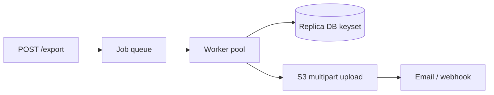

# Export hàng triệu bản ghi — Làm thế nào?

## Tóm tắt một câu

**Không** load hết vào memory, **không** sync HTTP chờ 30 phút. Dùng **cursor/keyset pagination**, **streaming**, **background job**, worker pool giới hạn, ghi **file chunk** (CSV/Parquet), notify user khi xong (email/S3 link).

---

## Anti-pattern

```go
// SAI — SELECT * 10M rows vào []Row
rows, _ := db.Query("SELECT * FROM orders")
var all []Order
for rows.Next() { all = append(all, scan()) }
```

→ OOM, timeout gateway, lock DB lâu.

---

## Giải pháp chuẩn

### 1. Async job

```
POST /export → 202 Accepted + job_id
Worker xử lý background → upload S3 → email link download
GET /export/{job_id}/status
```

### 2. Keyset pagination (cursor)

```sql
SELECT id, col1, col2 FROM orders
WHERE id > $last_id
ORDER BY id
LIMIT 5000;
```

Tránh `OFFSET 1000000` — Postgres vẫn scan bỏ row.

### 3. Streaming ghi file

```go
for {
    batch := fetchNextBatch(lastID, 5000)
    if len(batch) == 0 { break }
    csvWriter.Write(batch)
    lastID = batch[len(batch)-1].ID
}
```

Memory **O(batch size)**, không O(total rows).

### 4. Worker pool

- Nhiều partition song song (theo `id` range hoặc `tenant_id`) — **giới hạn** concurrency ([worker pool](./demo/race-condition/worker_pool.go)).
- Mỗi worker ghi part file → merge hoặc zip.

### 5. Read replica

- Export đọc từ **replica** — không ảnh hưởng primary OLTP.

### 6. Format & delivery

| Format | Khi dùng |
|--------|----------|
| **CSV** | User Excel, đơn giản |
| **Parquet** | Data team, columnar, nén tốt |
| **S3 presigned URL** | File lớn, TTL download |

### 7. Giới hạn & bảo mật

- Rate limit export per user.
- Audit log ai export data gì.
- Mask PII nếu policy yêu cầu.

---

## Luồng tổng thể



---

## Câu trả lời ngắn (phỏng vấn)

Background job + keyset pagination + stream ghi file. Bounded memory, worker pool có giới hạn. Đọc replica. Trả link S3 khi xong. Không sync export triệu row qua HTTP.
