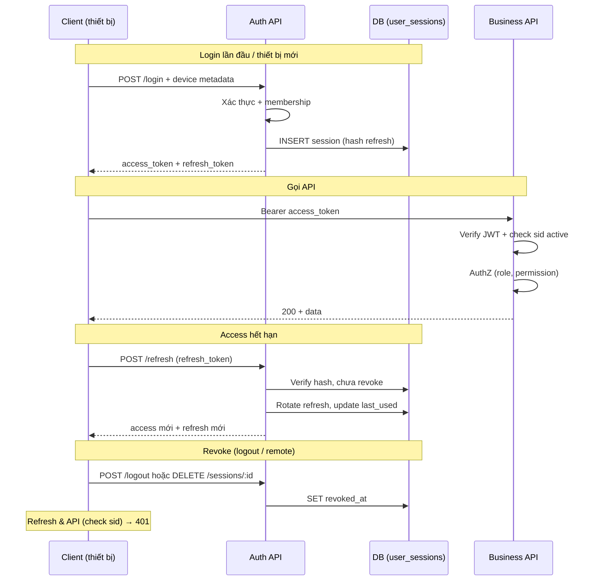

# Authentication & Authorization — Multi-Device

> Tóm tắt luồng **đăng nhập → gọi API → refresh → revoke** khi user có thể đăng nhập **nhiều thiết bị** cùng lúc.  
> Không có code — chỉ mô tả bước chạy, thành phần cần có, và hành vi revoke.

**Liên quan:** [database/multi-tenant/index.md](./database/multi-tenant/index.md) (tenant + JWT `tid`), [design-sys/csrf-sso-oauth-state.md](./design-sys/csrf-sso-oauth-state.md) (SSO/OAuth), [database/security.md](./database/security.md) (least privilege).

---

## 1. Tổng quan — hai tầng token + session theo thiết bị

Mỗi thiết bị login = **một session riêng** trên server. Mỗi session có **một cặp token** độc lập.

```
┌─────────────────────────────────────────────────────────────────────────┐
│                         THÀNH PHẦN CẦN CÓ                                │
├─────────────────────────────────────────────────────────────────────────┤
│  Client (web / mobile / desktop)                                        │
│    · device_id      — ID ổn định do client tạo, gửi khi login           │
│    · device_name    — tên hiển thị ("Chrome on MacBook", "iPhone 15")   │
│    · client_type    — web | ios | android | desktop                     │
│    · lưu refresh token (cookie HttpOnly hoặc secure storage)            │
│    · giữ access token ngắn hạn (memory / header)                        │
├─────────────────────────────────────────────────────────────────────────┤
│  Auth API                                                               │
│    · xác thực credentials hoặc SSO/OIDC                                 │
│    · tạo session + issue access + refresh token                         │
│    · verify JWT + kiểm tra session chưa revoke                          │
│    · RBAC / permission theo tenant                                      │
├─────────────────────────────────────────────────────────────────────────┤
│  Lưu trữ session (PostgreSQL — source of truth)                          │
│    · user_sessions: session_id, user_id, device metadata,               │
│      refresh_token_hash, expires_at, revoked_at, last_used_at           │
│  Cache tùy chọn (Redis)                                                 │
│    · session:{sid} — lookup nhanh khi verify request                    │
└─────────────────────────────────────────────────────────────────────────┘
```

### Hai loại token

| Token | Vai trò | TTL gợi ý | Ai cấp | Revoke |
|-------|---------|-----------|--------|--------|
| **Access token** (JWT) | Gọi API, mang `sub`, `tid`, `roles`, `sid` | 5–15 phút | Server ký | Gián tiếp — check `sid` còn active |
| **Refresh token** (opaque) | Lấy access token mới khi hết hạn | 7–30 ngày | Server sinh random | Trực tiếp — đánh dấu session revoked |

**Nguyên tắc:** Access ngắn, stateless (verify nhanh). Refresh dài, **chỉ lưu hash trên server** — mỗi refresh token gắn **một thiết bị / một session**.

---

## 2. Diagram tổng — vòng đời từ login đến API

```
                    ┌──────────────┐
                    │   CLIENT     │
                    │  (thiết bị)  │
                    └──────┬───────┘
                           │
          ┌────────────────┼────────────────┐
          │                │                │
          ▼                ▼                ▼
    ┌──────────┐    ┌──────────┐    ┌──────────┐
    │  LOGIN   │    │ REFRESH  │    │ API call │
    │ (lần đầu)│    │(hết access)   │(Bearer)  │
    └────┬─────┘    └────┬─────┘    └────┬─────┘
         │               │               │
         └───────────────┼───────────────┘
                         ▼
              ┌─────────────────────┐
              │      AUTH API       │
              │  login / refresh /  │
              │  verify / logout    │
              └──────────┬──────────┘
                         │
         ┌───────────────┼───────────────┐
         ▼               ▼               ▼
  ┌────────────┐  ┌────────────┐  ┌────────────┐
  │ PostgreSQL │  │   Redis    │  │ Tenant +   │
  │user_sessions│  │ (cache)   │  │ RBAC       │
  └────────────┘  └────────────┘  └────────────┘
```

---

## 3. Login lần đầu — thiết bị A (Laptop)

```
  User nhập email + password (+ chọn tenant nếu multi-tenant)
  Client gửi kèm: device_id, device_name, client_type
                    │
                    ▼
         ┌──────────────────────┐
         │ 1. Xác thực          │
         │ email/password hoặc  │
         │ SSO/OIDC callback    │
         └──────────┬───────────┘
                    │ user hợp lệ
                    ▼
         ┌──────────────────────┐
         │ 2. Kiểm tra tenant   │
         │ membership active    │
         │ (tid, role)          │
         └──────────┬───────────┘
                    │ OK
                    ▼
         ┌──────────────────────┐
         │ 3. Tạo session mới   │
         │ session_id = UUID      │
         │ sinh refresh_token     │
         │ lưu hash vào DB        │
         │ + device metadata      │
         └──────────┬───────────┘
                    │
                    ▼
         ┌──────────────────────┐
         │ 4. Issue tokens      │
         │ access_token (JWT)   │
         │   chứa sid, sub, tid │
         │ refresh_token        │
         └──────────┬───────────┘
                    │
                    ▼
         ┌──────────────────────┐
         │ 5. Client lưu        │
         │ Web: refresh → cookie│
         │      access → memory │
         │ Mobile: cả hai →     │
         │      Keychain        │
         └──────────────────────┘

  DB sau bước này:
  ┌────────────────────────────────────────────────────────┐
  │ user_sessions                                          │
  │  session_A │ alice │ Laptop │ refresh_hash_A │ active │
  └────────────────────────────────────────────────────────┘
```

**Cần có khi login:**

- Credentials hoặc luồng SSO (xem [csrf-sso-oauth-state.md](./design-sys/csrf-sso-oauth-state.md))
- Bảng `user_sessions` (hoặc tương đương)
- Client gửi metadata thiết bị — server **không tự đoán** thiết bị nếu không có input

---

## 4. Login thiết bị thứ hai — thiết bị B (Điện thoại)

**Không ghi đè** session thiết bị A. Tạo **session mới** + **cặp token mới**.

```
  Phone login (cùng user, cùng tenant)
                    │
                    ▼
         ┌──────────────────────┐
         │ Bước 1–4 giống Laptop│
         │ nhưng session_id khác│
         │ refresh_token khác   │
         └──────────┬───────────┘
                    │
                    ▼
  DB sau bước này — HAI session song song:
  ┌────────────────────────────────────────────────────────┐
  │ session_A │ alice │ Laptop  │ hash_A │ active          │
  │ session_B │ alice │ iPhone  │ hash_B │ active          │
  └────────────────────────────────────────────────────────┘

  Laptop vẫn dùng refresh_A — không bị ảnh hưởng
  Phone dùng refresh_B — độc lập hoàn toàn
```

### Phân biệt thiết bị — server dựa vào gì?

| Trường | Nguồn | Mục đích |
|--------|-------|----------|
| `session_id` (`sid` trong JWT) | Server | Khóa chính — mỗi cặp token ↔ một session |
| `device_id` | Client (tạo 1 lần, giữ lâu dài) | Nhóm / nhận diện cùng máy khi login lại |
| `device_name` | Client gửi khi login | Hiển thị UI "Thiết bị đang đăng nhập" |
| `client_type` | Client | web / ios / android / desktop |
| `user_agent`, `ip` | Server đọc request | Audit, gợi ý — không dùng làm khóa duy nhất |

```
  GET /auth/sessions  →  danh sách cho user:

  ┌─────────────────────────────────────────────────┐
  │ ● Chrome on MacBook   last: 2 phút   [current] │
  │ ○ iPhone 15           last: 1 giờ    [Đăng xuất]│
  └─────────────────────────────────────────────────┘
```

---

## 5. Gọi API — Authentication rồi Authorization

Mỗi request có `Authorization: Bearer <access_token>`.

```
  GET /api/projects
  Header: Authorization: Bearer <access_token>
                    │
                    ▼
         ┌──────────────────────┐
         │ 1. Tenant Resolver   │  ← subdomain / header / claim tid
         │ tenant active?       │
         └──────────┬───────────┘
                    │
                    ▼
         ┌──────────────────────┐
         │ 2. Authentication    │
         │ verify JWT signature │
         │ iss, aud, exp        │
         │ đọc sid, sub, tid    │
         └──────────┬───────────┘
                    │
                    ▼
         ┌──────────────────────┐
         │ 3. Session check     │  ← bắt buộc nếu cần revoke realtime
         │ sid còn active?      │
         │ revoked_at IS NULL   │
         │ (cache Redis nếu có) │
         └──────────┬───────────┘
                    │ session OK
                    ▼
         ┌──────────────────────┐
         │ 4. Tenant membership│
         │ user thuộc tenant?  │
         │ role trong tenant   │
         └──────────┬───────────┘
                    │
                    ▼
         ┌──────────────────────┐
         │ 5. Authorization     │
         │ RBAC: permission     │
         │ vd. projects:read    │
         └──────────┬───────────┘
                    │ allowed
                    ▼
         ┌──────────────────────┐
         │ 6. Business logic    │
         │ SET search_path /    │
         │ tenant context       │
         └──────────┬───────────┘
                    ▼
                 Response
```

### Authentication vs Authorization

| | Authentication (AuthN) | Authorization (AuthZ) |
|--|------------------------|------------------------|
| **Câu hỏi** | Ai đang gọi? Token/session hợp lệ? | User được phép làm gì? |
| **Kiểm tra** | JWT, `sid`, session chưa revoke | membership, role, permission |
| **Fail** | `401 Unauthorized` | `403 Forbidden` |

**Fail-fast:**

```
JWT invalid / hết exp     → 401  → client gọi /auth/refresh
session revoked (sid)     → 401  → client về màn login
user không thuộc tenant   → 403
thiếu permission          → 403
tenant suspended          → 403
```

---

## 6. Refresh — khi access token hết hạn

Access hết hạn **không** cần login lại nếu refresh token còn hiệu lực.

```
  API trả 401 (access expired)
                    │
                    ▼
  POST /auth/refresh
  Web:    cookie refresh_token
  Mobile: body { refreshToken }
                    │
                    ▼
         ┌──────────────────────┐
         │ 1. Hash refresh    │
         │ tìm user_sessions  │
         └──────────┬───────────┘
                    │
                    ▼
         ┌──────────────────────┐
         │ 2. Kiểm tra        │
         │ chưa revoke        │
         │ chưa hết expires_at│
         └──────────┬───────────┘
                    │ OK
                    ▼
         ┌──────────────────────┐
         │ 3. Rotate (khuyến nghị)│
         │ invalidate refresh cũ │
         │ issue refresh mới     │
         │ issue access mới      │
         └──────────┬───────────┘
                    │
                    ▼
         ┌──────────────────────┐
         │ 4. Cập nhật          │
         │ last_used_at         │
         │ client lưu token mới │
         └──────────────────────┘
```

### Refresh token rotation — phát hiện đánh cắp

```
  Bình thường:
    refresh_v1  →  refresh_v2 + access_mới
    (v1 bị vô hiệu)

  Attacker dùng refresh_v1 sau khi user đã rotate:
                    │
                    ▼
         ┌──────────────────────┐
         │ Token reuse detected │
         │ → revoke TẤT CẢ      │
         │   session của user   │
         └──────────────────────┘
    Mọi thiết bị phải login lại — an toàn hơn im lặng bỏ qua
```

---

## 7. Revoke — các kịch bản và hậu quả

### 7.1 So sánh: revoke refresh vs access

```
  Sau khi REVOKE session_X:

  ┌──────────────────┬────────────────────────────────────────────┐
  │ Refresh token    │ Hết hiệu lực NGAY — /refresh → 401        │
  ├──────────────────┼────────────────────────────────────────────┤
  │ Access token     │ JWT vẫn verify được đến exp                │
  │ (nếu không check │ → CẦN check sid mỗi request HOẶC TTL ngắn │
  │  session)        │                                            │
  └──────────────────┴────────────────────────────────────────────┘
```

### 7.2 Logout thiết bị hiện tại

```
  User trên Laptop → POST /auth/logout
  JWT chứa sid = session_A
                    │
                    ▼
         ┌──────────────────────┐
         │ UPDATE user_sessions │
         │ session_A.revoked_at │
         │ = now()              │
         │ DEL cache Redis      │
         └──────────┬───────────┘
                    │
                    ▼
  Client xóa refresh cookie / secure storage

  Hậu quả:
    Laptop  → không refresh được → phải login lại
    iPhone  → session_B vẫn active → không ảnh hưởng
```

### 7.3 Revoke một thiết bị khác (từ UI quản lý session)

```
  User trên Laptop → DELETE /auth/sessions/session_B
                    │
                    ▼
         session_B.revoked_at = now()

  Hậu quả:
    iPhone  → refresh fail → về login
    Laptop  → vẫn OK
```

### 7.4 Logout tất cả thiết bị

```
  POST /auth/logout-all
                    │
                    ▼
         Revoke mọi session của user
         (có thể GIỮ session hiện tại — tùy policy)

  Hậu quả:
    Mọi thiết bị khác → 401 khi refresh / gọi API (nếu check sid)
    Thiết bị hiện tại → tùy implement
```

### 7.5 Đổi mật khẩu / admin khóa tài khoản

```
  Password changed / account disabled
                    │
                    ▼
         Revoke TẤT CẢ session (kể cả session hiện tại
         hoặc trừ session đổi mật khẩu — tùy policy)

  Hậu quả: mọi thiết bị phải đăng nhập lại
```

### 7.6 Diagram tổng hợp revoke

```
                    ┌─────────────────┐
                    │  Trigger revoke │
                    └────────┬────────┘
                             │
     ┌───────────┬───────────┼───────────┬───────────┐
     ▼           ▼           ▼           ▼           ▼
  Logout      Logout      Revoke      Logout      Token
  1 device    other       all         password    reuse
  (session_A) (session_B) sessions    change      detected
     │           │           │           │           │
     └───────────┴───────────┴───────────┴───────────┘
                             │
                             ▼
              ┌──────────────────────────┐
              │ DB: revoked_at = now()   │
              │ Redis: DEL session:{sid} │
              └──────────────────────────┘
                             │
              ┌──────────────┴──────────────┐
              ▼                             ▼
    Refresh token của                Access token:
    session bị revoke              check sid → 401
    → /refresh 401                 (nếu có session check)
```

---

## 8. Lưu token trên từng loại client

```
  ┌─────────────┬─────────────────────┬──────────────────────────┐
  │ Client      │ Access token        │ Refresh token            │
  ├─────────────┼─────────────────────┼──────────────────────────┤
  │ Web SPA     │ Memory (biến JS)    │ HttpOnly, Secure,        │
  │             │ — tránh localStorage│ SameSite=Lax cookie      │
  ├─────────────┼─────────────────────┼──────────────────────────┤
  │ iOS/Android │ Keychain /          │ Cùng secure storage      │
  │             │ Encrypted prefs     │                          │
  ├─────────────┼─────────────────────┼──────────────────────────┤
  │ Desktop     │ Secure storage      │ Secure storage           │
  └─────────────┴─────────────────────┴──────────────────────────┘
```

**Lưu ý:** Server **không** lưu refresh token plaintext — chỉ lưu **hash**.

---

## 9. Policy tùy chọn — giới hạn thiết bị

```
  Policy A — Multi-device (mặc định)
    Mỗi login = thêm session, không xóa cũ

  Policy B — Giới hạn N thiết bị (vd. 5)
    Login thiết bị thứ 6 → revoke session cũ nhất (last_used_at)

  Policy C — Single session
    Login thiết bị mới → revoke HẾT session cũ
    Chỉ 1 thiết bị online tại một thời điểm
```

---

## 10. Timeline ví dụ — Alice, 2 thiết bị

```
  Thứ 2   Login Laptop     → session_A, refresh_A
  Thứ 3   Login iPhone     → session_B, refresh_B  (A vẫn sống)
  Thứ 4   Laptop gọi API   → access OK (sid=A)
  Thứ 4   Access hết hạn   → refresh_A → access mới
  Thứ 5   Alice "Đăng xuất iPhone" trên Laptop
          → revoke session_B
          → iPhone: refresh_B fail → login lại
          → Laptop: vẫn OK
  Thứ 6   Alice "Đăng xuất tất cả"
          → revoke A + B
          → cả hai thiết bị về màn login
```

---

## 11. Checklist triển khai

### Session & token

```
□ Mỗi login tạo session_id riêng + refresh token riêng
□ JWT access chứa sid — dùng khi logout / revoke
□ Refresh token: random, entropy cao; server chỉ lưu hash
□ Access TTL ngắn (5–15 phút); refresh TTL dài (7–30 ngày)
□ Refresh rotation + phát hiện reuse → revoke all (tùy policy)
□ Mỗi API request: verify JWT + check session sid chưa revoke
```

### Multi-device

```
□ Client gửi device_id, device_name, client_type khi login
□ API list sessions + revoke từng session
□ Logout / logout-all / đổi password → revoke đúng phạm vi
□ Chọn policy: unlimited / max N devices / single session
```

### Multi-tenant (nếu có)

```
□ Login bind tenant — JWT mang tid, tslug, roles
□ Session có thể gắn tenant_id
□ SSO: state bind tenant — xem csrf-sso-oauth-state.md
```

### Bảo mật

```
□ Rate limit /auth/login và /auth/refresh
□ Web: HttpOnly cookie cho refresh; chống XSS cho access
□ Không lưu refresh plaintext trên DB
□ Audit: ip, user_agent, last_used_at trên user_sessions
```

---

## 12. API surface gợi ý

| Endpoint | Mục đích |
|----------|----------|
| `POST /auth/login` | Tạo session + cặp token; nhận device metadata |
| `POST /auth/refresh` | Access mới (+ refresh mới nếu rotate) |
| `POST /auth/logout` | Revoke session hiện tại (sid từ JWT) |
| `POST /auth/logout-all` | Revoke mọi session của user |
| `GET /auth/sessions` | Danh sách thiết bị đang đăng nhập |
| `DELETE /auth/sessions/:id` | Revoke session / thiết bị cụ thể |

---

## 13. Mermaid — luồng đầy đủ (tham chiếu nhanh)


